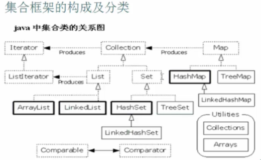

<link href="http://cdn.bootcss.com/highlight.js/8.0/styles/monokai_sublime.min.css" rel="stylesheet">  
<script src="http://cdn.bootcss.com/highlight.js/8.0/highlight.min.js"></script>  
<script>hljs.initHighlightingOnLoad();</script>  

# Java跨平台原理（一次编译，随处执行）
- JVM（Java虚拟机），用于解析Java程序
- JVM本身不能跨平台
- JVM使Java程序具有跨平台性
- JVM在**classpath**里找可执行程序，即.class文件，若没有配置classpath，则在当前目录下找

---

# JRE和JDK
- **JRE** Java Runtime Environment,Java运行环境
- JRE = JVM + Java类库
- **JDK** Java Development Kit,Java开发工具包
- JDK = JRE + Java开发工具
- 使用JDK开发的Java程序，可以交给JRE运行

---

# Idea

- Debug
 - F7：单步执行，会进入方法内部
 - F8：单步执行，不会进入方法内部
 - F9：全速执行，直接跳到下一个断点
- Generate(Alt+Insert)：可以快速在类中创建构造函数constructor()、setter()和getter()、equals()、toString()等，还可以选择要覆写的父类方法、要实现接口的方法等
- quick fix：Alt + Enter
- 代码格式化：Ctrl + Alt + L
- 单行剪切：Ctrl + X —— 可用于删除单行
- 单行复制并粘贴：Ctrl + Alt + down
- 批量修改变量名：选中变量名后Shift + F6
- 改大小写：选中后Ctrl + Shift + U
- 整行上下移动：Alt + Shift + 上下箭头
- 代码重构之提取为方法：Alt + Ctrl + M
- 收尾（末尾加分号、补全括号等）：Ctrl + Shift + Enter
- 方法注释：Alt + P
- 全局搜索：Ctrl + N
- 查看继承关系：Ctrl + H
- 查看方法参数提示：Ctrl + P
- 数组的for循环：itar
- 增强for循环：iter

---

# Dos命令行
```
- help
- cls  清屏
- cd  进入指定目录
- dir 显示当前目录下的文件和文件夹
- cd.. 退回上一级目录
- cd\\ 退回到根目录
- md  创建新目录
- rd  删除目录（文件夹）
- del 删除文件（如.txt）
- javac （编译器）编译Java程序（.java文件），编译出运行程序(.class文件)
- java （JVM）执行已存在的Java运行程序(.class文件)
- set 可以临时配置环境变量（只在当前命令行有效）若想加入新值，则`set path=新值;%path%`
- exit 退出Dos命令行
 ```

#内存的划分
 1. 寄存器
 2. 本地方法区
 3. 方法区(共享数据区)
 4. 栈内存：存放的都是**局部变量**，而且变量所属作用域一旦结束，该变量就自动释放
 5. 堆内存：存放数组和**对象**(其实数组也是对象)，凡是通过**new**创建的**实体**(存放多个数据的容器)就存放在堆中，特点：1，每一个实体都有**首地址**；2，堆内存中每一个变量都有**默认的初始值**，根据类型不同而不同(如int类型是0，double类型是0.0，float类型是0.0f，boolean类型是false)；3，有**垃圾回收机制**

---

# Java
## 基础
- Java中int和boolean类型不兼容，即不能用`while(1)`来进入循环体
- 初始化float类型变量时后面要加**f**（如`float x=0.23f;`，否则0.23默认是double，编译报错，类型不兼容），类似的，long类型变量后面要加**l**（默认是int），但初始化short和byte等类型变量时不用，会自动截断，如可直接`short x=4;`
- 变量的作用域是其所在的{ }
- 类型运算细节
  - `byte b1=3;`，编译不报错！因为赋值时会进行自动类型转换，截取低8位（1 byte）
  - `byte b1=3; byte b2=4; byte b; b=b1+b2;`，编译报错！因为b1和b2相加可能超过byte的范围，而b1和b2的值未知，不能进行检查，因此不能做自动类型转换
  - `int x1=3; int x2=4; int x; x=x1+x2;`，编译不报错！因为int是默认型，如果超出范围，会自动截取低32位（4 bytes）
  - `short i=1; i=i+1;`，编译报错！原理同上（i+1时做了自动类型提升，提升后的类型不能再赋给低值类型，会出现精度丢失）
  - `short i=1; i+=1;`，编译不报错！因为“+=”会做强制自动类型转换，如同`short i=1;`中的“=”
- 模运算（%）的符号只参考被模数，而与模数无关，如`(-5)%2＝-1`，但`5%(-2)=1`
- 任何类型和字符串用“+”拼接都变成字符串，如`System.out.println("5+5="+5+5)`的输出为`5+5=55`，从左到右运算！
- 一个数异或同一个数两次，值不变，如`6^3^3=6`，可用于交换两个变量的值（不使用第三个变量）:  
```
int a = 7;
int b = 10;
a = a^b; 
b = a^b;
a = a^b;
```
运算后`a=10，b=7`
- 自增运算
  - 后增：`int a=1; int b; b=a++;`，结果是`a=2，b=1`，但实际过程不是a先把值赋给b再自增，而是a先保留自己的值，然后进行自增，再将保留的值赋给b
  - 先增：`int a=1; int b; b=++a;`，结果是`a=2，b=2`，过程是a先进行自增，再将值赋给b
  - `int i=1; i=i++;`，结果是`i=1`，i先保留自己的值（保留到一个临时区temp里），再进行自增，自增完成后再进行赋值运算，将temp里的值赋给i
- &和&&的区别（|和||等同理）
  - &可以表示位运算
  - 表示判断时，&和&&结果相同，但&两边的表达式都要执行，而&&只要左边表达式为false，则右边的表达式不用再执行
- 移位运算
  - 左移(<<)最低位补0，左移几位就相当于乘以2的几次方，可以完成2的此幂运算(如`6<<2=24`)
  - 右移(>>)时，最高位原来是1就补1，原来是0就补0，右移几位就相当于除以2的几次方(但要注意类型，如`6>>2=1`，因为`6/4=1`)
  - 无符号右移(>>>)，最高位永远补0
- switch
  - switch语句只能对四种类型的变量进行选择判断：byte short int char （JDK7.0后，String和枚举类也可以）
  - switch语句中的default无论放在哪里，都会先判断有效的case，执行完所有case而没有遇到break时，才会执行default
  - switch语句只有两种结束方式：break和switch语句的大括号，**找到匹配而没有结束**时，会**继续执行所有可执行的语句而不再进行判断**（不管case匹不匹配，都会执行），例如：
```
        int x=7;
        switch (x)
        {
            default:
                System.out.print("d");
            case(1):
                System.out.print("a");
            case(2):
                System.out.print("b");
                break;
            case(3):
                System.out.print("c");
                break;
        }
```
输出结果是`dab`，执行顺序是case(1)**不匹配**→case(2)**不匹配**→case(3)**不匹配**→default**匹配，但没有break**→print(d)**不进行判断**→print(a)**不进行判断**→print(b)**不进行判断**→break
  - 可用多个case只对应同一个执行语句来提高代码的复用性
- 通过变量对循环进行控制，该变量只作为循环增量存在时，用for循环比较好，如`for(int i=0;i<10;i++)`，因为循环完成后该变量就可释放
- 无限循环：`while(true){}`，`for(;;);`
- 转义字符：
```
\n: 回车
\t: 制表符
\b: 退格
\r: 按下回车键(回到本行开头)
```
Windows系统中，回车符其实是由两个符号组成：`\r\n`
Linux系统中，回车符是`\n`
**\r和\n的区别：**
```
for(int i=0; i<4; i++)
{
	System.out.print(i+"\r")
}
```
输出结果是`3`
```
for(int i=0;i<4;i++)
{
	System.out.print(i+"\n"); // 或 System.out.print(i+"\r\n")
}
```
输出结果是
```
0
1
2
3
```

- break和continue控制循环时，可以给循环起名字，以控制指定循环，例如：
```
loop1:for(int i=0;i<3;i++)
			loop2:for(int j=0; j<3; j++)
			{
				System.out.println("i="+i);
				break loop1;
			}
```
输出结果是`i=0`

## 函数（方法）
- 函数：定义在**类**中的**具有独立功能**的一段独立小程序(不能在函数里面定义函数)
- 命名规范：用多个单词时，第一个单词小写，第二个单词开始首字母大写，如myPrint()
- main函数是JVM执行程序时的入口，如果没有定义main函数或者main函数格式错误，若没有语法错误，则编译不报错(因为语法没有错误)，运行时才报错(main不是关键词，只是一个JVM可以识别的固定的函数名)
- 静态上下文中不能引用非静态方法，即`static`类型的函数里面不能调用没有定义`static`的其他函数
- 编译时只检查语法，不代入数值，例如：
```
private static char mySign(int a){
	if(a>=0)
		return '+';
	else if(a<0)
		return '-';
}
```
**编译报错！**因为编译器认为可能if和else if的语句可能会都不满足条件，导致函数没有返回语句，要用if-else if-else

- 函数重载(overload)：在**同一个类**中，允许存在一个以上同名函数，只要它们的**参数个数或者参数类型**不同即可(与返回值类型无关)

## 数组
- **一维数组**：`int[] arr = new int[3];`或者`int[] arr = {1,1,1};(静态初始化方式)`，变量arr存放在**栈内存**中，数组实体存放在**堆内存**中，数组中每个元素默认初始化为0，变量中存的值是数组实体的**首地址值**，称为**引用数据类型**，`arr=null;`可以取消引用，当没有变量指向堆内存中的某个实体时，它会变为垃圾，垃圾回收机制不定时回收垃圾

- 交换数组中两个元素的值，选择用函数时，参数除了两个索引之外，还**要指定数组**，即`mySwap(arr,i,j)`
```
            private static void mySwap(int[] arr, int i, int j) {
                int temp = arr[i];
                arr[i] = arr[j];
                arr[j] = temp;
            }
```
- 排序算法：
  - 选择排序：arr[0]依次和arr[1]、arr[2]...arr[n-1]比较，排完一轮后arr[0]不用参与下一轮排序
```
            private static void mySelectSort(int[] arr) {
                for (int i=0; i<arr.length-1; i++){
                    for (int j=i+1; j<arr.length; j++)
                        if (arr[j]<arr[i])	//当前位置(i)的元素不断与后面元素比较，遇到比它小的值就交换
                            mySwap(arr,i,j);
                }
            }
```
  - 冒泡排序：相邻元素比较，即arr[0]和arr[1]比较，然后arr[1]和arr[2]比较，排完一轮后arr[n-1]不用参与下一轮排序
```
            private static void myBubbleSoft(int[] arr) {
                for (int i=0; i<arr.length; i++){
                    for (int j=0; j<arr.length-1-i; j++){	//-1保证不越界，-i使已经“冒泡”到最后的最大值不用再参与比较
                        if (arr[j+1]<arr[j])	//相邻元素比较，有需要时交换
                            mySwap(arr,j,j+1);
                    }
                }
            }
```
 - 选择排序改进版：每次找到剩余元素中的最小值后才置换，不用每次碰到小的就换(排一轮最多只置换一次)
```
            private static void mySelectSortPlus(int[] arr) {
                for (int i=0; i<arr.length-1; i++){
                    int restMinIndex = getRestMinIndex(arr,i);  //找到剩余元素中的最小值的索引
                    if (i!=restMinIndex)          //当最小值元素不是当前元素时，交换位置
                        mySwap(arr,i,restMinIndex);
                }
            }

            private static int getRestMinIndex(int[] arr,int i){  //找最小值的索引
                int minIndex = i;
                for (int j=i+1; j<arr.length; j++){
                    if (arr[j] < arr[minIndex])
                        minIndex = j;
                }
                return minIndex;
            }
```
- 查找算法：
 - 折半查找(只能查找有序数组的索引值)   →改进：如果存在，则返回索引值；如果不存在，则返回(**-** 插入点索引值 **- 1**)
```
            private static int myBinarySearch(int[] arr,int value){
                int low = 0;
                int high = arr.length-1;
                while (low<=high){
                    int mid = (low+high)>>1;	//移位运算的效率最高
                    if (arr[mid]>value)
                        high = mid-1;
                    else if (arr[mid]<value)
                        low = mid+1;
                    else
                        return mid;    //找到，返回索引值
                }
                return -low-1;      //未找到，返回 （- 插入索引 - 1）
            }
```
- 查表法(如进制转换):

```
       private static void myToBinary(int num){
            System.out.print(num+"的二进制数值为：");
            myToOther(num,2,1);
        }

        private static void myToOctal(int num){
            System.out.print(num+"的八进制数值为：");
            myToOther(num,8,3);
        }

        private static void myToHex(int num){
            System.out.print(num+"的十六进制数值为：");
            myToOther(num,16,4);
        }

        private static void myToOther(int num,int base,int offset){
            if (num == 0){                //程序的健壮性，否则转换0时无输出
                System.out.println("0");
                return;           //不需要再开辟下面代码所需的内存空间
            }
            char[] tab = {'0','1','2','3','4','5','6','7','8','9','A','B','C','D','E','F'};
            char[] otherNum = new char[16];
            int pos = otherNum.length-1;
            while (num!=0){				//取完所有有效位时，跳出
                int temp = num & (base-1);        //取出低n位
                otherNum[pos] = tab[temp];
                pos --;				//从后往前存
                num = num >>> offset;		//右移offset位
            }
            for (int i=pos+1; i<otherNum.length; i++)  //pos后的元素为赋过值的有效值
                System.out.print(otherNum[i]);
            System.out.println();
        }
```

- **二维数组**：`int[][] arr = new int[3][2];`或者`int[][] arr = new int[2][]; arr[0] = new int[7]; arr[1] = new int[3];`或者`int[][] arr = {{0,1,2},{1,1}};(静态初始化方式)`，二维数组变量存储在栈内存中，二维数组和二维数组里的一维数组存储在堆内存中，二维数组里的每个“一维数组元素”的默认初始值为null，在堆内存中再开辟新的空间存放一维数组，一维数组中的每个元素的初始值为0(若为int类型的二维数组)，赋值时，二维数组再引用该地址值，而不是将一维数组存进二维数组开辟的空间中，因为一维数组也是实体，会开辟自己独立的内存空间


##面向对象
- 面向对象的三个特征：封装、继承、多态
- 类的命名规范：类名的首字母大写
- 类前加了**public**后，类名和源文件名必须相同
- 对象和类的关系：**类是事物的描述，包括属性（成员变量）和功能（成员函数）两方面；而对象是该类事物的实例(在Java中是通过new创建的)**
- **成员变量**和**局部变量**的区别：
 1. 成员变量定义在**类**中，整个类都可以访问；局部变量定义在**函数(方法)、语句、局部代码块**中，只在所属区域有效
 2. 成员变量存在**堆内存**的**对象**中；局部变量存在**栈内存**的**函数(方法)**中
 3. 成员变量随着**对象**的创建而存在，随着对象的消失而消失；局部变量随着**所属区域**的执行而存在，随着所属区域的结束而释放
 4. 成员变量**有默认初始值**；局部变量**没有默认初始值**，未初始化的局部变量不能使用

- `Car c1 = new Car(); Car c2 = c1;`，则c1和c2指向**同一个**Car对象，改变其中一个的值，相当于另一个中的值也改变

- 类类型的变量如`Car c1 = new Car();`中的`c1`：类类型的变量要么指向一个对象，要么为null
- 匿名对象，如`new Car();`
 1. 当对象**对方法**仅进行**一次**调用时，可以简化成匿名对象，如`new Car().run();`（注意：当对方法进行多次调用时，如果使用匿名对象，如`new Car().run(); new Car().run();`，其实是创建了两个对象，两个对象分别对这个方法进行调用；而当对属性进行调用时，使用匿名对象没有意义，因为该语句执行完后对象就变成了垃圾，因为没有引用变量指向它，如`new Car().num=4;`没有意义）
 2. 匿名对象可以作为实际参数进行传递，如`carShow(new Car());`，此时在carShwo()这个方法内部一定会有一个类类型的引用变量接收它，因此它不会变成垃圾
- 基本数据类型参数传递图解与引用数据类型参数传递图解
 - 基本数据类型参数传递图解

 - 引用数据类型参数传递图解

- 封装：隐藏对象的属性和实现细节，仅对外提供公共访问方式(通过public的set函数和get函数才能访问private的成员变量)
- `private`：权限修饰符，用于修饰类中的成员，私有的内容只在本类中有效（注意：私有仅仅是封装的其中一种体现而已，私有是封装，但封装不限于私有）
- 构造函数：
 - 构造函数的**函数名与类名一样**(意味着构造函数的首字母大写)
 - 构造函数**不用写返回值类型**(如果写了，就不再是构造函数，而是一般函数，但此时其首字母又是大写，造成了不规范)
 - 构造函数用于**对对象进行初始化**
 - 构造函数在**创建对象时被调用**
 - **创建的对象都必须通过构造函数进行初始化**，如果一个类中没有定义过构造函数，那么会有一个空参数的默认构造函数，如果一个类中定义了指定的构造函数，那么默认构造函数就没有了
 - 构造函数和一般函数的区别：**构造函数**在**对象创建时**就会被调用，且**一个对象只调用一次构造函数**，对对象进行初始化；**一般函数**在**对象创建后**，需要该函数功能时才被调用，且**可以调用多次**

###`this`
- `this`：代表对象，且代表**当前对象**，哪个对象调用了`this`所在的函数，`this`就代表哪个对象，例如：

```
Class Person{
	int age;
	...
	Person(int age){
		this.age = age;
	}
	...
}

Class PersonDemo{
	public static void main(String[] args){
		Person p = new Person(20);
		...
	}
}
```
对象p调用了这个`this`所在的函数Person()（构造函数），因此这个`this`代表的就是对象p
内存图解：


this也可以用于在构造函数中调用其他构造函数，但要注意只能定义在构造函数的第一行，否则会报错，因为初始化要先执行（凡是调用构造函数的语句都要放在第一行），例如：
```
class Person{
	private int age;
	private String name;

	Person(String name) {this.name = name;}
	Person(int age,Sting name) {
		this(name);	//调用参数为名字的构造函数，只能放在当前构造函数的第一行
		this.age = age;	//调用成员变量，不一定要放在第一行
	}
	...
}
```

###`static`
- `static`：静态修饰符，用于类中的修饰成员(包括成员变量和成员函数)
 - 用`static`修饰的成员是所有该类对象所**共享**的，其**优先于对象存在(随着类的加载而存在)**
 - **静态变量**和**成员变量**的区别：
 1. 生命周期不同：成员变量随着对象的创建而存在，随着对象的回收而消失；静态变量**随着类的加载而存在(先于对象存在)**，随着类的消失而消失
 2. 调用方式不同：成员变量只能用对象名调用；静态变量除了可以用对象名调用外，还**可以用类名直接调用**
 3. 别名不同：成员变量也称为**实例变量**；静态变量也称为**类变量**(和类类型变量区分)
 4. 数据存储位置不同：成员变量数据存储在**堆内存的对象中**，是**对象的特有数据**；静态变量数据存储在**方法区(数据共享区)的静态区**，是**对象的共享数据**
- 静态`static`使用的注意事项：
 - 静态方法只能访问静态成员(非静态方法既可以访问静态成员，也可以访问非静态成员)
 - 静态方法中不可以使用`this`和`super`关键字(因为静态成员先于对象存在，可能使用时还没有创建对象)
 - main函数是静态的
- `static`内存图解


- 何时使用静态？
 - 静态变量：当该类中**所有**对象的某个变量**值相同**，且**不用修改**时，定义成`static`，节省内存空间；只要有一个对象的变量值不同，或需要修改，就不能定义成`static`
 - 静态函数：当该函数要**访问**到对象中的**特有数据**(即要访问到**非静态数据**)时，**不能**定义成`static`(因为静态函数可以在未创建对象时使用，因此不能访问对象的特有数据，即非静态数据)；当该函数**只访问静态数据(类数据)**时，定义成`static`(此时若不定义成`static`，则要创建对象来调用这个函数，但又因为没有访问对象的特有数据，所以该对象的创建没有意义，浪费堆内存空间)
- 静态代码块：**随着类的加载而执行，且只执行一次**，当类中变量全都是静态变量时，可以用静态代码块进行初始化，而不用对象进行初始化(没有特有数据，对象没有意义)，例如：

```
class StaticCode{
	static int num;
	static	
	{
		num = 10;
		System.out.println("static code block run...");
	}		//静态代码块
	
	static void show()
	{
		System.out.println("show run...");
	}
}

class StaticCodeDemo{
	static	//静态代码块，加载类时就执行
	{
		System.out.println("aaa");
	}

	public static void main(String[] args){
		System.out.println("bbb");
		StaticCode.show();
	}
}
```
输出为：
```
aaa
bbb
static code block run...
show run...
```
- 构造代码块：可以用于对所有对象进行初始化，**每创建一个对象时执行一次**，例如：

```
class Person{
    private String name;
    {				//构造代码块，必须加{}，创建对象时执行，可以给所有对象进行初始化
        cry();
    }

    public static void cry() {
        System.out.println("哇哇哇");
    }

    public Person() {
        this.name = "baby";
    }

    public Person(String name) {	//构造函数，给特定对象进行针对性初始化
        this.name = name;
    }

    public void speak() {
        System.out.println("My name is "+this.name);
    }
}

class PersonDemo{
    public static void main(String[] args) {
        Person p1 = new Person();	//new对象的时候，会执行构造代码块
        p1.speak();
        Person p2 = new Person("vv");
        p2.speak();
    }
}
```
输出为：
```
哇哇哇
My name is baby
哇哇哇
My name is vv
```
- 执行顺序：静态代码块→构造代码块(如果创建了对象)→构造函数
- 当类中的所有方法都是static的时，该类不需要创建对象，为了保证**不让其他程序创建对象**，可以**将构造函数私有化**，例如：
```
class ArrayTool{	//该类中所有方法都是静态的，所以该类无需创建对象
	private ArrayTool(){}	//将构造函数私有化，不让其他程序创建该类对象
	public static void bubbleSort(int[] arr) {...}
	...
}
```

###单例设计模式
- 单例设计模式：保证一个类在内存中的**对象唯一性**，例如对于多个程序使用同一个配置信息时，就需要保证该对象的唯一性，步骤：
 1. 不让其他程序创建该类对象 → 私有化构造函数
 2. 在本类中创建一个唯一的对象
 3. 对外提供一个公共的方法，让其他程序获取该类中创建的那个对象

```
class Single {		//饿汉式，类一加载，就创建对象
		private int num;
    	private static Single s = new Single();		//在该类中创建一个对象
													//由于getInstance()函数static且要访问这个对象，因此这个对象也要static
    	private Single() {}		//私有化构造函数，避免其他程序可以随意创建该类的对象，保证对象唯一性
    	public static Single getInstance() { return s; }		//对外提供获取该类中创建的那个对象的公共方法
																//由于其他程序不能创建对象，因此要用类名调用，故此函数要static

    	public int getNum() { return num; }
    	public void setNum(int num) { this.num = num; }
}

class Single2 {		//懒汉式，类加载时不创建对象，调用方法getInstance()时才创建对象
		private int age;
		private Single2() {}
		static Single2 s = null;
		public static Single2 getInstance() {
			if (s==null)
				s = new Single2();
			return s;
		}

		public void setAge(int age) { this.age = age; }
		public int getAge() { return age; }
}

class SingleDemo {
    public static void main(String[] args) {
        	Single s1 = Single.getInstance();
        	Single s2 = Single.getInstance();	//s1、s2获取的是同一个对象，保证了对象唯一性
        	s1.setNum(10);
        	s2.setNum(20);
        	System.out.println(s1.getNum()); //输出为20
    	}
}
```


---
###继承
- Java中支持单继承(一个类只能有一个直接父类)，不支持多继承(但对C++中的多继承进行了改进)，且支持多层(多重)继承
- `super`与`this`的区别：
 - `this`代表一个本类对象的引用
 - `super`代表一个父类空间(父类并没有创建对象)
- 子类不能直接访问父类中private的数据，但可通过public的Getter函数访问
- 创建子类对象时，父类会比子类先加载进内存，因为父类中有子类所需要的数据
- 子父类中有相同的成员函数时，会运行子类的成员函数，称为覆盖/重写/覆写操作(实际上没有覆盖，两个函数在内存中的位置不同，一个在子类中，一个在父类中)
- 覆写和重载区分：
 - **重载(overload)**是**同一个类**中的两个**参数列表不同**的**同名**函数(**与返回值类型无关**)
 - **覆写/重写/覆盖(override)**是**子父类**中**完全一模一样**的函数(**包括返回值类型、是否static、函数名和参数列表**)
- 覆盖的注意事项：
 1. 子类方法的权限必须大于等于父类方法的权限，才能覆盖(即不能将权限缩小，如在父类中为public，在子类中为private，则不能覆盖)
 2. 静态方法只能覆盖静态方法，或被静态方法覆盖，而不能和非静态方法相互覆盖
- **子类的实例化过程**：子类中所有构造函数都会默认访问父类中空参数的构造函数，即子类中所有构造函数的**第一行**都会有一条隐式语句`super();`，因为子类继承了父类中的属性，所以在使用之前必须先看父类是如何对其属性进行初始化的，且父类初始化动作必须先完成，若父类中自定义了构造函数，而没有空参数构造函数，则必须在子类构造函数中用super明确调用父类的哪个构造函数，如`super(x);`，例如：

```
class DemoA {
    DemoA() { System.out.println("A1 --- DemoA run..."); }
    DemoA(int x) { System.out.println("A2 --- DemoA run..."+x); }

    public static void show() {
        System.out.println("DemoA show...");
    }
}

class DemoB extends DemoA {
    DemoB() {
        super(6);
        System.out.println("B1 --- DemoB run...");
    }

    DemoB(int x) {		//有一条隐式的super();
		System.out.println("B2--- DemoB run..."+x);
	}

    public static void show() {		//覆盖 override
        System.out.println("DemoB show...");
    }
}

class ExtendsDemo {
    public static void main(String[] args) {
        new DemoB();
        System.out.println("\--------\");
        new DemoB(6);
    }
}
```
输出为：
```
A2 --- DemoA run...6
B1 --- DemoB run...
\--------\
A1 --- DemoA run...
B2--- DemoB run...6
```
注意：如果子类构造函数中调用了本类构造函数，如`this();`，那么`super();`就不存在了，因为`this();`和`super;`都必须放在第一行，但可以保证的是，子类中肯定会有构造函数访问到父类的构造函数，例如：

```
class DemoA {
	DemoA() { System.out.println("A --- DemoA run..."); }
}

class DemoB extends DemoA {
	DemoB() {		//此处有隐式的super()语句
		System.out.println("B --- DemoB run...");
	}

	DemoB(int x) {
		this();		//此时这个子类构造函数中没有super()语句，但其调用的本类构造函数中还会有
		System.out.println("C --- DemoB run...");
	}
}

class Test {
	public static void main(String[] args) {
		new DemoB(5);
	}
}
```
输出为：
```
A --- DemoA run...
B --- DemoB run...
C --- DemoB run...
```
- **对象**的实例化过程（如`Person p = new Person();`）：
 1. JVM读取指定路径下的.class文件，并加载进内存，如果有直接父类，则**先加载其直接父类**
 2. 在堆内存中开辟空间，分配地址，并在对象中进行**默认初始化**
 3. 调用对应的**构造函数**进行**初始化**
 4. 构造函数的第一行会调用**父类**中的**构造函数**进行**初始化**，即隐式的`super();`语句
 5. **父类初始化完毕后**，执行**子类**中的**显式初始化**
 6. 如果有构造代码块初始化，执行**构造代码块初始化**
 6. 然后才进行**子类构造函数**中的**特定初始化**
 7. 初始化完成后，将地址值赋给引用变量

```
class DemoA {
    DemoA() { show(); } //此时会执行子类中的show，因为此时this是指向子类所创建的对象，父类根本没有创建对象，子类中没有这个方法时，才执行父类的
    public void show() { System.out.println("DemoA show run..."); }
}

class DemoB extends DemoA {
    int num = 10;	//显式初始化
    DemoB() {	//此处会有一条隐式的super()语句，做父类初始化，完成后才进行子类的显式初始化
				System.out.println("DemoB run...num="+num);	//此时显式初始化才完成
				num = 20;
		}

    public void show() {
        	System.out.println("DemoB show run...num="+num);
    	}
}

class ExtendsDemo {
    public static void main(String[] args) {
        	DemoB b = new DemoB();
        	b.show();
    	}
}
```
输出为：
```
DemoB show run...num=0
DemoB run...num=10
DemoB show run...num=20
```
即`super();`是构造时的分水岭，在它之前只做默认初始化，在它之后才做显式初始化（父类初始化完毕后，子类才初始化）
```
class Fu {
    int num = 9;

    Fu() {      //父类构造函数
        System.out.println("Fu constructor run...");
        show();
    }

    void show() {       //被子类覆盖，不会执行
        System.out.println("Fu show run...num="+num);
    }
}

class Zi extends Fu {
    int num = 7;        //显式初始化

    {
        System.out.println("Zi constructor code run...num="+num);
    }   //构造代码块

    Zi() {      //子类构造函数
        super();
        /*----此处执行显式初始化----*/
        /*----此处执行构造代码块初始化----*/
        show();
		num = 20;
    }

    void show() {
        System.out.println("Zi show run...num="+num);
    }
}

public class InitializeDemo {
    public static void main(String[] args) {
        new Zi().show();
    }
}
```
输出为：
```
Fu constructor run...
Zi show run...num=0
Zi constructor code run...num=7
Zi show run...num=7
Zi show run...num=20
```

###`final`
- `final`可以修饰类、方法、变量
- `final`修饰的**类不能被继承**
- `final`修饰的**方法不能被覆盖**
- `final`修饰的**变量为常量**，只能赋值一次(常量名的字母**全部大写**，多个单词用下划线连接，如`final double MY_PI = 3.14;`，且一般常量会加`static`，因为常量对于所有对象都是一致的)

###`abstract`
- 方法**只有声明而没有具体实现**时，需要被`abstract`修饰成抽象方法，而抽象方法必须定义在抽象类中，因此该类也要被abstract修饰，例如：

```
abstract class Person {		//抽象类，不能被实例化，但抽象类有构造函数，可用于其子类对象的初始化
	...
	abstract void speak() {}		//抽象函数，只有声明，没有方法体，子类必须覆盖父类所有抽象函数后才能实例化
	...
}

class Boy extends Person {
	...
	void speak() { System.out.println("I'm a boy."); }		//覆盖父类中的抽象方法
	...
}

class Girl extends Person {
	...
	void speak() { System.out.println("I'm a girl."); }
	...
}
```
- **抽象类不能被实例化**(因为调用抽象类中的抽象方法无意义)，但抽象类**有构造函数**，可用于对其子类对象进行初始化
- 抽象类一定是父类，因为抽象类必须被其**子类覆盖了所有抽象方法后，该子类才能实例化**，否则该子类仍然是抽象类
- 抽象类**可以不定义抽象方法**，目的是不让该类创建对象，如AWT中的适配器对象就是这种类
- `abstract`**不可以**和以下关键字**共存**：
 - `private`：因为abstract方法private后子类无法对其进行覆盖，无意义
 - `static`：因为abstract方法static后可以直接通过类名调用，无意义
 - `final`：因为abstract方法final后子类无法对其进行覆盖，abstract类final后不允许继承，无意义
- **抽象类**和**一般类**异同点：
 - 相同点：都是用来描述事物的，都在内部定义了成员
 - 不同点：一般类有足够的信息描述事物，而抽象类没有足够的信息描述事物；一般类中不能定义抽象方法，抽象类中可以定义抽象方法；一般类可以被实例化，抽象类不能被实例化

###`interface`(接口)
- 当抽象类中的**所有方法都是抽象方法**时，可以将此抽象类用interface定义和表示
- 接口中常见的成员有**全局常量**和**抽象方法**，它们都是**public**的，且它们都有固定的修饰符（即使不写也存在）
- 接口是对外**暴露的规则**，是程序的**功能扩展**，可**降低耦合性**，可用来**多实现**

####`implements`(实现)
- 类与类之间是继承(extends)关系且不支持多继承，而**类与接口**之间是**实现(implements)**关系，接口与接口之间是继承(extends)关系且支持多继承
- **接口不可以实例化**，只有**实现了接口的子类覆盖了接口中所有抽象方法**后，该子类**才能实例化**，否则该子类是一个抽象类

```
public interface Demo {		//定义一个接口
	public static final int NUM = 7;	//全局常量NUM，修饰符public static final可省略
	public abstract void show();	//全局抽象方法，修饰符public abstract可省略，但最好不要省略public，因为子类覆盖时也必须public，否则权限变小
}

class DemoImpl implements Demo {		//定义一个子类来实现接口
	public void show() 	//覆盖接口中的抽象方法，必须加public，否则造成权限变小
	{ 
		System.out.println("This is the implement of the interface..."+NUM); 
	}
}

public class Test {
	public static void main(String args[]) {
		DemoImpl impl = new DemoImpl();		//子类覆盖了接口中的所有抽象方法后，可以实例化
		impl.show();
	}
}
```
输出为`This is the implement of the interface...7`
- Java不支持多继承，但**支持多实现**，即**一个类可以实现多个接口**，因为多继承会产生调用不确定性，而多继承则不会
- 一个类可以在**继承**另一个类的**同时**，**实现多个接口**，避免了单继承的局限性，例如`class InterfImple extends B implements InterfA {...}`，则类InterfImple在继承了类B的同时，实现了接口InterfA
- **接口**可以**继承接口**，且**支持多继承**，例如`interface InterfA extends InterfB,InterfC {...}`，则接口InterfA多继承了接口InterfB和InterfC，因为接口内没有方法体，因此不会产生调用不确定性

```
interface InterfA {		//定义接口InterfA
	public void show(int x);	//即public abstract void show(int x);
}

interface InterfB {		//定义接口InterfB
	public void show(int x);	//即public abstract void show(int x);
}

class InterfImple implements InterfA,InterfB {	//InterfImple类多实现了接口InterfA和InterfB
	public void show(int x) { System.out.println("x="+x); }	//同时覆盖了接口InterfA和InterfB中的show()方法
}

public class Test {
	public static void main(String args[]){
		InterfImple imple = new InterfImple();
		imple.show(7);
	}
}
```
输出为：`x=7`

####接口和抽象类
- 相同点：都是不断向上抽取而来的
- 不同点：
 - 抽象类需要被**继承**，而且只能**单继承**；接口需要被**实现**，且可以**多实现**
 - 抽象类中可以定义抽象方法和非抽象方法，其子类可以直接使用非抽象方法；接口中**只能定义抽象方法**，必须由子类去实现
 - 抽象类定义体系的**共性内容**；接口定义体系的**额外内容**
 
####接口的应用
```
/**
 * 实现笔记本电脑的USB接口，可以接U盘、USB鼠标等
 */

interface USB {     //暴露的规则，定义USB接口
    public void open();
    public void use();
    public void close();
}

class PC {
    public static void main(String[] args) {
        useUSB(null);
		USBFlashDisk ufd = new USBFlashDisk();		//创建一个U盘对象
        useUSB(ufd);		//使用该U盘对象
		USBMouse um = new USBMouse();		创建一个USB鼠标对象
        useUSB(um);		使用该USB鼠标对象
    }

	//使用规则
    public static void useUSB(USB u) {      //接口类型的引用，用于接收（指向）接口的子类对象
        if (u==null) {
            System.out.println("There is no USB device...");
            return;
        }
        u.open();
        u.use();
        u.close();
    }
}


/*----------实现规则，降低了耦合性-----------------*/

class USBFlashDisk implements USB {     //实现规则，定义U盘类，实现USB接口
    public void open() {
        System.out.println("USB Flash Disk open...");
    }

    public void use() {
        System.out.println("USB Flash Disk use...");
    }

    public void close() {
        System.out.println("USB Flash Disk close...");
    }
}


class USBMouse implements USB {     //实现规则，定义USB鼠标类，实现USB接口
    public void open() {
        System.out.println("USB Mouse open...");
    }

    public void use() {
        System.out.println("USB Mouse use...");
    }

    public void close() {
        System.out.println("USB Mouse close...");
    }
}
```
输出为：
```
There is no USB device...
USB Flash Disk open...
USB Flash Disk use...
USB Flash Disk close...
USB Mouse open...
USB Mouse use...
USB Mouse close...
```
---
###多态
- **父类或接口的引用指向其子类对象或实现**，称为多态，即一个对象，两种形态，例如：
```
class Animal {...}
class Cat extends Animal {...}
class Test {
	public static void main(String args){
		Animal vv = new Cat();	//父类的引用指向其子类对象
	}
}
```
- 多态的好处：可以提高代码的**扩展性**，前期定义的代码可以使用后期的内容
- 多态的弊端：前期定义的内容不能使用（调用）后期子类的**特有**内容
- 多态的前提：
 1. **存在继承关系**
 2. **子类重写父类方法**（若子类没有重写父类方法，则全是子类的特有内容，无法调用）
 3. **父类引用指向子类对象**
- 转型
 - 向上转型：限制对特有功能的访问，如`Animal animal = new Dog();`，则对象animal不能使用Dog类中的特有功能
 - 向下转型：目的是使用子类中的特有功能，如`Dog dog = (Dog) animal;`，则对象dog由Animal类向下转型成Dog类，可以使用Dog类中的特有功能
 - 注意：**对于转型，自始至终都是子类对象在做着类型的变换**，如`Animal anm = new Animal(); Cat c = (Cat) anm;`是**错误的**！！会出现**类型转换异常**`ClassCastException`

```
abstract class Animal {
    String name;

    public Animal(String name) {
        this.name = name;
    }

    abstract void eat();
}

class Cat extends Animal {
    public Cat(String name) {
        super(name);
    }

    void eat(){
        System.out.println(name+" eating fish...");
    }

    void catchMouse() {
        System.out.println(name+" catching mouse...");
    }
}

class Dog extends Animal {
    public Dog(String name) {
        super(name);
    }

    void eat() {
        System.out.println(name+" eating bones...");
    }

    void guardDoor() {
        System.out.println(name+" guarding door...");
    }
}

public class PolymorphismDemo {
    public static void main(String[] args) {
        Cat vv = new Cat("vv");
        Dog dd = new Dog("dd");
        animalEat(vv);
        animalEat(dd);
        vv.catchMouse();
        dd.guardDoor();

        Animal cris = new Dog("cris");  //自动类型提升，Dog对象向上转型为Animal类型，此时不能调用Dog类的特有方法guardDoor()
        Dog dris = (Dog) cris; //向下转型，转型后可以使用Dog类的特有方法guardDoor()
        dris.guardDoor();
    }

    private static void animalEat(Animal a) {	//将来再出现新的Animal，仍能使用此方法
        a.eat();
    }
}
```
输出为：
```
vv eating fish...
dd eating bones...
vv catching mouse...
dd guarding door...
cris guarding door...

```

- `instanceof`：用于**判断对象的具体类型**，只能用于引用数据类型的判断，通常用于向下转型前判断健壮性，例如

```
Animal a = new Cat();
if (a instanceof Cat) {		//向下转型前，判断是否为Cat类，若是则向下转型，之后可以使用Cat类的特有方法catchMouse()
	Cat c = (Cat) a;
	c.catchMouse();
}
else {
	System.out.println("It's not a cat, it can't catch mouse...");
}
```

- 多态的特点：
 - 成员变量：编译看左边（父类），运行看左边（父类）
 - **成员方法（非静态）**：编译看左边（父类），**运行看右边（子类）（动态绑定）（父类的方法称为虚拟方法）**
 - 静态方法：编译看左边（父类），运行看左边（父类）（其实对于静态方法，不需要对象，直接用类名调用即可）

```
class Parent {
    int num = 1;

    void show() {
        System.out.println("Parent show...");
    }

    static void method() {
        System.out.println("Parent method...");
    }
}

class Son extends Parent {
    int num = 7;

    void show() {
        System.out.println("Son show...");
    }

    static void method() {
        System.out.println("Son method...");
    }
}

public class PolymorphismDemo {
    public static void main(String[] args) {
        Parent p = new Son();
        System.out.println("num="+p.num);
        p.show();
        p.method();
    }
}
```
输出为：
```
num=1
Son show...
Parent method...
```


- 多态是编译时行为还是运行时行为？如何证明？
 - **多态是运行时行为**。
 - 证明如下：比如Animal类有许多子类(Dog、Car、Fish...)，子类都重写了Animal类的某方法(以eat()方法为例)，但输出不同。生成一个随机数，随机选择一个子类，赋值给Animal对象，调用eat()方法，在未运行时无法确定调用的是哪个子类的eat()方法

##内部类
- 类的设计时，发现事物1中还有别的事物2，且事物2还在访问事物1的内容，则将事物2定义成事物1的内部类
- 特点
 - **内部类可以直接访问外部类中的成员**
 - **外部类不能直接访问内部类中的成员，必须通过new内部类的对象，再通过该对象进行访问**
- 如果内部类中有静态成员，则内部类也必须是静态的
- 其他地方调用内部类
 - 如果内部类不是静态的，则要依赖于外部类的对象来访问，先new外部类对象，再通过该对象new内部类对象来调用
 - 如果内部类是静态的，则随着外部类的加载而加载，故不用依赖于外部类的对象来访问，可直接new内部类的对象来调用
 - 如果内部类是静态的，内部类中要调用的成员也是静态的（此时内部类也必须是静态的），该成员也随着外部类的加载而加载，故不用new对象，可以直接调用

```
class Outer {		//外部类
    private int num = 7;

    class InnerA {
        void show() {
            System.out.println("Inner A show run..."+num);      //内部类可以直接访问外部类的成员
        }
    }

    static class InnerB {   //静态内部类
        void method() {
            System.out.println("Inner B method run...");
        }
    }

    static class InnerC {   //内部类中有静态成员时，该内部类必须静态
        static void function() {        //静态内部类中的静态成员方法
            System.out.println("Inner C function run...");
        }
    }

    public void go() {
        InnerA ia = new InnerA();   //外部类不能直接访问内部类的成员，要通过new内部类的对象来访问
        ia.show();
    }
}

public class InnerClassDemo {
    public static void main(String[] args) {
        Outer.InnerA ia = new Outer().new InnerA();     //非静态的内部类，先new外部类对象，再通过该外部对象new内部类对象，才能调用内部类成员
        ia.show();
        Outer.InnerB ib = new Outer.InnerB();       //静态的内部类，可直接new内部类对象，从而调用内部类方法
        ib.method();
        Outer.InnerC.function();        //静态的内部类中的静态成员，不用new对象，可直接调用
    }
}
```
输出为：
```
Inner A show run...7
Inner B method run...
Inner C function run...
```
- 内部类可以直接访问外部类中的成员，是因为内部类持有外部类的引用，形式为：`外部类名.this`，例如：

```
class Outer {		//外部类
    int num = 1;

    class Inner {		//内部类
        int num = 2;

        void show() {
            int num = 3;
            System.out.println("num="+num);		//栈中有num，不用到堆中找
            System.out.println("num="+this.num);	//持有this. 指向堆内存中的内部类对象
            System.out.println("num="+Outer.this.num);	//持有外部类名.this. 指向堆内存中的外部类对象
        }
    }

    public void method() {
        new Inner().show();		//外部类中，通过new内部类对象，来访问内部类的成员
    }
}


public class InnerClassDemo {
    public static void main(String[] args) {
        new Outer().method();
    }
}
```
输出为：
```
num=3
num=2
num=1
```
- 内部类可以定义在局部位置上，称为局部内部类，只能在该局部中访问，如

```
class Outer {
	int num = 7;
	void show() {
		class Inner{		//局部内部类
			void method() {
				System.out.println("num="+num);
			}
		}

		new Inner().method();	//该局部中可以访问该局部内部类
	}

	//该局部之外不能再访问该局部内部类，如此处不能new Inner()
}
```
输出为：`num=7`

####匿名内部类
- 前提：匿名内部类必须继承一个父类或者实现一个接口


```
abstract class SubClass {
    abstract void show();
}

class Outer {
    int num = 7;

    void method() {

        new SubClass() {	//继承了SubClass类的匿名内部类
            void show() {		//覆盖父类的抽象方法
                System.out.println("num="+num);
            }
        }.show();		//该匿名内部类调用自己的成员
    }
}


public class InnerClassDemo {
    public static void main(String[] args) {
        new Outer().method();
    }
}
```
输出为：`num=7`
- 匿名内部类可以用其继承的父类或者其实现的接口来接收（多态），但这种形式不能再调用子类中的特有方法（已经向上转型了！！）
- 应用场景之一：当**函数参数**是**接口类型**，且接口中的**方法不超过3个**时，可以用**匿名内部类**作为实际参数进行传递

```
interface Interf {
    public void show();
    public void function();
}

class Outer {
    public void method() {
	/*---------------从这----------------------*/
        Interf inner = new Interf() {	
            public void show() {		//实现接口中的抽象方法						 
                System.out.println("show A run...");	  	  
            }												
																 
            public void function() {	//实现接口中的抽象方法						 
                System.out.println("function A run...");

			public void myShow(){}		 //子类的特有方法
            }													
        };  //匿名内部类可以用其继承的父类或其实现的接口接收（多态），但这种形式不能再调用子类中的特有方法（已经向上转型了！！）	
	/*---------------到这 是一条语句----------------*/

        inner.show();
        inner.function();
		//inner.myShow();编译报错！！！编译看左边，Interf接口中没有myShow()方法，不能调用！！
    }
}


public class InnerClassDemo {
    public static void main(String[] args) {
        new Outer().method();

	/*---------------从这----------------------*/
        run(new Interf(){
            public void show(){
                System.out.println("show B run...");
            }
            public void function() {
                System.out.println("function B run...");
            }
        });     //用匿名内部类作为实际参数进行传递
	/*---------------到这 是一条语句----------------*/
    }

    public static void run(Interf inf) {        //参数是接口类型
        inf.show();
        inf.function();
    }
}
```
输出为：
```
show A run...
function A run...
show B run...
function B run...
```

---
##异常
- 异常是指在**运行时**发生的不正常情况（编译不报错，运行报错）
- 在Java中用**类的形式**对异常进行描述和封装，将正常流程代码和问题处理代码进行分离，提高了阅读性
- 描述异常情况的类称为**异常类**
- Java中最顶级的异常类为**Throwable**，其子类分为：
 - 一般**不可处理**的：**Error**：Error是由JVM抛出的严重性问题，一般不针对性处理，直接修改程序
 - 一般**可处理**的：**Exception**
- 异常发生时应该可以抛出，以让调用者知道并处理，所以Throwable及其所有子类都具有**可抛性**（即可以被修饰符`throw`或`throws`修饰）
- `throw`和`throws`的区别：
 1. `throws`使用在**函数上**，`throw`使用在**函数中**
 2. `throws`抛出的是**异常类**，可以抛出多个，`throw`抛出的是**异常对象**，只抛出一个


- 要让一个类成为异常类，该类**必须继承异常体系**，继承后该类才具有**可抛性**，自定义异常类，要么继承Exception类，要么继承RuntimeException类
- Exception类的分类：
 - 编译时不检测异常（**运行时异常**）：**RuntimeException类及其子类**，如IndexOutOfBoundsException、NullPointerException等，**无需用`throws`子句进行声明，也无需用`catch`语句捕捉，编译可以通过**，因为这种异常发生更多是因为调用者的原因或者内部状态的改变导致的，功能无法继续，运算无法进行，一般不处理，程序**直接强制停止**，让调用者对代码进行修正
 - 编译时被检测异常：**Exception类及其子类（除了RuntimeException类及其子类），需要用`throws`子句进行声明，或者用`catch`语句捕捉，编译报错**，这种异常可以**针对性处理**

```
class NegativeArrayIndexException extends Exception {		//继承Exception类，使其具有可抛性，可能抛出该异常的方法需要用throws子句进行声明
															//若继承的是RuntimeException类及其子类，则不需要用throws子句进行声明
    NegativeArrayIndexException() {}

    NegativeArrayIndexException(String msg) {
        super(msg);		//使用父类定义过的显示异常信息的方法
    }
}


public class ExceptionDemo {
    public static void main(String[] args) throws NegativeArrayIndexException {		//throws子句进行声明
        int[] arr = new int[7];
        show(arr,-7);
    }

    public static void show(int[] arr, int index) throws NegativeArrayIndexException {	//throws子句进行声明
        if(index<0) {
            throw new NegativeArrayIndexException("数组索引不能为负数，错误的索引："+index);
        }

        System.out.println("arr["+index+"]="+arr[index]);
    }
}
```
输出为：
```
//Exception in thread "main" NegativeArrayIndexException: 数组索引不能为负数，错误的索引：-7
	at ExceptionDemo.show(ExceptionDemo.java:19)
	at ExceptionDemo.main(ExceptionDemo.java:14)
```
- 什么时候`catch`，什么时候`throws`：内部可以处理该异常时，用`catch`；内部处理不了时，用`throws`告诉调用者，让调用者处理

```
class NegativeArrayIndexException extends Exception {
    NegativeArrayIndexException() {}
    NegativeArrayIndexException(String msg) {
        super(msg);
    }
}


public class ExceptionDemo {
    public static void main(String[] args) {
        int[] arr = new int[]{1,2,3,4,5,6,7};
        try {		//检测异常，如果没有检测到异常，catch()里的代码不会执行！
            int value = getValue(arr,-3);
            System.out.println("value="+value);
        }
        catch(NegativeArrayIndexException ne) {		//异常捕获并处理，try()中调用的方法getValue()抛出的是什么类型的异常，就接收什么类型的异常
            System.out.println(ne.getMessage());
            System.out.println("/*------------------*/");
            System.out.println("String:"+ne);		//自动调用了ne.toString()方法
            System.out.println("/*------------------*/");
            ne.printStackTrace();		//JVM默认的异常处理方式就是调用这个方法
            System.out.println("/*------------------*/");
            System.out.println("注意！数组索引不能为负值！");
        }
        System.out.println("Over");		//这句也会执行，因为getValue()中抛出的异常已经被处理了
    }

    public static int getValue(int[] arr, int index) throws NegativeArrayIndexException { //异常是调用时传入不当参数导致的，此处无法处理，抛出
        if (index<0)
            throw new NegativeArrayIndexException("数组索引不能为负值，错误索引值："+index);

        return arr[index];
    }
}
```
输出为：
```
数组索引不能为负值，错误索引值：-3
/*------------------*/
String:NegativeArrayIndexException: 数组索引不能为负值，错误索引值：-3
/*------------------*/
NegativeArrayIndexException: 数组索引不能为负值，错误索引值：-3
	at ExceptionDemo.getValue(ExceptionDemo.java:30)
	at ExceptionDemo.main(ExceptionDemo.java:13)
/*------------------*/
注意！数组索引不能为负值！
Over
```

- 一个`try`对应多个`catch`的情况，**父异常类的`catch`语句块放在最下面**，否则会编译报错，因为如果父类的`catch`语句块放在上面，则子类的`catch`语句块不可能执行到

```
class MyAException extends Exception {...}
class MyBException extends Exception {...}
public class ExceptionDemo {
	public static void main(String[] args) {
		try {
			...//调用的方法可能抛出两种异常，即throws MyAException,MyBException
		}
		catch (MyAException mae) {
			...
		}
		catch (MyBException mbe) {
			...
		}
		catch (Exception e) {		//多catch情况，父异常类的catch语句块必须放在最下面，否则编译报错，但一般不直接catch父异常类
			...
		}
	}
}
```

- `finally`语句块一定会执行，除非在`catch`语句块中直接退出JVM（`System.exit(0);`），它通常用于**释放（关闭）资源**，如关闭数据库连接

```
public class ExceptionDemo {
    public static void main(String[] args) {
        int[] arr = new int[3];
        try {
            getValue(arr,-1);
        }
        catch (ArrayIndexOutOfBoundsException e) {
            System.out.println(e.toString());
            return;
        }
        finally {
            System.out.println("finally run...");
        }
        System.out.println("over");	//已经return，此句不执行，但finally中的语句仍执行
    }

    public static int getValue(int[] arr, int index) {
        if (index<0)
            throw new ArrayIndexOutOfBoundsException();
        return arr[index];
    }
}

//若将return换成System.exit(0)，则直接退出JVM，finally中的语句也不执行
```
输出为：
```
java.lang.ArrayIndexOutOfBoundsException
finally run...
```

- `try-finally`组合：异常无法直接`catch`处理，但资源需要关闭

```
void method() throws Exception {
		try {
			/*----（开启资源）----*/
			throw new Exception();
		}
		finally {
			/*----（关闭资源）----*/
		}
}
```

- **异常转换**（异常封装）：不一定是出现哪种异常，就暴露哪种异常，应该暴露调用者能处理、能看懂的异常，而不该暴露的异常就不暴露，就算暴露了对方也处理不了。出现无法处理的异常后，应该做自己力所能及的处理，然后转换成调用者能处理、能看懂的异常来暴露，让调用者处理

```
/**
 * @Author: Cris_JiangDT
 * @Description: 异常
 *               毕老师用电脑讲课
 *               电脑可能蓝屏，老师可以自行重启电脑，继续讲课
 *               电脑可能冒烟，老师无法处理，让大家做练习，告知教务处，并更换老师讲课
 */

//电脑蓝屏异常类
class LanPingException extends Exception {
    LanPingException() {}
    LanPingException(String msg) {
        super(msg);
    }
}

//电脑冒烟异常类
class MaoYanException extends Exception {
    MaoYanException() {}
    MaoYanException(String msg) {
        super(msg);
    }
}

//教学计划推迟类
class PlanPostponeException extends Exception {
    PlanPostponeException() {}
    PlanPostponeException(String msg) {
        super(msg);
    }
}

/**
 * 电脑类
 *      属性：状态state：0-正常 1-蓝屏 2-冒烟
 *      行为：run()：正常运行   reset()：重启
 */
class PC {
    private int state=0;
    PC(int state) {
        this.state = state;
    }

    public void run() throws LanPingException,MaoYanException {
        if (state==1)   //蓝屏异常
            throw new LanPingException("电脑蓝屏了，请重启...");
        if (state==2)
            throw new MaoYanException("电脑冒烟了...");
        System.out.println("电脑启动...");
    }

    public void reset() {
        state = 0;
    }
}

/**
 * 教师类
 *      属性：姓名name   电脑pc
 *      行为：teach()：教学   test()：让大家做练习
 */
class Teacher {
    private String name;
    private PC pc;

    public Teacher(String name, int state) {
        this.name = name;
        pc = new PC(state);
    }

    public void teach() throws PlanPostponeException {
        try {
            System.out.println(name+"来了...");
            pc.run();
            System.out.println(name+"讲课...");
        }
        catch (LanPingException e) {    //捕捉电脑蓝屏异常类，老师可以自己做重启电脑处理
            System.out.println(e.toString());
            pc.reset();
            System.out.println("电脑重启...");
            System.out.println(name+"讲课...");
        }
        catch (MaoYanException e) {     //捕捉电脑冒烟异常类，老师无法处理，必须更换老师
            System.out.println(e.toString());
            test();
            /*----维修电脑----*/
            throw new PlanPostponeException("教学计划推迟了，原因是："+e.getMessage()); //异常转换，接收到的是电脑冒烟异常，
                                                                                    // 自己做力所能及的处理（让大家做练习）后，
                                                                                   //抛出教学计划推迟异常
        }
    }

    public void test() {
        System.out.println("大家先做练习...");
    }
}


public class ExceptionDemo {
    public static void main(String[] args) {
        teachStart("毕老师",0);
        System.out.println("/*-------------------*/");
        teachStart("毕老师",1);
        System.out.println("/*-------------------*/");
        teachStart("毕老师",2);
    }

    /**
     * @param name：教师姓名
     * @param pcState：教师电脑的状态：0-正常 1-蓝屏 2-冒烟
     */
    public static void teachStart(String name, int pcState) {
        try {
            new Teacher(name,pcState).teach();
        }
        catch (PlanPostponeException e) {
            System.out.println(e.toString());
            System.out.println("更换老师");
            teachStart("李老师",1);
        }
    }
}
```
输出为：
```
毕老师来了...
电脑启动...
毕老师讲课...
/*-------------------*/
毕老师来了...
LanPingException: 电脑蓝屏了，请重启...
电脑重启...
毕老师讲课...
/*-------------------*/
毕老师来了...
MaoYanException: 电脑冒烟了...
大家先做练习...
PlanPostponeException: 教学计划推迟了，原因是：电脑冒烟了...
更换老师
李老师来了...
LanPingException: 电脑蓝屏了，请重启...
电脑重启...
李老师讲课...
```

- 子类覆盖父类方法时
 - 父类方法如果抛出了（`throws`）异常类，那么子类方法覆盖时要抛就只能抛出父类方法抛出的异常类或其子异常类（当然也可以不抛）
 - 父类方法如果抛出了（`throws`）多个异常类，那么子类方法覆盖时要抛就只能抛出父类方法抛出的异常类的子集及其子异常类（当然也可以不抛）
 - 父类方法如果没有抛出异常类，那么子类方法覆盖时绝对不能抛出任何异常类，如果有异常，只能在自己内部`try`

---
## Object类

### equals(Object obj)方法

- 参数是Object类型，可以比较**任意类型的对象**的**地址值**是否相同，即**是否为同一个对象**
```
public boolean equals(Object obj) {
        return (this == obj);
    }
```

- 通常覆盖equals()方法，根据对象的特有内容，建立判断对象是否相同的依据

```
    public boolean equals(Object obj) {
        if (!(obj instanceof Person)) {		//向下转型前必须先判断类型
            throw new ClassCastException("类型错误");
        }
        
        Person p = (Person) obj;	//向下转型，否则向上转型后的obj无法访问子类的特有内容age
        return (p.age==this.age);
    }
```

### hashCode()方法

- 不同的对象返回不同的整数（哈希码值），相同对象返回相同的整数（哈希码值）

```
class Person {
    private int age;

    public Person(int age) {
        this.age = age;
    }
}


public class ObjectDemo {
    public static void main(String[] args) {
        Person p1 = new Person(20);
        Person p2 = new Person(20);
        Person p3 = p1;
        System.out.println(p1);		//直接输出引用型变量，输出的是“类型@哈希码值(十六进制)”
        System.out.println(Integer.toHexString(p1.hashCode()));
        System.out.println("p1's hash code: "+p1.hashCode());
        System.out.println("p2's hash code: "+p2.hashCode());
        System.out.println("p3's hash code: "+p3.hashCode());
		//p1和p2不是同一对象，返回的哈希码值不同，p1和p3是同一对象，返回的哈希码值相同
    }
}
```
输出为：
```
Person@b4c966a
b4c966a
p1's hash code: 189568618
p2's hash code: 960604060
p3's hash code: 189568618
```

- 通常覆盖hashCode()方法，根据对象特有的内容定义哈希码值

### getClass()方法

- `Person p1 = new Person();`时，先加载**Person.class对象**，它属于**Class类**，称为**字节码文件对象**，只会有一个Person.class对象，它可以产生很多Person对象，getClass()方法返回的就是该对象的字节码文件对象（**运行时类**）
- Person.class对象内存中只有一份，因此不同的Person对象调用getClass()方法返回的为同一个字节码文件对象


```
Person p1 = new Person();
Person p2 = new Person();
Class clazz1 = p1.getClass();		//字节码文件对象为Class类对象
Class clazz2 = p2.getClass();
System.out.println(clazz1);
System.out.println(clazz2);
System.out.println(clazz1==clazz2);		//不同的Person对象会返回相同的Person.class对象
System.out.println(clazz1.getName());
```
输出为：
```
class Person
class Person
true
Person
```

### toString()方法

- 默认返回的字符串形式为“对象的类型@哈希码值”
- 通常要覆盖toString()方法，使其返回需要的信息的字符串形式

```
class Person {
    private int age;
    private String name;

    public Person(int age, String name) {
        this.age = age;
        this.name = name;
    }

    public boolean equals(Object obj) {     //覆盖equals()方法， 判断两个Person对象的age是否相等
        if(!(obj instanceof Person))
            throw new ClassCastException();

        Person p = (Person) obj;
        return (p.age==this.age);
    }

    public int hashCode() {     //覆盖hashCode()方法，使Person对象的哈希码值为其age值
        return this.age;
    }

    public String toString() {      //覆盖toString()方法,返回Person对象的姓名和年龄
        return this.getClass().getName()+":"+this.name+","+this.age;
    }
}


public class ObjectDemo {
    public static void main(String[] args) {
        Person cris = new Person(20,"Cris");
        Person vv = new Person(20,"vv");
        System.out.println(cris.equals(vv));
        System.out.println(cris.hashCode());
        System.out.println(vv.hashCode());
        System.out.println(cris);       //会自动调用toString()方法
        System.out.println(cris.toString());
    }
}
```
输出为：
```
true
20
20
Person:Cris,20
Person:Cris,20
```

---
## 包

- 包与包之间进行访问，被访问的包中的类必须是public的（这意味着该类名必须和源文件名相同），被访问的包中的方法也必须是public的
- 有了包之后，packa包中DemoA类的正确类名书写变为packa.DemoA

### protected
- 用来保护**子类**的，子类可以访问它修饰的成员，其他的类则不可以，它相当于传递给子类的一种继承的东西
- **注意！！子类和父类不在同一个包中时，父类protected的成员仅允许外部包中的子类在自己内部访问，而不可以通过创建父类对象访问**

- 权限修饰符：

-| 类内部 | 包内部 | （非本包的）子类 | 外部包（的非子类）
-|-|-|-|- 
public | √ | √ | √ | √
protected | √ | √ | √ | ×
default(friendly) | √ | √ | × | ×
private | √ | × | × | ×

### import

- 用于简化类名书写，也就是说不简化就可以不`import`
- `import`用于**导入**包中的**类**，原则是**用到哪个类就导入哪个类**
- 如果packa包里有DemoA.class文件和abc子包，abc子包里有DemoB.class文件，那么`import packa.*;`只导入了DemoA类，而不会导入DemoB类，应该`import packa.DemoA; import packa.abc.DemoB;`

### Jar包

- Jar包：Java的压缩包
- Jar包不用解压缩可以直接用。只需`set classpath = ./xx.jar`

---
# 多线程

## 进程与线程
- **进程**就是正在执行中的程序（直译），它**开辟**要执行的程序的**内存空间**，**线程**是进程中一个负责**程序执行的控制单元（执行路径）**
- **一个进程中至少有一个线程**
- 一个进程中可以有多个线程，称为**多线程**，开启多线程是为了**同时执行多部份代码**
- 每个**线程**都有自己**运行的内容**，这个内容可以称为线程要执行的**任务**


- 多线程的好处与弊端：
 - 好处：解决了多部份同时运行的问题
 - 弊端：线程过多时效率会变低，CPU处理不过来（CPU会在不同的线程间不断切换，线程太多，则切换到某个线程的时间变少，概率变低，效率也就变低）
- JVM启动时，就启动了多个线程，比如：
 - **主线程**：执行main函数的线程，其任务代码都在main函数中
 - 垃圾回收线程：负责垃圾回收的线程，由垃圾回收器调用每个对象从Object继承来的finalize()方法（已过时*deprecated*，调用强烈不建议使用！），回收堆内存中的垃圾（没有引用的对象），可以通过`System.gc();`来运行垃圾回收器（不一定是立即运行）

```
class Demo {
    public void finalize() {		//finalize()方法已过时(deprecated)，被弃用，强烈不建议使用
        System.out.println("ok");
    }
}

public class ThreadDemo {
    public static void main(String[] args) {
        new Demo();
        new Demo();
        System.gc();		//运行垃圾回收器，会开启垃圾回收线程，但开启的时间不能确定，垃圾回收器会调用finalize()方法
        new Demo();
        System.out.println("Hello");
    }
}

```
输出有不确定性，输出`ok`的次数以及`ok`与`Hello`的位置都不确定，因为是两个线程，且不确定垃圾回收线程何时开启

## 多线程的创建方式
### 多线程的创建方式（一）—— 继承Thread类

- 步骤：
 1. 定义一个类，**继承Thread类**
 2. 在该类中**重写Thread类中的run()方法**，run()方法中封装着线程的任务代码
 3. **创建该类对象**
 4. **调用start()方法开启该线程**。注意！！！是调用线程的start()方法能使该线程开始执行，使JVM调用该线程的run()方法；而直接调用线程的run()方法不会开启新的线程，效果和其他函数调用没有区别
- 调用线程run()方法和start()方法的区别：
 - 当程序**调用start()方法**时，一个新线程将会被创建，并且在run()方法中的代码将会在**新线程**上运行
 - 当**直接调用run()方法**的时候，程序并不会创建新线程，run()方法内部的代码将在**当前线程**上运行，这时候系统会把run()方法当成普通的方法，线程对象也当成一个普通对象
 - 大多数情况下调用run()方法是一个bug或者失误，因为调用者的初衷是调用start()方法去开启一个新的线程
 - start()方法不能重复调用，但run()方法可以重复调用
- 可以通过Thread类的getName()方法获取线程的名称，其命名格式是“Thread-编号”（编号从0开始），主线程的名称就是“main”
- 可以通过currentThread()方法获取当前进程

```
class Demo extends Thread {		//继承Thread类
    private String name;

    public Demo(String name) {
        this.name = name;
    }

    public void run() {		//重写Thread类中的run()方法
        for (int i=0; i<10; i++)
            System.out.println(this.name+"..."+i+"..."+Thread.currentThread().getName());
    }
}

public class ThreadDemo {
    public static void main(String[] args) {
        Demo d1 = new Demo("Cris");		//此对象是一个线程对象！！
        Demo d2 = new Demo("vv");
        d1.start();		//开启该线程，并由JVM调用该线程的run()方法
        d2.start();
    }
}
```
每次运行的结果不一定相同，因为多线程并行执行，CPU会随机切换，其中一种运行结果为：

```
vv...0...Thread-1
vv...1...Thread-1
vv...2...Thread-1
Cris...0...Thread-0
vv...3...Thread-1
Cris...1...Thread-0
vv...4...Thread-1
Cris...2...Thread-0
vv...5...Thread-1
Cris...3...Thread-0
vv...6...Thread-1
Cris...4...Thread-0
vv...7...Thread-1
Cris...5...Thread-0
vv...8...Thread-1
Cris...6...Thread-0
vv...9...Thread-1
Cris...7...Thread-0
Cris...8...Thread-0
Cris...9...Thread-0
```

- getName()方法获取的是对象名称，调用run()方法和start()方法显示的名称一样，不一定是当前线程名称，要获取**当前线程的名称**，要用**currentThread().getName()方法**

```
class Demo extends Thread {
    private String name;

    public Demo(String name) {
        super(name);		//利用Thread中带名字参数的构造函数，给线程自定义名称
        this.name = name;
    }

    public void run() {
        for (int i=0; i<10; i++)
            System.out.println(this.name+"..."+i+"..."+Thread.currentThread().getName());
    }
}

public class ThreadDemo {
    public static void main(String[] args) {
        Demo d1 = new Demo("Cris");
        Demo d2 = new Demo("vv");
        d1.start();
        d2.run();
    }
}

// 如果直接getName()，在主线程中运行的d2.run()的名称也会显示为vv，但是该线程未开启，其实是在主线程main中运行的
```
其中一种运行结果：
```
vv...0...main
vv...1...main
vv...2...main
Cris...0...Cris
vv...3...main
Cris...1...Cris
vv...4...main
Cris...2...Cris
Cris...3...Cris
Cris...4...Cris
Cris...5...Cris
vv...5...main
Cris...6...Cris
vv...6...main
Cris...7...Cris
vv...7...main
Cris...8...Cris
vv...8...main
Cris...9...Cris
vv...9...main
```

- 线程之间互不干扰，一个线程抛出异常，其他线程仍正常执行


- 线程状态转换图


### 线程创建方式（二）——实现Runnable接口 （较为常用）

- 步骤：
 1. 定义一个类，**实现Runnable接口**
 2. **实现Runnable接口中的run()方法**，run()方法中封装着线程的任务代码
 3. **通过Thread类创建线程对象，并将Runnable接口的子类对象作为Thread类构造函数的参数进行传递**，因为线程对象创建时要明确任务，而任务封装在Runnable接口的子类对象的run()方法中
 4. 调用线程对象的**start()方法**开启线程

```
class RunImpl implements Runnable {		//实现Runnable接口
    public void run() {		//实现Runnable接口中的run()方法
        for (int i=0; i<10; i++)
            System.out.println(Thread.currentThread().getName()+"..."+i);
    }
}

public class ThreadDemo {
    public static void main(String[] args) {
        RunImpl d1 = new RunImpl();		//此对象不是线程对象！！
        RunImpl d2 = new RunImpl();
        Thread t1 = new Thread(d1);		//将Runnable接口的子类对象作为Thread类的构造参数进行传递，指定线程的任务，即d1中的run()方法
        Thread t2 = new Thread(d2);
        t1.start();
        t2.start();
    }
}
```

- 线程两种创建方式之间的区别：
 - **Runnable接口的实现单独将线程的任务进行了对象的封装（一种重要的思想）；而继承Thred类是变成了线程体系中的一部分**
 - 实现Runnable接口的子类对象不是线程对象，不能调用线程的start()、sleep()等方法；而继承Thread类的子类对象是线程对象，可以调用线程的所有方法
 - 本身就已经有父类的类，不能再继承Thread类，但可以实现Runnable接口来实现多线程，克服了Java单继承的局限性

### 卖票事例
**三个售票窗口同时卖票**
**错误的解法：**
```
class Ticket extends Thread {
    private int num;

    public Ticket(int num) {
        this.num = num;
    }

    public void sale() {
        while (true)
            if (num>0)
                System.out.println(Thread.currentThread().getName()+" sale No."+num--);
            else
                break;
    }

    public void run() {
        sale();
    }
}

public class ThreadDemo {
    public static void main(String[] args) {
        Ticket t1 = new Ticket(100);
        Ticket t2 = new Ticket(100);
        Ticket t3 = new Ticket(100);
        t1.start();
        t2.start();
        t3.start();
    }
}
```
发现每张票都分别被三个售票窗口卖出去了，总共卖出300张票，**错！**原因是三个线程对象都有自己的成员变量num，图解：

**改进解法（未考虑线程安全问题）：**
```
class Ticket implements Runnable {
    private int num;

    public Ticket(int num) {
        this.num = num;
    }

    public void sale() {
        while (true)
            if (num>0)
                System.out.println(Thread.currentThread().getName()+" sales No."+num--);
            else
                break;
    }

    public void run() {
        sale();
    }
}

public class ThreadDemo {
    public static void main(String[] args) {
        Ticket t = new Ticket(100);
        Thread t1 = new Thread(t,"No.1 Ticket Window");
        Thread t2 = new Thread(t,"No.2 Ticket Window");
        Thread t3 = new Thread(t,"No.3 Ticket Window");
        t1.start();
        t2.start();
        t3.start();
    }
}
```
此时堆内存中只有**一个Ticket类对象t**，也只有一个成员变量num，而**三个线程对象（th1、th2、th3)**的线程任务通过构造时传递的参数确定，即都是t中的run()方法

## 同步
- **同步锁实质是对象，也叫对象监视器**
- 产生线程安全问题的前提：
 1. **多个线程**在操作**共享数据**
 2. 线程代码中**有多条操作同一个共享数据的语句**
- 一个线程在操作**同一个共享数据**的**多条代码之间**，有**其他线程参与（抢占CPU）**时，就会产生线程安全问题

### 同步代码块
- 线程安全问题的解决思路：利用**同步代码块**，同步代码块中封装的代码，当有线程在执行时，其他线程不可以抢占CPU，必须要等当前线程把同步代码块中的代码执行完后，其他线程才能参与运算。同步代码块的表现形式：`synchronized(对象) { /*要封装的代码*/ }`，**注意：必须是同一个“对象”才有意义，才是同一个锁**
- 同步的好处和弊端：
 - 好处：可以解决线程安全问题
 - 弊端：降低了一些效率，因为同步外的线程都会判断同步锁，判断了又进不去

**卖票事例考虑了线程安全问题的解法：**
```
class Ticket implements Runnable {
    private int num;
    Object obj = new Object();

    public Ticket(int num) {
        this.num = num;
    }

    public void sale() {
        while (true) {
			/*----如果把Object obj = new Object()放在这，同步代码块无意义！因为不是同一把锁！----*/
            synchronized (obj) {		//同步代码块（上锁），用的是同一个对象，同一把锁！！
                if (num>0) {
                    try {
                        Thread.sleep(10);		//线程sleep()，虽然释放了CPU，但是占有CPU的线程要判断同步锁，仍然进不来
                    }						   //（火车厕所，里面的人熏晕了，外面的人还是进不去）
                    catch (InterruptedException e) {}
                    System.out.println(Thread.currentThread().getName()+" tickets windows sales NO."+num);
                    num--;
                }
                else
                    break;
            }
        }
    }

    public void run() {
        sale();
    }
}

public class ThreadDemo {
    public static void main(String[] args) {
        Ticket t = new Ticket(100);
        Thread t1 = new Thread(t,"NO.1");
        Thread t2 = new Thread(t,"NO.2");
        Thread t3 = new Thread(t,"NO.3");
        t1.start();
        t2.start();
        t3.start();
    }
}
```

### 同步函数
- 同步函数，如：`public synchronized void show() {...}`
- 同步函数使用的锁是`this`
- **同步函数**和**同步代码块**的区别：
 - 同步函数的**锁是固定的`this`**
 - 同步代码块的**锁可以是任意的对象**
 - 建议使用同步代码块，当使用的锁为`this`时，同步函数可以作为同步代码块的简写

#### 存钱事例
两个储户到银行存钱，每人存三次100
```
class Bank {
    private int sum;

    public synchronized void deposit(int cash) {		//同步函数，使用的锁是this对象
            sum += cash;
            try {
                Thread.sleep(10);
            } catch (InterruptedException e) { }
            System.out.println(Thread.currentThread().getName() + ",sum=" + sum);
    }
}

class Customer implements Runnable {
    Bank b = new Bank();

    public void run() {
        for (int i = 0; i < 3; i++)
            b.deposit(100);
    }
}

public class ThreadDemo {
    public static void main(String[] args) {
        Customer c = new Customer();
        Thread t1 = new Thread(c);
        Thread t2 = new Thread(c);
        t1.start();
        t2.start();
    }
}
```

#### 静态同步函数
- 静态同步函数，如：`public static synchronized void show() {...}`
- **静态同步函数使用的锁**是该函数所属**字节码文件对象**（因为是静态的，所以不可能有`this`），可以用`对象.getClass()`获取，也可以用`当前类.class`获取。例如`Ticket t = new Ticket();`，静态同步函数锁可以表示为`t.getClass()`或者`Ticket.class`

### 单例设计模式的线程安全问题
```
/*
饿汉式，没有线程安全问题
class Single {
    private Single() {}
    private static final Single s = new Single();
    public static Single getInstance() {return s;}
}
 */

/*懒汉式，有线程安全问题，可能会new出多个对象，不能保证单实例
class Single {
    private Single() {}
    private static Single s = null;
    public static Single getInstance() {
        if (s==null)
            s = new Single();
        return s;
    }
}
*/

/*懒汉式改进1（同步函数），解决了线程安全问题，但效率不高，创建过实例以后还是每次都要判断锁
class Single {
    private Single() {}
    private static Single s = null;
    public static synchronized Single getInstance() {
        if (s==null)
            s = new Single();
        return s;
    }
}
*/

/*懒汉式改进2（同步代码块1），解决了线程安全问题，但效率还是不高，创建过实例以后仍然每次都要判断锁
class Single {
    private Single() {}
    private static Single s = null;
    public static Single getInstance() {
        synchronized (Single.class) {       //不能getClass()，因为getClass()是非静态的，这里是静态的，更不能this.getClass()，根本没有this
            if (s == null)
                s = new Single();
        }
        return s;
    }
}
*/

/*懒汉式改进3（同步代码块2），解决了线程安全问题，效率也高，创建过实例以后不用再判断锁，只在还没有实例而要创建实例之前判断锁*/
class Single {
    private Single() {}
    private static Single s = null;
    public static Single getInstance() {
        if (s==null) {      //如果已经存在实例，则不用再判断锁
            synchronized (Single.class) {
                if (s==null)
                    s = new Single();
            }
        }
        return s;
    }
}
```

### 死锁
- **死锁**产生的常见情形：**同步嵌套**

```
class Demo implements Runnable {
    private boolean flag = true;

    public void setFlag(boolean flag) {
        this.flag = flag;
    }

    public void run() {
        if (flag) {		//flag为true时，先获取A锁，再获取B锁
            while (true)
                synchronized (MyLock.myLockA) {
                    System.out.println(Thread.currentThread().getName() + "...if...myLockA");
                    synchronized (MyLock.myLockB) {
                        System.out.println(Thread.currentThread().getName()+"...if...myLockA");
                    }
                }
        }
        else {		//flag为false时，先获取B锁，再获取A锁
            while (true)
                    synchronized (MyLock.myLockB) {
                        System.out.println(Thread.currentThread().getName() + "...else...myLockB");
                        synchronized (MyLock.myLockA) {
                            System.out.println(Thread.currentThread().getName() + "...else myLockA");
                    }
                }
        }
    }
}

class MyLock {
    public static MyLock myLockA = new MyLock();
    public static MyLock myLockB = new MyLock();
}

public class DeadLockDemo {
    public static void main(String[] args) {
        Demo d = new Demo();
        Thread t1 = new Thread(d);
        Thread t2 = new Thread(d);
        t1.start();

        try {
            Thread.sleep(10);
        } catch (InterruptedException e) {}

        d.setFlag(false);		//通过改变flag的值，改变线程的任务，即改变线程在run()中执行的部分
								//若不sleep()，主线程可能瞬间把flag改为false，导致t1线程也进入false分支
        t2.start();
    }
}
```

## 线程间通信

- 线程间通信：有**多个线程**操作**共享数据**，但每个线程的**任务不同**（如生产者和消费者问题）

例：一个线程Input往Resource中传值（Name和Sex），另一个线程Output从Resource中取值（Name和Sex）
分析：两个线程操作共享数据，但任务不同，需要通信（同步）；由于两个线程任务是操作同一个资源对象，不能在任务里面创建资源对象，应该创建好资源对象后通过构造函数传到线程任务里
```
class Resource {
    String name;
    String sex;
}

class Input implements Runnable {
    Resource r;

    public Input(Resource r) { this.r = r; }

    private int x = 0;

    public void run() {
        while (true) {
            synchronized (r) {
                if (x == 0) {
                    r.name="Cris";
                    r.sex="Male";
                } else {
                    r.name="vv";
                    r.sex="Female";
                }
                x = x ^ 1;
            }
        }
    }
}

class Output implements Runnable {
    Resource r;

    public Output(Resource r) { this.r = r; }

    public void run() {
        while (true)
            synchronized (r) {
                System.out.println("Name:" + r.name + " , Sex:" + r.sex);
            }
    }
}

public class MultiThreadCommuDemo {
    public static void main(String[] args) {
		//创建资源
        Resource r = new Resource();
		//创建任务
        Input in = new Input(r);
        Output out = new Output(r);
		//创建线程（执行路径）
        Thread t1 = new Thread(in);
        Thread t2 = new Thread(out);
		//开启线程
        t1.start();
        t2.start();
    }
}
```
输出如：
```
Name:Cris , Sex:Male
Name:Cris , Sex:Male
Name:Cris , Sex:Male
Name:Cris , Sex:Male
Name:Cris , Sex:Male
Name:Cris , Sex:Male
Name:Cris , Sex:Male
Name:Cris , Sex:Male
Name:Cris , Sex:Male
Name:Cris , Sex:Male
Name:vv , Sex:Female
Name:vv , Sex:Female
Name:vv , Sex:Female
Name:vv , Sex:Female
Name:vv , Sex:Female
Name:vv , Sex:Female
Name:vv , Sex:Female
Name:vv , Sex:Female
Name:vv , Sex:Female
```
造成输出“一大片一大片”的原因是：线程t1（Input）拿到CPU执行权时，不会只进行一次赋值，而是赋值很多次，线程t2（Output）拿到CPU执行权时，也不只输出一次，而是将取到的值不断输出，由此就造成了连续重复的输出，解决思想是**等待/唤醒机制**

### 等待/唤醒机制

- 等待/唤醒机制涉及的方法（监视器方法）：**（注意：这些方法必须定义在同步中，因为这些方法都是操作线程状态的方法，必须要明确操作的是哪个锁上的线程）**
 - **wait()方法**：让线程处于**冻结**状态，**释放CPU的执行权和执行资格**，被wait的线程会存储在线程池中
 - **notify()方法**：从线程池中唤醒一个线程（随机），使其具备CPU的执行资格，变成运行状态或临时阻塞状态
 - **notifyAll()方法**：唤醒线程池中的所有线程，使它们都具备CPU的执行资格，变成运行状态或临时阻塞状态
- 上述三个**监视器方法**不是定义在Thread类中，而是**定义在Object类中**，原因是它们是监视器方法，监视器就是锁，**锁是任意对象，能被任意对象调用的方法一定是定义在Object类中**

上例改进1：避免“一大片一大片”的输出，实现交替输出。利用等待/唤醒机制，线程t1（Input）每往Resource中赋值一次，自己就等待，并唤醒线程t2（Output），同样，线程t2（Output）每从Resource中取值一次，自己就等待，并唤醒线程t1（Input）
```
/*资源类*/
class Resource {
    String name;
    String sex;
    boolean flag = false;		//flag为true表示有数据（即数据还未被取走），false表示无数据（即数据已被取走）
}

/*输入线程任务*/
class Input implements Runnable {
    Resource r;
    int x=0;

    public Input(Resource r) { this.r = r; }

    public void run() {
        while (true) {
            synchronized (r) {
                if (r.flag) {		//数据还未被取走，输入线程冻结
                    try {
                        r.wait();
                    } catch (InterruptedException e) {}
                }
                else {		//数据已被取走，输入线程输入数据
                    if (x==0) {
                        r.name="Cris";
                        r.sex="Male";
                    }
                    else {
                        r.name="vv";
                        r.sex="Female";
                    }
                    x = x^1;
                    r.flag = true;
                    r.notify();		//唤醒线程监视器r管理的线程池中的线程
                }
            }
        }
    }
}

/*输出线程任务*/
class Output implements Runnable {
    Resource r;

    public Output(Resource r) { this.r = r; }

    public void run() {
        while (true) {
            synchronized (r) {
                if (r.flag) {		//有未被取的数据，输出进程取走数据
                    System.out.println("Name:"+r.name+"  Sex:"+r.sex);
                    r.flag = false;
                    r.notify();
                }
                else {		//没有未被取的数据，输出进程冻结
                    try {
                        r.wait();
                    } catch (InterruptedException e) {}
                }
            }
        }
    }
}
```

**上例改进2**：应该对资源进行更好的封装
```
class Resource {
    private String name;
    private String sex;
    private int age;
    private boolean flag = false;

    public synchronized void set(String name,String sex,int age) {
        if (flag) {
            try {
                this.wait();
            } catch (InterruptedException e) {}
        }
        this.name = name;
        this.sex = sex;
        this.age = age;
        flag = true;
        this.notify();
    }

    public synchronized void take() {
        if (!flag) {
            try {
                this.wait();
            } catch (InterruptedException e) {}
        }
        System.out.println("Name:"+name+"  Sex:"+sex+"  Age:"+age);
        flag = false;
        this.notify();
    }
}

class Input implements Runnable {
    Resource r;
    private int x=0;

    public Input(Resource r) {
        this.r = r;
    }

    public void run() {
        for (int i=0; i<10; i++) {
            if (x==0)
                r.set("Cris","Male",20);
            else
                r.set("vv","Female",3);
            x = x^1;
        }
    }
}

class Output implements Runnable {
    Resource r;

    public Output(Resource r) {
        this.r = r;
    }

    public void run() {
        for (int i=0; i<10; i++) {
            r.take();
        }
    }
}

public class MultiThreadCommuDemo {
    public static void main(String[] args) {
        //创建资源
        Resource r = new Resource();
        //创建线程任务
        Input in = new Input(r);
        Output out = new Output(r);
        //创建线程，即执行路径
        Thread t1 = new Thread(in);
        Thread t2 = new Thread(out);
        //开启线程
        t1.start();
        t2.start();
    }
}
```
输出为：
```
Name:Cris  Sex:Male  Age:20
Name:vv  Sex:Female  Age:3
Name:Cris  Sex:Male  Age:20
Name:vv  Sex:Female  Age:3
Name:Cris  Sex:Male  Age:20
Name:vv  Sex:Female  Age:3
Name:Cris  Sex:Male  Age:20
Name:vv  Sex:Female  Age:3
Name:Cris  Sex:Male  Age:20
Name:vv  Sex:Female  Age:3
```

### 生产者消费者问题
#### 单生产者单消费者问题
- 见上例

#### 多生产者多消费者问题（注意！！！判断标志变量时用while！！！）
- 上例中如果增加生产者和消费者数量，会出现问题，原因是生产者/消费者线程可能会**唤醒本方线程**，造成**重复生产/消费**，因为**线程从被wait的地方被唤醒，被wait之前已经判断了flag，所以不再判断flag的值，而直接进行生产/消费**
- **解决方法**
 - **将flag的判断从`if`改为`while`**，使得线程每次被唤醒时，还会判断flag
 - 同时要**将`notify();`改成`notifyAll();`**，保证能唤醒对方线程，而notify()只能唤醒一个线程，若唤醒的是本方线程，则while+notify()会导致所有线程都被wait，出现死锁


```
class Food {
    private String name;
    private int count = 0;
    private boolean flag = false;

    public synchronized void set(String name) {
        while (flag) {		//被唤醒的线程还会判断flag的值
            try {
                wait();
            } catch (InterruptedException e) {}
        }
        this.name = name + count;
        count++;
        System.out.println(Thread.currentThread().getName()+" 生产 "+this.name);
        flag = true;
        notifyAll();		//唤醒所有线程，避免了唤醒的是本方线程时，会造成死锁的情形
    }

    public synchronized void take() {
        while (!flag) {		//被唤醒的线程还会判断flag的值
            try {
                wait();
            } catch (InterruptedException e) {}
        }
        System.out.println(Thread.currentThread().getName()+" 消费 "+name);
        flag = false;
        notifyAll();		//唤醒所有线程，避免了唤醒的是本方线程时，会造成死锁的情形
    }
}

class Producer implements Runnable {
    Food f;

    public Producer(Food f) {
        this.f = f;
    }

    public void run() {
        while (true)
            f.set("烤全羊");
    }
}

class Consumer implements Runnable {
    Food f;

    public Consumer(Food f) {
        this.f = f;
    }

    public void run() {
        while (true)
            f.take();
    }
}

public class ProducerConsumerDemo {
    public static void main(String[] args) {
        Food f = new Food();
        Producer pro = new Producer(f);
        Consumer con = new Consumer(f);
        Thread t0 = new Thread(pro);
        Thread t1 = new Thread(pro);
        Thread t2 = new Thread(con);
        Thread t3 = new Thread(con);
        t0.start();
        t1.start();
        t2.start();
        t3.start();
    }
}
```

### Lock接口和Condition接口（实现一个锁上可以挂多组监视器对象）
- JDK1.5以后将同步和锁封装成了对象，并将同步代码块和同步函数中对锁的隐式操作定义到了该对象中，将隐式动作变成了显式动作
- **Lock接口**：**代替**了**同步代码块和同步函数**，将同步的隐式锁变成了显式锁，同时更为灵活，**一个锁上可以挂多组监视器**
 - lock()方法：获取锁
 - unlock()方法：释放锁，**通常需要定义在finally语句块中**，保证即使抛出异常，锁也会释放
 - newCondition()方法：创建Condition监视器对象
- **Condition接口**：**代替**了Object类中的wait()、notify()、notifyAll()等方法，将这些**监视器方法**进行了单独的封装，变成Condition监视器对象，可以和任意锁组合
 - await()方法：相当于Object的wait()方法
 - signal()方法：相当于Object的notify()方法
 - signalAll()方法：相当于Object的notifyAll()方法


```
import java.util.concurrent.locks.*		//导入

Lock lock = new ReentrantLock();	//创建锁对象，ReentrantLock类是Java定义好的已经实现Lock接口的子类
Condition con1 = lock.newCondition();
Condition con2 = lock.newCondition();

void show() {
	lock.lock(); 	//获取锁
	try {
		code... (可能抛出异常)
		/*	调用con1.await()、con1.signal()、con1.signalAll()、con2.await()、con2.signal()、con2.signalAll()等	*/
	}
	finally {
		lock.unlock();		//释放锁（无论抛不抛出异常都要释放锁）
	}
}
```

#### 多生产者多消费者(单缓冲区)问题——JDK1.5后的解决方法
```
class Food {
    private String name;
    private int count = 0;
    private boolean flag = false;

    public void setFlag(boolean flag) {
        this.flag = flag;
    }

    private Lock lock = new ReentrantLock();
    private Condition producer_con = lock.newCondition();	//生产者的监视器
    private Condition consumer_con = lock.newCondition();	//消费者的监视器

    public void set(String name) {
        lock.lock();		//获取锁
        try {
            while (flag) {
                try {
                    producer_con.await();		//还有数据未被取走，冻结该生产者
                } catch (InterruptedException e) {}
            }
            this.name = name + count;
            count++;
            System.out.println(Thread.currentThread().getName()+" 生产 "+this.name);
            setFlag(true);
            consumer_con.signal();		//唤醒一个消费者，而不唤醒生产者
        }
        finally {
            lock.unlock();		//释放锁
        }

    }

    public void take() {
        lock.lock();		//获取锁
        try {
            while (!flag) {
                try {
                    consumer_con.await();		//没有可取数据，冻结该消费者
                } catch (InterruptedException e) {}
            }
            System.out.println(Thread.currentThread().getName()+" 消费 "+name);
            setFlag(false);
            producer_con.signal();		//唤醒一个生产者，而不唤醒消费者
        }
        finally {
            lock.unlock();		//释放锁
        }
    }
}

class Producer implements Runnable {
    private Food f;

    public Producer(Food f) {
        this.f = f;
    }

    public void run() {
        while (true)
            f.set("烤全羊");
    }
}

class Consumer implements Runnable {
    private Food f;

    public Consumer(Food f) {
        this.f = f;
    }

    public void run() {
        while (true)
            f.take();
    }
}

public class ProducerConsumerDemo {
    public static void main(String[] args) {
        Food f = new Food();
        Producer pro = new Producer(f);
        Consumer con = new Consumer(f);
        Thread t0 = new Thread(pro);
        Thread t1 = new Thread(pro);
        Thread t2 = new Thread(con);
        Thread t3 = new Thread(con);
        t0.start();
        t1.start();
        t2.start();
        t3.start();
    }
}
```

#### 多生产者多消费者多缓冲区（官方范例）

```
class BoundedBuffer<E> {
    final Lock lock = new ReentrantLock();
    final Condition notFull  = lock.newCondition();
    final Condition notEmpty = lock.newCondition();

    final Object[] items = new Object[100];
    int putptr, takeptr, count;

    public void put(E x) throws InterruptedException {
        lock.lock();
        try {
            while (count == items.length)
                notFull.await();
            items[putptr] = x;
            if (++putptr == items.length) putptr = 0;
            ++count;
            notEmpty.signal();
        } finally {
            lock.unlock();
        }
    }

    public E take() throws InterruptedException {
        lock.lock();
        try {
            while (count == 0)
                notEmpty.await();
            E x = (E) items[takeptr];
            if (++takeptr == items.length) takeptr = 0;
            --count;
            notFull.signal();
            return x;
        } finally {
            lock.unlock();
        }
    }
}
```

- **sleep()**和**wait()**的区别
 - wait()可以指定时间，也**可以不指定时间**；sleep()**必须指定时间**
 - wait()释放CPU执行权，也**释放锁**（否则别的线程进不来，导致无法notify()）；sleep()释放CPU执行权，但**不释放锁**

## 停止线程

- 停止线程的方法
 1. stop()方法，已过时！！
 2. 线程任务结束，即线程的**run()方法结束** —— 通常run()方法中都有循环，可通过**用标记控制循环**来结束任务（如果不是要循环很多次，通常不需要用多线程）

```
class MyThread implements Runnable {
    private boolean flag = true;

    public void run() {
        while (flag) { ... }
    }

    public void setFlag() {		//用于控制线程的停止
        flag = false;
    }
}
```

### interrupt()方法

- 作用：**强制将线程从冻结状态中强制恢复到可运行状态中来，使其具备执行资格**，但**会抛出InterruptedException异常**，要记得处理

想要停止线程，一般是用标记控制run()方法中的循环，但如果**线程处于冻结状态，无法正常读取标记**，则要使用**interrupt()方法**将线程从冻结状态中强制恢复到可运行状态中来，同时（在InterruptedException的异常处理中）**改变循环控制标记**，以便跳出循环，结束线程任务

```
class MyThread implements Runnable {
    private boolean flag = true;

    public synchronized void run() {
        while (flag) {
            try {
                wait();		//如果不interrupt()，线程t1和t2会一直挂在此处，无法结束线程任务
            } catch (InterruptedException e) {
                System.out.println(Thread.currentThread()+"..."+e.toString());
				flag = false;		//interrupt()后将flag置为false，以便跳出循环，结束线程任务
            }		//线程从冻结状态被interrupt()强制恢复到可运行状态，会抛出InterruptedException异常，需要处理
            System.out.println(Thread.currentThread().getName()+" running...");
        }
    }
}

public class StopThread {
    public static void main(String[] args) {
        MyThread mt = new MyThread();
        Thread t1 = new Thread(mt);
        Thread t2 = new Thread(mt);
        t1.start();
        t2.start();
        int num = 0;
        for (;;) {
            if (++num >= 10) {
                t1.interrupt();
                t2.interrupt();
                break;
            }
            System.out.println(Thread.currentThread().getName()+" running , num="+num);
        }
        System.out.println("over");
    }
}
```

## Thread类一些其他的方法

### setDaemon(boolean on)方法

- `t.setDaemon(true);`，将线程t设为守护线程/用户线程
- 当正在运行的所有线程都是守护线程时，JVM停止运行
- 该方法必须在线程开启前调用

### join()方法

- 等待该线程结束，可能抛出InterruptedException异常，需要处理
- 临时要加入一个线程运算时，可以使用join()方法

例如：
```
class JoinThread implements Runnable {
    public void run() {
        for (int i=0; i<10; i++)
            System.out.println(Thread.currentThread().getName()+" running... i="+i);
    }
}


public class Join {
    public static void main(String[] args) {
        JoinThread jt = new JoinThread();
        Thread t0 = new Thread(jt);
        Thread t1 = new Thread(jt);
        t0.start();
        t1.start();
        
        try {
            t0.join();		//主线程执行到此处时，变为冻结状态（此时线程t0和t1抢夺CPU），等待线程t0结束后再变为可运行状态（与线程t1是否结束无关）
        } catch (InterruptedException e) {}

        for (int i=0; i<10; i++)
            System.out.println(Thread.currentThread().getName()+" running... i="+i);
    }
}

```

### toString()方法

- 返回线程的字符串表现形式，包括线程名称、优先级和线程组
- 线程优先级范围是[1,10]的整数，优先级越大，获得CPU执行权的概率越大，默认的优先级时5，常用的字段（Field）`MAX_PRIORITY`、`NORM_PRIORITY`、`MIN_PRIORITY`分别代表10、5、1。如`t.setPriority(MAX_PRIORITY);`可以设置线程t的优先级为10
- 线程在构造时可以指定所属线程组，其中一个构造器：Thread(ThreadGroup group, Runnable target)

### yield()方法

- 释放CPU执行权，并重新与其他线程争夺CPU执行权

### 匿名内部类和多线程结合
```
class Test {
    public static void main(String[] args) {
        new Thread() {
            public void run() {
                for (int x=0; x<=20; x++)
                    System.out.println(Thread.currentThread().getName()+"  x="+x);
            }
        }.start();

        for (int y=0; y<=20; y++)
            System.out.println(Thread.currentThread().getName()+"  y="+y);

        Runnable r = new Runnable() {
            public void run() {
                for (int z=0; z<=20; z++)
                    System.out.println(Thread.currentThread().getName()+"  z="+z);
            }
        };
        new Thread(r).start();
    }
}
```

### 两道面试题

#### 题1

以下代码报错出现在哪一行？
```
class Demo implements Runnable {
    public void run(Thread t) {
        System.out.println("...");
    }
}
```
- 答：**第1行**，没有覆盖父类接口Runnable中的抽象方法run()方法，因此Demo类应该为抽象类，应被`abstract`修饰

#### 题2

以下代码输出是什么？
```
class Test {
    public static void main(String[] args) {
        new Thread(new Runnable() {
            public void run() {
                System.out.println("Runnable run...");
            }
        }) {
            public void run() {
                System.out.println("subThread run...");
            }
        }.start();
    }
}
```
- 答：其实是匿名内部类`new Thread(r) {...}.start()`的形式，以子类为主！因此**输出为`subThread run...`**。如果没有子类，执行匿名内部类自己的任务（即执行r中的run()方法，输出`Runnable run...`），如果也没有任务，执行Thread()类自己的run()方法

---
# 常用对象API

## String类

- 字符串是一个特殊的对象
- 创建方法：
 - `String s = "abc";` —— 在**字符串缓冲区（字符串常量池）**中创建**一个对象，s指向的是字符串常量池中的对象**（字符串常量池中的字符串对象是可共享的）
 - `String s = new String("abc");` —— 实际创建了**两个对象**，编译完成后**字符串常量池**中就有了"abc"，运行时在**堆内存**中创建字符串对象"abc"，**s指向的是堆内存中的对象**
- 字符串中，**`==`比较的是引用（地址值），equals()方法比较的是内容**（覆写了Object类中比较地址值的equals()方法）

```
    private static void stringTest1() {
        String s1 = "abc";      //在字符串常量池中查找"abc"，有则直接引用，没有则在字符串常量池中创建后引用，s1指向的是字符串常量池中的"abc"
        String s2 = "a" + "bc";     //"a"和"bc"合成为字符串常量"abc"，然后在字符串常量池中查找，s2指向的也是字符串常量池中的"abc"
        String s3 = new String("abc");      //堆内存中创建字符串对象"abc"，s3指向的是堆中的字符串变量
        String s4 = "a" + new String("bc");     //在堆内存中创建"bc"对象，与"a"合成，返回新的字符串对象赋给s4.s4仍然是指向堆中的字符串对象
        String s5 = new String("def");      //实际创建了两个对象，编译完成后字符串常量池中创建了"def"，运行时堆内存中创建String类对象接收"def"

        System.out.println(s1==s2);     //true
        System.out.println(s1==s3);     //false
        System.out.println(s1==s4);     //false
        System.out.println(s3==s4);     //false

        System.out.println(s1.equals(s2));	// true
        System.out.println(s2.equals(s3));	// true
        System.out.println(s1.equals(s4));	// true
        System.out.println(s3.equals(s4));	// true

        System.out.println("---------");

        String str1 = "str1";
        String str2 = "str2";
        String str3 = str1 + str2;      //str3编译时不能确定，故str会指向堆内存中的字符串对象"str1str2"，而不是字符串常量池
        String str4 = "str1str2";       //str4指向字符串常量池

        System.out.println(str1 == "str1");     //true
        System.out.println(str3 == "str1str2");     //false
        System.out.println(str4 == "str1str2");     //true

        final String t1 = "str1";
        final String t2 = "str2";
        final String t = t1 + t2;       //用final修饰后是常量，编译时已经可以确定，故t指向的是字符串常量池中的"str1str2"

        System.out.println(t == "str1str2");        //true
    }
```

- **字符串对象一旦初始化就不可以改变**

```
String s = "abc";
System.out.println(s);
s = "abcd";
System.out.println(s);
```
输出为：
```
abc
abcd
```
其实是**引用变量s的指向改变了，而不是字符串对象改变了**

### String类的常用构造函数

- `String s = new String();` —— 创建空字符串（也是一个对象），等效于`String s = "";`，但不等效于`String s = null;`（没有对象）
- String类的构造器还可以传入byte[]、char[]数组，并可以指定取数组其中的一部分（byte[]传入的值是ASCII码值），如
 - `String(char[] value)`
 - `String(char[] value, int offset, int count)`
 - `String(byte[] bytes)`
 - `String(byte[] bytes, int offset, int length)`


```
    private static void stringTest2() {
        char[] arr = {'C','r','i','s','-','J','i','a','n','g','D','T'};
        byte[] b = {65,66,97,98};
        String s1 = new String(arr);
        String s2 = new String(arr,5,7);		//String(char[] value, int offset, int count)
        String s3 = new String(b);		//String​(byte[] bytes)
        String s4 = new String(b,2,2);		//String​(byte[] bytes, int offset, int length)

        System.out.println("s1=" + s1);		//s1=Cris-JiangDT
        System.out.println("s2=" + s2);		//s2=JiangDT
        System.out.println("s3=" + s3);		//s3=ABab
        System.out.println("s4=" + s4);		//s4=ab
    }
```

### String类 获取 的方法

- 获取字符串中字符个数（字符串长度）：`int length()` **（注意：数组的长度是调用属性 .length  字符串的长度是调用函数 .length()）**
- 根据索引值获取字符：`char charAt(int index)`
- 根据字符获取索引值：
 - `int indexOf(int ch)` —— 获取字符（可用ASCII码表示）第一次出现的索引值
 - `int indexOf(int ch, int indexFrom)` —— 获取字符从索引值indexFrom开始往后第一次出现的索引值
 - `int indexOf(String str)` —— 获取字符串子串第一次出现的索引值
 - `int indexOf(String str, int indexFrom)` —— 获取字符串子串从索引值indexFrom开始往后第一次出现的索引值
 - `int lastIndexOf(int ch)` —— 获取字符最后一次出现的索引值
 - `int lastIndexOf(int ch, int indexFrom)` —— 获取字符在索引值indexFrom之前最后一次出现的索引值
 - `int lastIndexOf(String str)` —— 获取字符串子串最后一次出现的索引值
 - `int lastIndexOf(String str, int indexFrom)` —— 获取字符串子串在索引值indexFrom之前最后一次出现的索引值
- 获取子串：
 - `String substring(int beginIndex, int endIndex)` —— 获取索引值在**[beginIndex, endIndex-1]**区间的子串**（包含beginIndex，不包含endIndex，长度为endIndex-beginIndex）**
 - `String substring(int beginIndex)` —— 获取索引值在[beginIndex, length()-1]区间的子串（从beginIndex到最后）
 
```
    private static void stringTest3() {
        String s = "abcdaebcd";

        System.out.println("length: " + s.length());     //length: 9
        System.out.println("char: " + s.charAt(2));      //char: c
        System.out.println("index: " + s.indexOf('a'));      //index: 0
        System.out.println("last index: " + s.lastIndexOf('a'));     //last index: 4
        System.out.println("index from 1: " + s.indexOf('a',1));     //index from 1: 4
        System.out.println("\"bcd\" index: " + s.indexOf("bcd"));       //"bcd" index: 1
        System.out.println("\"bcd\" last index: " + s.lastIndexOf("bcd"));      //"bcd" last index: 6
		
        System.out.println(s.indexOf('k'));     //-1    所查找的字符不存在时，返回-1，可用这个办法判断字符串中是否有某个字符或字符串子串
        System.out.println(s.indexOf("abcde"));     //-1

        System.out.println("substring: " + s.substring(1,5));       //bcda
    }
```

### String类 转换 的方法

- 将字符串转换成字符串数组（字符串的切割）： `String[] split(String regex)` 涉及到正则表达式
- 将字符串转换成字符数组： `char[] toCharArray()`
- 将字符串转换成字节数组： `byte[] getBytes()`
- 将字符串中的字母转换大小写（只作用于字母）：
 - `String toUpperCase()` —— 将字符串中的字母全部转换成大写
 - `String toLowerCase()` —— 将字符串中的字母全部转换成小写
- 将字符串中的内容进行替换：
 - `String replace(char oldChar, char newChar)`
 - `String replace(String oldString, String newString)`
- 去除字符串**两端**的空格： `String trim()`
- 字符串连接： `String concat()`
- 将其他类型转换成String类型： `String valueOf(...)`

```
    private static void stringTest4() {
        String s = "C罗，梅西，江岱庭";
        String[] arr = s.split("，");		// {"C罗","梅西","江岱庭"}
        char[] chars = s.toCharArray();		// {"C","罗","梅","西","江","岱","庭"}
        byte[] bytes = s.getBytes();		// {67,-25,...}

        for (int i=0; i<arr.length; i++)
            System.out.println(arr[i]);

        System.out.println("-------");

        for (int i=0; i<chars.length; i++)
            System.out.println(chars[i]);

        System.out.println("-------");

        for (int i=0; i<bytes.length; i++)
            System.out.println(bytes[i]);

        System.out.println("-------");

        System.out.println("aBC".toUpperCase());    // ABC
        System.out.println("aBC江".toLowerCase());       // abc江

        System.out.println("-------");

        String s1 = "java";
        String s2 = s1.replace('a','o');
        String s3 = s1.replace('x','y');
        String s4 = s1.replace("ava","iayou");

        System.out.println(s2);     // jovo
        System.out.println(s3);     // java
        System.out.println(s1==s3);     //true
        System.out.println(s4);     // jiayou

        System.out.println("-" + " abc  ".trim() + "-");       // -abc-
        System.out.println("Cris".concat("JiangDT"));       // CrisJiangDT

        String str = String.valueOf(true);
        System.out.println(str);        // true （String类型）
    }
```

### String类 判断 的方法

- 判断字符串内容是否相同：
 - `boolean equals(Object obj)` —— **覆写了Object类的方法，参数是Object类的**
 - `boolean equalsIgnoreCase(String str)` —— **忽略大小写**，比较字符串内容是否相同
- 判断是否包含某个字符串： `boolean contains(String str)`
- 判断是否以某个字符串开始/结尾：
 - `boolean startsWith(String str)`
 - `boolean endsWith(String str)`

```
    private static void stringTest5() {
        String s1 = "ArrayDemo.java";
        String s2 = "ARRAYDEMO.JAVA";

        System.out.println(s1.equals(s2));      // false
        System.out.println(s1.equalsIgnoreCase(s2));        // true
        System.out.println(s1.contains("Demo"));        // true
        System.out.println(s1.startsWith("Array"));     // true
        System.out.println(s1.endsWith(".java"));       // true
    }
```

### String类 比较 的方法 

**（对象的比较用的是compareTo()方法，而不是`>`、`<`、`==`）**
`int compareTo(String str)` —— 若此字符串小于参数字符串，则返回一个负数；若此字符串等于参数字符串，则返回0；若此字符串大于参数字符串，则返回一个正数

```
    private static void stringTest6() {
        String s1 = "abc";
        String s2 = "acd";
        String s3 = "ABC";
        String s4 = "0abc";

        System.out.println(s1.compareTo(s2));       // 一个负数
        System.out.println(s1.compareTo(s3));       // 一个正数
        System.out.println(s1.compareTo(s4));       // 一个正数
    }
```

### String类 intern() 方法

`String intern()`： 对**字符串常量池**进行操作，如果池中有与此字符串内容相同的字符串，则返回池中的字符串，否则在池中创建一个该字符串，并返回

```
    private static void stringTest7() {
        String s1 = "abc";      // s1指向常量池中的"abc"
        String s2 = new String("abc");      // s2指向堆中的字符串对象
        String s3 = s2.intern();        // s3指向常量池中的"abc"

        System.out.println(s1 == s2);       // false
        System.out.println(s2 == s3);       // false
        System.out.println(s1 == s3);       // true
    }
```

## 基本数据类型包装类

为了方便操作**基本数据类型（8种：byte、short、int、long、double、float、char、boolean）**，就将其封装成了类，就是**基本数据类型包装类（Byte、Short、Integer、Long、Double、Float、Character、Boolean）**，定义了属性和行为，丰富了操作

```
        System.out.println(Integer.MAX_VALUE);
        System.out.println(Integer.MIN_VALUE);
```

### 基本数据类型和字符串之间的相互转换

该包装对象主要用于基本数据类型和字符串之间的相互转换
- **基本数据类型 --> 字符串**：
 - `基本数据类型 + ""`
 - String类的静态方法valueOf(...)
 - 基本数据类型的toString()方法
 
- **字符串 --> 基本数据类型 **： 使用包装类的静态方法`xxx parseXxx(String xxx类型的字符串)`（xxx代表基本数据类型），如`int parseInt(String int类型的字符串)`、`double parseDouble(String double类型的字符串)`、`boolean parseBoolean(String boolean类型的字符串)`等。8种基本数据类型中，**只有Character没有parse方法(注意：Byte的parseByte()方法有问题，无法识别符号位，容易越界，可以用Integer.parseInt().byteValue()来转换)**

```
        String s1 = String.valueOf(6);       // "6"
        String s2 = 6 + "";     // "6"
        String s3 = Integer.toString(6);        // "6"

        System.out.println("123" + 4);      // 1234
        System.out.println(Integer.parseInt("123") + 4);        // 127
        System.out.println(Integer.parseInt("abc") + 4);		// 字符串"abc"的内容不是int，会抛出NumberFormatException
```

- `xxx xxxValue()` —— **获取基本数据类型对象中封装的值（注意：基本数据类型对象为null时，调用此方法会抛出NullPointerException，要先进行判断）**，例如：

```
Integer i = new Integer(123);		// 已过时，现有自动装箱操作，可直接写成 Integer i = 123;
if (i != null)
	int num = i.intValue();
```

### 进制转换

- **十进制 --> 其他进制**
 1. 十进制 --> 二进制 : `String toBinaryString(int i)`
 2. 十进制 --> 八进制 : `String toOctalString(int i)`
 3. 十进制 --> 十六进制 : `String toHexString(int i)`
 4. 十进制 --> 任意进制 ： `String toString(int i, int radix)` —— 转换成radix进制

- **其他进制 --> 十进制** : `int parseInt(String s, int radix)` —— 将s中radix进制的内容转换成十进制的int

```
        int num = 100;
        System.out.println(Integer.toBinaryString(num));        // 1100100 （二进制）
        System.out.println(Integer.toOctalString(num));     // 144 （八进制）
        System.out.println(Integer.toHexString(num));       // 64 （十六进制）
        System.out.println(Integer.toString(num, 4));       // 1210 （四进制）

        String s = "110";
        System.out.println(Integer.parseInt(s, 2));     // 6 （把"110"作为二进制数，转换成十进制）
        System.out.println(Integer.parseInt(s, 8));     // 72 （把"110"作为八进制数，转换成十进制）
        System.out.println(Integer.parseInt(s, 10));        // 110 （把"110"作为十进制数，转换成十进制）
        System.out.println(Integer.parseInt(s, 16));        // 272 （把"110"作为十六进制数，转换成十进制）
```

### 自动装箱/拆箱

能让基本数据类型包装类像基本数据类型一样简便操作

```
    private static void wrapperTest3() {
        Integer i = 123;    // 自动装箱，实际做的是 Integer i = new Integer(123);
        i = i + 6;      // 自动拆箱，实际做的是 i = new Integer(i.intValue() + 6);

        Integer a = new Integer(127);
        Integer b = new Integer(127);
        System.out.println(a == b);    // false
        System.out.println(a.equals(b));   // true

		/* 自动装箱时，如果装箱的是一个字节（[-128, +127]），那么该数据被共享，不会重新开辟空间（Integer维护一个Integer型缓存数组，存着[-128, +127]，目的是提高效率）*/

        Integer c = 127;
        Integer d = 127;
        System.out.println(c == d);    // true 
        System.out.println(c.equals(d));   // true

        Integer a1 = new Integer(128);
        Integer b1 = new Integer(128);
        System.out.println(a1 == b1);		// false
        System.out.println(a1.equals(b1));	// true

        Integer c1 = 128;
        Integer d1 = 128;
        System.out.println(c1 == d1);		// false 超过了一个字节
        System.out.println(c1.equals(d1));	// true
    }
```

什么时候自动装箱、自动拆箱？
- 当基本数据类型值赋给引用数据类型时，自动装箱，例如：`Object num = 7;`
- 当引用数据类型和基本数据类型做基本运算时，自动拆箱，例如：`Integer num = 7; int x = num + 7;`

## StringBuffer类

- StringBuffer类是**容器**，特点：
 1. **长度可变**
 2. **可以存储不同类型数据**
 3. 最终要转换成字符串进行使用**（局限性）**
 4. 可以用于对字符串进行修改
- StringBuffer构造函数：
 - `StringBuffer()`	—— 默认容量为16
 - `StringBuffer(String str)` —— 指定初始内容
 - `StringBuffer(int capacity)` —— 指定初始容量（长度），因为StringBuffer长度是可变的，不指定也可以，区别在于效率（装不下的时候要进行空间的开辟和复制运算）
- StringBuffer类常用的方法：
 - 添加：`StringBuffer append(xxx)`（在末尾添加）、`StringBuffer insert(int index, xxx)`（在指定位置添加）
 - 删除：`StringBuffer delete(int start, int end)`（删除[start, end-1]）、`StringBuffer deleteCharAt(int index)`（删除指定位置的单个字符）
 - 查找(和String的查找一样)：`char charAt(int index)`、`int indexOf(String str)`、`int indexOf(String str, int fromIndex)`、`int lastIndexOf(String str)`、`int lastIndexOf(String str, int fromIndex)`
 - 替换：`StringBuffer replace(int start, int end, String str)`（将[start, end-1]的内容替换成str）、`void setCharAt(int index, char ch)`（将指定位置的内容替换成单个字符ch）
 - `void setLength(int newLength)`—— 删除已有内容/添加空字符使缓冲区长度变为newLength
 - `StringBuffer reverse()`—— 反转

```
    /**
     * StringBuffer 添加方法 ： append() 、 insert()
     */
    private static void stringBufferTest1() {
        StringBuffer sb = new StringBuffer();
        sb.append(7).append("Cris").append('-').append("JiangDT").append(true);
        sb.insert(1,"号");
        System.out.println(sb);     // 7号Cris-JiangDTtrue

        String str = "ABEF";
        StringBuffer strSB = new StringBuffer(str);
        strSB.insert(2,"CD");
        System.out.println(strSB);      // ABCDEF
    }

    /**
     * StringBuffer 删除 方法： delete(int start, int end) 、 deleteCharAt(int index)
     */
    private static void stringBufferTest2() {
        StringBuffer sb = new StringBuffer("ABCDE");
        sb.delete(1,3);
        System.out.println(sb);     // ADE
        sb.deleteCharAt(1);
        System.out.println(sb);     // AE

        sb.delete(0, sb.length());      // 清空缓冲区
        System.out.println(sb);     // (空)
    }

    /**
     * StringBuffer 替换 方法： replace(int start, int end, String str) 、 setCharAt(int index, char ch)
     */
    private static void stringBufferTest3() {
        StringBuffer sb = new StringBuffer("ABCDE");
        sb.replace(1,3,"NBA");
        System.out.println(sb);     // ANBADE
        sb.setCharAt(0, 'I');
        System.out.println(sb);     // INBADE
    }

    /**
     * StringBuffer 其他方法： setLength(int newLength) 、 reverse()
     */
    private static void stringBufferTest4() {
        StringBuffer sb = new StringBuffer("EDCBA");
        System.out.println("sb:" + sb + "...length:" + sb.length());    // sb:EDCBA...length:5
        sb.reverse();
        System.out.println("sb:" + sb + "...length:" + sb.length());    // sb:ABCDE...length:5
        sb.setLength(2);
        System.out.println("sb:" + sb + "...length:" + sb.length());    // sb:AB...length:2
        sb.setLength(10);
        System.out.println("sb:" + sb + "...length:" + sb.length());    // sb:AB        ...length:10
        //        sb.setLength(0);      // 清空了缓冲区
    }
```

## StringBuilder类（与StringBuffer类兼容）

- JDK1.5后出现，**功能和StringBuffer一模一样**，不同点：
 - **StringBuffer是线程安全（线程同步）的，通常用于多线程，效率低**
 - **StringBuilder是线程不安全（线程不同步）的，通常用于单线程，效率高**
- 当所存的内容要**当作字符串来使用时，考虑用StringBuffer和StringBuilder**，例如将数组转换成字符串形式：

```
    /**
     * 将数组转换成字符串形式
     */
    private static void test() {
        int[] nums = {1,2,3,5,2,4};
        String str = arrayToString(nums);
        System.out.println(str);	// [1, 2, 3, 5, 2, 4]
    }

    private static String arrayToString(int[] arr) {
        StringBuilder sb = new StringBuilder("[");
        for (int i = 0; i < arr.length; i++) {
            if (i != arr.length - 1)
                sb.append(arr[i] + ", ");
            else
                sb.append(arr[i] + "]");
        }
        return sb.toString();		// 不是返回StringBuilder对象，而是返回字符串形式，用toString()方法
    }
```

## 集合框架

集合的特点：
 1. 用于**存储对象**的容器
 2. **长度可变**
 3. **不可以存储基本数据类型值**

## 集合框架体系图


集合容器因内部的数据结构不同，有很多种具体容器，不断向上抽取，就形成了**集合框架**

### Collection

框架的**顶层是Collection接口**，Collection常用的方法有:
- 添加：
 - `boolean add(Object obj)`
 - `boolean addAll(Collection c)` —— 添加c中的所有元素
- 删除：
 - `boolean remove(Object obj)`
 - `boolean removeAll(Collection c)` —— 删除c中有的所有元素（删除交集）
 - `void clear()` —— **清空容器**
- 判断：
 - `boolean contains(Object obj)`
 - `boolean containsAll(Collection c)` —— 判断是否包含c中的所有元素
 - `boolean isEmpty()` —— 判断集合是否为空
- 获取：
 - `int size()` —— 获取容器容量
 - `Iterator iterator()` —— **获取容器中的元素：迭代器**
- 其他：
 - `boolean retainAll(Collection c)` —— 保留c中的所有元素（取交集）
 - `Object[] toArray()` —— 将集合转成数组

```
    private static void collectionTest1(Collection coll) {
        // 添加
        coll.add("Cris");
        coll.add("vv");
        coll.add("Ronaldo");
        System.out.println(coll);   // [Cris, vv, Ronaldo]

        // 判断
        System.out.println(coll.contains("vv"));    // true

        // 删除
        coll.remove("Ronaldo");
        System.out.println(coll);   // [Cris, vv]

        // 清空
        coll.clear();
        System.out.println(coll);   // []
    }

    private static void collectionTest2(Collection coll1, Collection coll2) {
        coll1.add("abc1");
        coll1.add("abc2");
        coll1.add("abc3");
        coll1.add("abc4");

        coll2.add("abc4");
        coll2.add("abc5");
        coll2.add("abc6");

        System.out.println("c1: " + coll1); // c1: [abc1, abc2, abc3, abc4]
        System.out.println("c2: " + coll2); // c2: [abc4, abc5, abc6]

        // containsAll()
//        System.out.println(coll1.containsAll(coll2));   // false

        // addAll()
//        coll1.addAll(coll2);
//        System.out.println("c1: " + coll1); // c1: [abc1, abc2, abc3, abc4, abc4, abc5, abc6]

        // removeAll()
//        coll1.removeAll(coll2);
//        System.out.println("c1: " + coll1); // c1: [abc1, abc2, abc3]

        // retainAll() 保留交集 功能和removeAll()相反
        coll1.retainAll(coll2);
        System.out.println("c1: " + coll1); // c1: [abc4]
    }
```

### 迭代器

- 用于**获取集合中的元素**，该对象必须**依赖于具体容器**，因为不同容器的数据结构不同，所以**迭代器对象是在容器内部实现的（内部类）**，对于使用容器者而言，不需要知道迭代器的具体实现，**只要通过容器获取到该容器实现的迭代器对象即可**，如**`Iterator it = coll.iterator();`**获取到coll的迭代器对象，而**Interator接口就是对所有Collection容器进行获取元素的公共接口**
- 迭代器的方法：
 - `boolean hasNext()` —— 判断是否有下一个元素
 - `Object next()` —— 获取下一个元素
 - `void remove()` —— 利用迭代器删除集合中的元素（注意：没有调用next()时调用remove()会报错，调用一次next()却调用两次remove()也会报错）

```
    private static void iteratorTest(Collection coll) {
        coll.add("abc1");
        coll.add("abc2");
        coll.add("abc3");
        coll.add("abc4");
        System.out.println(coll);

        /*
        Iterator it = coll.iterator();
        while (it.hasNext())
            System.out.println(it.next());
         */

        // 节省内存，for循环后it变量不再存在
        for (Iterator it = coll.iterator(); it.hasNext(); )
            System.out.print(it.next() + " "); // abc1 abc2 abc3 abc4 
        System.out.println();

        // 利用迭代器删除集合中的某些元素
        for (Iterator it = coll.iterator(); it.hasNext(); ) {
            Object obj = it.next();
            if ("abc3".equals(obj))
                it.remove();
        }

        for (Iterator it = coll.iterator(); it.hasNext(); )
            System.out.print(it.next() + " ");  // abc1 abc2 abc4 
        System.out.println();
    }
```
输出为：
```
[abc1, abc2, abc3, abc4]
abc1 abc2 abc3 abc4 
abc1 abc2 abc4 
```

### Collection体系（单列集合）

**Collection**接口体系:
 - **List接口**：有序、**可重复**、元素**有索引值**、可对元素进行增删改查
  - **Vector**：内部是**数组数据结构**，是**同步**的，效率低，查询、增删速度都慢
  - **ArrayList**：内部是**数组数据结构**，是**非同步**的，替代了Vector（就算多线程一般也不再用Vector，而是自己加锁进行同步），**查询速度快**
  - **LinkedList**：内部是**链表数据结构**，是**非同步**的，**增删速度快**
 - **Set接口**：无序、**不可重复**
  - **HashSet**：内部是**哈希表数据结构**，是**非同步**的，**不可重复**，**不保证迭代顺序（无序）（子类LinkedHashSet可以实现有序）**
  - **TreeSet**：内部是**二叉树数据结构**，是**非同步**的，**不可重复**，**可以对元素进行排序**
 - ...

#### List

特点：有序、**可重复**、元素有索引值、可对元素进行增删改查
List特有方法（共性是都能**操作索引**）：
- 添加（在指定位置）：
 - `void add(int index, E element)`
 - `boolean addAll(int index, Collection c)`
- 删除（指定位置元素）：
 - `E remove(int index)` —— **返回原来在该位置的元素**
- 修改（指定位置元素）：
 - `E set(int index, E element)` —— 将指定位置的元素替换成element，并**返回原来该位置的元素**
- 获取：
 - `int indexOf(Object obj)`
 - `int lastIndexOf(Object obj)`
 - `E get(int index)` —— 获取指定位置的元素（可用于List特有的取出方式）
 - `List subList(int fromIndex, int toIndex)` —— 获取子列表，[fromIndex, toIndex - 1]

```
    /**
     *  List的特有方法是对索引进行操作，而对索引进行操作时一般会返回原来该位置的元素，以让调用者知道操作了哪个元素
     *  （如果不是通过索引操作元素，是直接操作元素，则一般不返回所操作的元素，因为已知所操作的元素）
     */
    private static void listTest1() {
        List list = new ArrayList();
        list.add("abc1");
        list.add("abc2");
        list.add("abc3");
        list.add("abc4");
        System.out.println(list);   // [abc1, abc2, abc3, abc4]

        // (指定位置)增
        list.add(1, "abc7");
        System.out.println(list);    // [abc1, abc7, abc2, abc3, abc4]

        // (指定位置)删
        System.out.println("remove: " + list.remove(1));    // remove: abc7
        System.out.println(list);   // [abc1, abc2, abc3, abc4]

        // (指定位置)改
        System.out.println("set: " + list.set(1, "abc7"));  // set: abc2
        System.out.println(list);   // [abc1, abc7, abc3, abc4]

        // 查
        System.out.println("index: " + list.indexOf("abc4"));   // index: 3
        System.out.println("get: " + list.get(3));  // abc4
        System.out.println("subList: " + list.subList(0, 2));   // [abc1, abc7]

        /* 所有Collection都具备的取出方式
        for (Iterator it = list.iterator(); it.hasNext(); )
            System.out.println(it.next());
         */

        // List特有的取出方式
        for (int i = 0; i < list.size(); i++)
            System.out.println(list.get(i));
    }
```
##### ListIterator

- 在迭代过程中，如果使用集合操作元素，会抛出ConcurrentModificationException，因为**Iterator获取不了集合实时的变化**
- **可以使用Iterator的子接口ListIterator来完成在迭代过程中对元素进行增删改查（注意：只有List集合具备该迭代功能），并且ListIterator可以实现逆向遍历**（通过hasPrevious()、previous()方法）
- ListIterator的方法有：add()、set()、remove()、next()、hasNext()、previous()、hasPrevious()等

```
        private static void listTest2() {
        List list = new ArrayList();
        list.add("abc1");
        list.add("abc2");
        list.add("abc3");
        System.out.println(list);   // [abc1, abc2, abc3]

        /* Iterator不能在迭代过程中操作集合元素，会抛出ConcurrentModificationException
        for (Iterator it = list.iterator(); it.hasNext(); ) {
            Object obj = it.next();
            if ("abc2".equals(obj))
                list.add("abc7");
            else
                System.out.print(obj + " ");
        }
         */

        // ListIterator可以实现在迭代过程中对集合元素进行增删改查操作
        for (ListIterator lit = list.listIterator(); lit.hasNext(); ) {
            Object obj = lit.next();
            if ("abc2".equals(obj))
                lit.set("abc7");
            else
                System.out.print(obj + " ");    // abc1 abc3 
        }
        System.out.println();
        System.out.println(list);   // [abc1, abc7, abc3]

        // ListIterator可以实现逆向遍历List
        ListIterator lit = list.listIterator(list.size());  // ListIterator可以指定初始指向的位置
        while (lit.hasPrevious())
            System.out.print(lit.previous() + " "); // abc3 abc7 abc1 
        System.out.println();
    }
```

##### Vector

- 已经被ArrayList取代，线程同步，效率低，内部是数组数据结构
- 特有方法：`void addElement()`、**`Enumration elements()`（返回枚举）**等，其中Enumeration接口有`hasMoreElements()`、`nextElement()`方法，功能和Iterator相同，优先考虑Iterator（因为方法名更简短）

```
    private static void vectorTest() {
        Vector v = new Vector();
        v.addElement("abc1");
        v.addElement("abc2");
        v.addElement("abc3");

        for (Enumeration e = v.elements(); e.hasMoreElements(); )
            System.out.println(e.nextElement());

        for (Iterator it = v.iterator(); it.hasNext(); )
            System.out.println(it.next());
    }
```

##### LinkedList

- 内部是**链表数据结构**，**增删效率高**，线程不同步
- 特有方法：**对头尾元素进行操作**，如
 - `void addFirst(E e)`、`void addLast(E e)` —— 在头尾处添加元素
 - `void offerFirst(E e)`、`void offerLast(E e)` —— 在头尾处添加元素，JDK1.6后
 - `E getFirst()`、`E getLast()` —— **获取但不移除**头尾元素，**如果链表为空，抛出异常**
 - `E peekFirst()`、`E peekLast()` —— **获取但不移除**头尾元素，JDK1.6后，**如果链表为空，返回null**
 - `E removeFirst()`、`E removeLast()` —— **获取并移除**头尾元素（可不用迭代器就逐个取出元素，但会删光原链表），**如果链表为空，抛出异常**
 - `E pollFirst()`、`E pollLast()` —— **获取并移除**头尾元素，JDK1.6后，**如果链表为空，返回null**

```
    private static void linkedListTest1() {
        LinkedList link = new LinkedList();
        link.addFirst("abc1");
        link.addFirst("abc2");
        link.addFirst("abc3");
        link.addFirst("abc4");
        System.out.println(link);   // [abc4, abc3, abc2, abc1]

        System.out.println(link.getFirst());    // abc4
        System.out.println(link.getFirst());    // abc4

        while (!link.isEmpty())
            System.out.print(link.removeFirst() + " "); // abc4 abc3 abc2 abc1
        System.out.println();
        System.out.println(link);   // []
        // 可以不用迭代器而逐个取出元素，但会删光链表中的内容（用removeLast()可以倒序取）
    }
```

利用LinkedList实现队列/堆栈数据结构
```
// 队列数据结构（先进先出 FIFO）
class MyQueue {
	private LinkedList link;

	public MyQueue() {
		link = new LinkedList();
	}

	public void add(Object obj) {
		link.addLast(obj);
	}

	public Object get() {
		return link.removeFirst();
	}

	public boolean isNull() {
		return link.isEmpty();
	}
}

// 堆栈数据结构（先进后出 FILO）也类似
```

###### LinkedList源码分析

 - `LinkedList list = new LinkedList();` 内部声明了Node类型的first和last属性，默认值为null
 - `list.addLast(123);` 创建Node对象，将数据装载到Node对象中，并修改last属性为当前Node对象
 - 其中Node中有prev、element、next，即**LinkedList是双向链表**

##### ArrayList（最常用）

- 内部是**数组数据结构**，**查找速度快**，线程不同步
- **注意！存进去的元素变成了Object类型（集合接收的是Object类型），取出使用时可能需要做类型转换**

```
    private static void arrayListTest() {
        ArrayList al = new ArrayList();
        al.add(new Person("Cris",20));
        al.add(new Person("vv",3));
        al.add("abc1");
//        System.out.println(al);

        for (Iterator it = al.iterator(); it.hasNext(); ) {
//            Person p = (Person) it.next();  // 此处要做强制类型转换，如果存的不只是Person对象，可加一步类型判断
											// 但要注意it.next()每使用一次都会向后一次
            Object obj = it.next();
            if (obj instanceof Person) {
                Person p = (Person) obj;
                System.out.println("Name:" + p.getName() + "   Age:" + p.getAge());
            }
        }
    }
```

##### ArrayList源码分析

- JDK7：
 - `ArrayList al = new ArrayList();` 底层创建了长度为10的Object[]数组elementDate
 - `al.add(123);` 将123放入数组中，即elementDate[0] = new Integer(123)
 - ...
 - `al.add(111);` 若此次添加导致底层elementDate数组容量不够，则默认扩容为1.5倍，其实是创建了一个新的Object[]数组，并将原数组中的元素复制到新数组中
 - 结论：最好根据要存储的元素的数量初始化ArrayList，即`ArrayList al = new ArrayList(int capacity);`
- JDK8：
 - `ArrayList al = new ArrayList();` 底层没有创建数组，将Object[] elementDate初始化为`{}`
 - `al.add(123);` 添加第一个元素时才创建长度为10的数组，并添加数据到数组中
 - ...
 - 后续操作和JDK7中一致
 - **结论：JDK7中ArrayList对象的创建类似于单例设计模式中的饿汉式，而JDK8中ArrayList对象的创建类似于单例设计模式中的懒汉式，即延迟了数组的创建，节省了内存**
 - 对比Vector：Vector线程安全，效率低。无论是JDK7还是JDK8中，Vector底层都直接初始化长度为10的数组，且Vector默认扩容为2倍

#### Set

- 特点：**不可重复**、**不保证迭代顺序（无序）**
- 方法和Collection一致
- 包括**HashSet（子类LinkedHashSet实现有序）、TreeSet**...

##### HashSet

- 内部是**哈希表数据结构**，**查询速度快**
 - **哈希表**判断两个元素是否相同时，**先判断两个元素的哈希值是否相同（判断的是对象的hashCode()方法），如果相同，则继续判断两个元素的内容是否相同（用的是equals()方法） （注意：如果两个元素的哈希值不相同，则两个元素不同，不需要再判断equals()方法）**，如果内容也相同，则两个元素相同，不会再存一次
 - **哈希冲突**：两个元素的**哈希值相同，但内容不相同**。解决方法有多种，如顺延、串连等
- **往HashSet中存入自定义对象时，要注意覆写hashCode()方法和equals()方法**，否则无法判断出是否为同一元素

```
    private static void hashSetTest1() {
        HashSet hs = new HashSet();
        hs.add("abc1");
        hs.add("abc2");
        hs.add("abc3");
        hs.add("abc1"); // 该元素已存在，不会再存一次

        for (Iterator it = hs.iterator(); it.hasNext(); )
            System.out.println(it.next());  // 不一定是按存入的顺序取出的
    }
```

```
    /**
	 * 往HashSet中存入自定义对象时，要注意覆写hashCode()和equals()方法，否则容易重复存入
     * 例如往HashSet中存入自定义的Person对象，当姓名和年龄相同，就视为同一元素
     * 要覆写Person从Object继承来的hashCode()和equals()，使得姓名和年龄相同时被视为同一元素
     */
    private static void hashSetTest2() {
        HashSet hs = new HashSet();
        hs.add(new Person("Cris",20));  // 调用hashCode()，不调用equals()
        hs.add(new Person("vv",3));  // 调用hashCode()，不调用equals()
        hs.add(new Person("vv",3));  // 调用hashCode()，发现有相同，会调用equals()，发现也相同，不再存


        for (Iterator it = hs.iterator(); it.hasNext(); ) {
            Object obj = it.next();
            if (obj instanceof Person) {
                Person p = (Person) obj;
                System.out.println("Name:" + p.getName() + "    Age:" + p.getAge());	// 只存入了两个元素
            }
        }
    }

class Person {

	...

    @Override
    public int hashCode() {
        return this.name.hashCode() + this.age * 37; // 比直接用age更具有唯一性
    }

    @Override
    public boolean equals(Object obj) {
        if (obj == this)
            return true;    // 如果地址相同，一定是同一个人

        if (! (obj instanceof Person))
            throw new ClassCastException("类型错误！");  // 健壮性判断

        Person p = (Person) obj;
        if (p.age == this.age && p.name.equals(this.name))  // name是字符串，判断内容用equals()
            return true;

        return false;
    }
}
```

###### HashSet源码分析

- **HashSet底层是 数组 + 链表，其实是HashMap，将元素存储到HashMap的key的位置上，而所有key的value位置上都是同一静态对象**
- HashSet添加元素时，先通过**hashCode()**方法计算出哈希值，通过某种算法，**确定其在数组中存放的位置**
 - 如果该位置上没有元素，则添加成功
 - 如果**该位置上有一个或多个元素（以链表形式存储）**，则逐个调用**hashCode()方法比较哈希值**，如果和所有存在的元素的哈希值都不相同，则添加成功；如果和某个元素的**哈希值相同**，还要继续调用**equals()方法**和该元素比较，如果**equals()方法返回false，则不是同一元素**；如果**equals()方法返回true，则视为同一元素，添加失败**
- 同一位置的元素按链表方式存储，具体方式是“七上八下”：JDK7中，新添加的元素放在数组中，下面链之前存在的元素；JDK8中，新添加的元素被链在之前存在的元素下面

练习1：去除ArrayList中的重复元素

```
    /**
     * 去除ArrayList中的重复元素
     */
    private static void exercise1() {
        ArrayList al = new ArrayList();
        al.add("abc1");
        al.add("abc1");
        al.add("abc2");
        al.add("abc3");
        al.add("abc2");

        System.out.println(al);	// [abc1, abc1, abc2, abc3, abc2]
        al = getSingleElement(al);
        System.out.println(al);	// [abc1, abc2, abc3]
    }

    private static ArrayList getSingleElement(ArrayList al) {
        // 定义一个新的容器
        ArrayList result = new ArrayList();

        // 遍历原容器中的元素，如果新容器中不存在，则添加
        for (Iterator it = al.iterator(); it.hasNext(); ) {
            Object obj = it.next();
            if (!result.contains(obj))
                result.add(obj);
        }

        return result;
    }
```

练习2：去除ArrayList中的重复元素（自定义类，如Person类，姓名和年龄相同则视为同一元素）

```
    /**
     * 去除ArrayList中的重复元素（自定义的Person对象） 姓名和年龄相同则视为同一元素
     * 
     * 注意！Person要覆写equals()方法，因为ArrayList的contains()、remove()等调用的是equals()进行判断
     * 
     * 注意！HashSet的contains()、remove()等方法判断的是hashCode()和equals()！！
     */
    private static void exercise2() {
        ArrayList al = new ArrayList();
        al.add(new Person("Cris",20));
        al.add(new Person("vv", 3));
        al.add(new Person("Ronaldo", 34));
        al.add(new Person("vv", 3));

        System.out.println(al); // [Cris:20, vv:3, Ronaldo:34, vv:3]
        al = getSingleElement(al);  // 如果Person类没有覆写equals()，ArrayList在用contains()判断时调用从Object继承来的equals()，无法判断出
        System.out.println(al); // [Cris:20, vv:3, Ronaldo:34]

        al.remove(new Person("Ronaldo", 34));   // 不是同一个对象，但仍能删除，因为ArrayList的remove()判断的也是equals()
        System.out.println(al); // [Cris:20, vv:3]
    }

    private static ArrayList getSingleElement(ArrayList al) {
        // 定义一个新的容器
        ArrayList result = new ArrayList();

        // 遍历原容器中的元素，如果新容器中不存在，则添加
        for (Iterator it = al.iterator(); it.hasNext(); ) {
            Object obj = it.next();
            if (!result.contains(obj))  // contains()判断的是equals()，自定义类要根据自身特点覆写equals()，否则会判断错误
                result.add(obj);
        }

        return result;
    }

class Person {

	...

    @Override
    public boolean equals(Object obj) {
        if (obj == this)
            return true;    // 如果地址相同，一定是同一个人

        if (! (obj instanceof Person))
            throw new ClassCastException("类型错误！");  // 健壮性判断

        Person p = (Person) obj;
        if (p.age == this.age && p.name.equals(this.name))  // name是字符串，判断内容用equals()
            return true;

        return false;
    }

    @Override
    public String toString() {
        return this.name + ":" + this.age;
    }
}
```

**注意！ArrayList的contains()、remove()等方法判断是否为同一元素的依据是euqals()，而HashSet的contains()、remove()等方法判断是否为同一元素的依据是hashCode()+equals()，而TreeSet则只判断compareTo()返回的结果是否为0，为0则视为相同元素，不存。这是因为不同集合内部的数据结构不同**

###### LinkedHashSet

- LinkedHashSet是HashSet的子类，实现了HashSet的有序

```
    private static void linkedHashSetTest() {
        HashSet hs = new LinkedHashSet();
        hs.add("abc1");
        hs.add("abc2");
        hs.add("abc3");
        System.out.println(hs); // [abc1, abc2, abc3]
        
        // 如果是HashSet 算出来是[abc1, abc3, abc2]
    }
```

##### TreeSet

- TreeSet**内部是二叉树数据结构**，**能够对元素进行排序**
- TreeSet判断两个元素是否相同的依据是**compareTo()返回的值是否为0**，若为0，则视为同一元素，不再存（和equals()、hashCode()无关）
- TreeSet对元素进行排序的方式：
 1. **让元素自身具备比较功能，元素需要实现Comparable接口，并覆写compareTo()方法**，确定该类的自然排序规则，否则会抛出异常
 2. **(较常用!)**(如果元素不具备自然顺序，或不想按照元素的自然顺序排序，怎么办？)**让TreeSet集合自身具备比较功能，定义一个类实现Comparator接口（比较器），覆写compare()方法确定比较规则，构造TreeSet时作为参数传入**

```
    private static void treeSetTest1() {
        /* 方式一：让元素自身具备比较功能，先按年龄再按姓名排序 —— 元素要实现Comparable接口，覆写compareTo()方法
        TreeSet ts = new TreeSet();
         */
        
        /* 方式二：让TreeSet具备比较功能，先按姓名再按年龄排序 —— TreeSet构造时要传入比较器，该比较器实现Comparator接口，覆写compare()方法 */
        TreeSet ts = new TreeSet(new CompareByName());

        ts.add(new Person("ZhangSan", 29));
        ts.add(new Person("LiSi", 27));
        ts.add(new Person("WangWu", 30));
        ts.add(new Person("ZhaoLiu", 20));
        ts.add(new Person("LuoBa", 29));

        for (Iterator it = ts.iterator(); it.hasNext(); )
            System.out.println(it.next());
    }

class CompareByName implements Comparator {
    @Override
    public int compare(Object o1, Object o2) {
        if (!(o1 instanceof Person) || !(o2 instanceof Person))
            throw new ClassCastException("类型错误，无法比较！");
        Person p1 = (Person) o1;
        Person p2 = (Person) o2;
        int temp = p1.getName().compareTo(p2.getName());
        return temp == 0 ? p1.getAge() - p2.getAge() : temp;
    }
}

class Person implements Comparable {

	...

    @Override
    public String toString() {
        return this.name + ":" + this.age;
    }

    @Override
    public int compareTo(Object o) {
        if (!(o instanceof Person))
            throw new ClassCastException("不是Person类，无法比较！");
        Person p = (Person) o;
        return (this.age == p.age) ? this.name.compareTo(p.name) : (this.age - p.age);      // 如果年龄相同则比较姓名，否则同年龄的只能存一个

        /* 若要先按姓名，再按年龄排序
        int temp = this.name.compareTo(p.name);
        return temp == 0 ? this.age - p.age : temp;
         */
    }
}
```

如果想**用TreeSet实现列表(FIFO)或堆栈(FILO)数据结构**，可直接**把比较器的返回值改成1**(队列，不管添加什么元素，都视为最“大”的，添加到右子树)**或者-1**(堆栈，不管添加什么元素，都视为最“小”的，添加到左子树) **（TreeSet取出时总是从最“小”的开始取）**

```
    /**
     * 用TreeSet实现队列(FIFO)或堆栈(FILO)数据结构
     */
    private static void treeSetTest2() {
        // 实现队列(FIFO)数据结构
        TreeSet ts1 = new TreeSet(new ComparatorImpl_Queue());
        ts1.add(new Person("Cris", 20));
        ts1.add(new Person("vv", 3));
        ts1.add(new Person("Ronaldo", 34));
        for (Iterator it = ts1.iterator(); it.hasNext(); )
            System.out.println(it.next());

        System.out.println("---------");

        // 实现堆栈(FILO)数据结构
        TreeSet ts2 = new TreeSet(new ComparatorImpl_Stack());
        ts2.add(new Person("Cris", 20));
        ts2.add(new Person("vv", 3));
        ts2.add(new Person("Ronaldo", 34));
        for (Iterator it = ts2.iterator(); it.hasNext(); )
            System.out.println(it.next());
    }

class ComparatorImpl_Stack implements Comparator {
    @Override
    public int compare(Object o1, Object o2) {
        return -1;
    }
}

class ComparatorImpl_Queue implements Comparator {
    @Override
    public int compare(Object o1, Object o2) {
        return 1;
    }
}
```

输出为：

```
Cris:20
vv:3
Ronaldo:34
---------
Ronaldo:34
vv:3
Cris:20
```

练习：对字符串按长度进行排序

```
    /**
     * TreeSet 对字符串的长度进行排序
     */
    private static void exercise3() {
        TreeSet ts = new TreeSet(new ComparatorImplByLength());
        ts.add("aaaaa");
        ts.add("zz");
        ts.add("nbaq");
        ts.add("cba");
        ts.add("abc");
        for (Iterator it = ts.iterator(); it.hasNext(); )
            System.out.println(it.next());
    }

class ComparatorImplByLength implements Comparator {
    @Override
    public int compare(Object o1, Object o2) {
        if (!(o1 instanceof String) || !(o2 instanceof String))
            throw new ClassCastException("类型错误，无法比较！");
        String s1 = (String) o1;
        String s2 = (String) o2;
        return s1.length() == s2.length() ? s1.compareTo(s2) : s1.length() - s2.length();
    }
}
```

### Map体系（双列集合）

- Map一次添加一对元素，Collection一次添加一个元素。故Map也称为双列集合，Collection也称为单列集合
- **Map中存储的是键值对，且Map必须保证键的唯一性（若存入时发现该key已有value，则会覆盖原有value）**
- **Map没有迭代器**
- Map常见子类：
 - Hashtable：内部是**哈希表数据结构**，是**同步**的，**不允许null作为键或值**，其**子类Properties**用来存储键值对型的配置文件的信息，可以和IO技术相结合
 - HashMap：内部是**哈希表数据结构**，是**不同步**的，**允许null作为键或值**(子类LinkedHashMap可实现有序)
 - TreeMap：内部是**二叉树数据结构**，是**不同步**的，**可以对**Map集合中的**键进行排序**

Map的常用方法：
1. 添加：
 - `V put(key, value)` —— 返回前一个和key关联的键值，如果没有，则返回null
2. 删除：
 - `V remove(key)` —— 根据指定的key删除键值对
 - `void clear()` —— 清空Map集合
3. 判断：
 - `boolean containsKey(key)`
 - `boolean containsValue(value)`
 - `boolean isEmpty()`
4. 获取：
 - `V get(key)` —— 根据键获取值，若没有该键则返回null（也可用于判断是否包含指定键）
 - `int size()` —— 获取键值对的个数
 - `Collection values()` —— 获取包含所有value的Collection集合（value可以重复，因此返回的不是Set集合）

```
    private static void mapTest1() {
        Map<Integer, String> m = new HashMap<>();

        // 添加
        System.out.println(m.put(3, "vvy"));    // null (之前不存在这个key，返回null)
        System.out.println(m.put(3, "vv"));    // vvy   (之前存在这个key，覆盖值，并返回原来的值)
        m.put(7, "旺财");
        m.put(8, "小强");
        System.out.println(m);  // {3=vv, 7=旺财, 8=小强}

        // 删除
        System.out.println(m.remove(7));    // 旺财
        System.out.println(m);  // {3=vv, 8=小强}

        // 判断
        System.out.println(m.containsKey(3));   // true
        System.out.println(m.containsValue("vv"));  // true

        // 获取
        System.out.println(m.get(3));   // vv

        System.out.println("------");

        Collection<String> coll = m.values();
        for (Iterator<String> it = coll.iterator(); it.hasNext(); )
            System.out.println(it.next());
    }
```

Map的**重点方法：`Set<K> keySet()`** —— 返回包含Map集合中所有key的Set集合，可用于**逐个取出Map中的键值对（思路：先通过Map集合的keySet()方法，获取包含所有key的Set集合，再用Set集合的迭代器逐个取出key，再用Map集合的get(key)方法取出对应的值）**

```
    /**
     * 获取Map中所有的键值对 方式一
     *
     * 思路：先通过Map集合的keySet()方法，获取所有的key所在的Set集合，再用Set集合的迭代器逐个取出key，并用Map集合的get()方法取出对应的值
     */
    private static void mapTest2() {
        Map<Integer, String> m = new HashMap<>();
        m.put(3, "旺财");
        m.put(4, "小强");
        m.put(7, "vv");

        Set<Integer> ks = m.keySet();
        for (Iterator<Integer> it = ks.iterator(); it.hasNext(); ) {
            int key = it.next();
            System.out.println(key + ":" + m.get(key));
        }
    }
```

Map的**重点方法：`Set<Map.Entry<K, V>> entrySet()`** —— 返回包含Map集合中所有**键值映射关系**的Set集合，**可用于逐个取出Map中的键值对（思路：**既然Map转成Set就可迭代，就有了另一种方法，即**entrySet()方法，该方法将Map中所有键和值的映射关系作为对象存储在Set中，而这个映射关系的类型就是Map.Entry类型，再用Set集合的迭代器逐个取出Map.Entry对象，然后用该对象的getKey()方法和getValue()方法取出每个映射关系的键和值）** （Entry其实是Map接口的内部接口）

```
    /**
     * 获取Map中所有的键值对 方式二
     *
     * 思路：既然Map转成Set就可以迭代，就有了另一种方法，即entrySet()方法，
	 *      entrySet()方法将键和值的映射关系作为对象存储到了Set中，而这个映射关系的类型就是Map.Entry类型（结婚证）
     *      再用Set集合的迭代器逐个取出Map.Entry，再通过该类型的getKey()方法和getValue()方法取出对应的键和值
     */
    private static void mapTest3() {
        Map<Integer, String> m = new HashMap<>();
        m.put(3, "旺财");
        m.put(4, "小强");
        m.put(7, "vv");

        Set<Map.Entry<Integer, String>> es = m.entrySet();
        for (Iterator<Map.Entry<Integer, String>> it = es.iterator(); it.hasNext(); ) {
            Map.Entry<Integer, String> me = it.next();
            int key = me.getKey();
            String value = me.getValue();
            System.out.println(key + ":" + value);
        }
    }
```

#### HashMap

- 内部是**哈希表数据结构**，是**非同步**的，**允许null作为键或值**
- 其**子类LinkedHashMap可实现有序（取出顺序和存储顺序相同）**


练习：将学生作为键，学生所在的归属地作为值，存储到HashMap中（姓名年龄相同视为同一学生）

```
    private static void hashMapTest() {
        HashMap<Student, String> hm = new HashMap<Student, String>();
        hm.put(new Student("Cris", 21), "梅州");
        hm.put(new Student("vv", 3), "外星");
        hm.put(new Student("Ronaldo", 34), "马德拉");
        hm.put(new Student("vv", 3), "大埔");

        for (Iterator<Student> it = hm.keySet().iterator(); it.hasNext(); ) {
            Student key = it.next();
            String value = hm.get(key);
            System.out.println(key.getName() + " : " + key.getAge() + " : " + value);
        }
    }

// 其中，Student类继承自Person类，也继承了Person类中覆写的hashCode()方法和euqals()方法
// 即当学生的姓名和年龄相同时判断为同一元素，否则"外星"不会被覆盖
```

##### HashMap源码分析

- **JDK7**中，HashMap的底层实现是 **数组 + 哈希表**：
 - `Map map = new HashMap();` 底层创建长度为16的**Entry[]数组**
 - `map.put(key1, value1);` **调用key1的hashCode()方法**，经过某种算法(其实用的是位与运算，而不是取模)确定<key1, value1>存放在Entry数组中的位置：如果该位置上没有元素，则添加成功；**如果该位置上已经存在一个元素或多个元素(以链表形式存在)**，则**调用key1的equals()方法**进行比较，如果都不相同，则添加成功；如果equals()方法比较**发现有相同，则用value1的值替代该位置原value值**
 - 在不断添加过程中，会涉及到扩容问题，**默认扩容为2倍**，并将原数据复制到新数组中（**元素重新计算位置重新排放**，原有的链表可能就不存在了）
 - **注意：不是等到数组放满才扩容，而是有个临界值threshold，当添加某个元素时size大于threshold，且该元素要存放的位置已有元素时，则扩容。因为HashMap的底层数组中有些位置可能已经链了很多元素，而有些位置永远不会有元素**
 - threshold阈值 = length数组长度 * loadFactor加载因子
 - **注意：HashMap底层数组的大小只能是2的幂次方，如`Map map = new HashMap(15);`，底层也会创建长度为16的Entry[]数组 **

- **JDK8**中，HashMap的底层实现是 **数组 + 哈希表 + 红黑树**：
 - `Map map = new HashMap();` 底层不会创建长度为16的数组
 - `map.put(key1, value1);` 首次**添加数据时才创建**长度为16的**Node[]数组**
 - 当数组中某个位置上的元素个数大于8，并且数组长度大于64时，该位置上的多个元素的存储方式从链表变为**红黑树**，以提高查询效率（若数组长度不大于64，则扩容，而不是改成红黑树）


- **其实HashSet底层是用HashMap实现的，将元素存在HashMap的key中，而所有key的value都是同一个对象**

##### LinkedHashMap

- LinkedHashMap是HashMap的子类，**可以实现有序（取出顺序和存储顺序相同）**

```
    private static void linkedHashMapTest() {
        LinkedHashMap<Integer, String> lhm = new LinkedHashMap<>();
        lhm.put(24, "Kobe");
        lhm.put(23, "James");
        lhm.put(3, "Wade");
        lhm.put(13, "Harden");
        for (Iterator<Map.Entry<Integer, String>> it = lhm.entrySet().iterator(); it.hasNext(); ) {
            Map.Entry<Integer, String> me = it.next();
            int key = me.getKey();
            String value = me.getValue();
            System.out.println(key + ":" + value);
        }
    }
```

###### LinkedHashMap源码分析

- LinkedHashMap之所以能记录添加的顺序，是因为其存储的Entry结构在继承HashMap存储的Node结构的同时，增加了before和after两个属性，指向其前后添加的元素（HashMap存储的Node结构中的next属性指向的是同一存储位置上用链表存储的下一元素，与添加顺序无关）


#### TreeMap

- 内部是**二叉树数据结构**，是**非同步**的，**可以对元素进行排序**

练习：将学生作为键，学生所在的归属地作为值，存储到TreeMap中（姓名年龄相同视为同一学生），并分别按年龄和姓名进行排序

```
    private static void treeMapTest() {
        /*
        按年龄排序，其中Student类继承自Person类，而Person类实现了Comparable接口，覆写了compareTo()方法，按年龄排序
        TreeMap<Student, String> tm = new TreeMap<>();
         */

        // 按姓名排序，其中CompareByName是实现了Comparator的比较器类，覆写了compare()方法，按姓名排序
        TreeMap<Student, String> tm = new TreeMap<>(new CompareByName());
        tm.put(new Student("Cris", 21), "梅州");
        tm.put(new Student("vv", 3), "外星");
        tm.put(new Student("Ronaldo", 34), "马德拉");
        tm.put(new Student("vv", 3), "大埔");

        for (Iterator<Map.Entry<Student, String>> it = tm.entrySet().iterator(); it.hasNext(); ) {
            Map.Entry<Student, String> me = it.next();
            Student key = me.getKey();
            String value = me.getValue();
            System.out.println(key.getName() + " : " + key.getAge() + " : " + value);
        }

        // 其中Student类继承了Person类中的compareTo()方法，姓名年龄相同视为同一元素，返回0，否则"外星"不会被覆盖
    }
```

**在有映射关系时，可优先考虑Map**，在查表法中运用最多

练习1：获取字符串中每一个**字母**出现的次数（未出现的不获取），要求打印结果如：a(2)b(1)...

```
    /**
     * 要求获取字符串中每一个字母出现的次数（未出现的不获取）
     * 要求打印结果如：a(2)b(1)...
     *
     * 思路：发现字母和次数之间存在映射关系（存在映射关系时，如果发现其中一个是有序的编号，想到用数组；否则想到用Map集合）
     *      使用Map集合，又发现可以保证唯一性的一方具备着顺序（abcd...），故可以用TreeMap集合
     */
    private static void mapExercise1() {
        String str = "e5ds-SfuodX7 +iVSsndWc3";
        Map<Character, Integer> map = new TreeMap<>();
        char[] chars = str.toCharArray();
        for (char c : chars) {
            if (!((c >= 'a' && c <= 'z') || (c >= 'A' && c <= 'Z')))
                continue;
            int count = 1;
            Integer value = map.get(c);
            if (value != null)
                count += value;
            map.put(c, count);
        }
        StringBuilder sb = new StringBuilder();
        for (Iterator<Map.Entry<Character, Integer>> it = map.entrySet().iterator(); it.hasNext(); ) {
            Map.Entry<Character, Integer> me = it.next();
            sb.append(me.getKey() + "(" + me.getValue() + ")");
        }
        System.out.println(sb.toString());
    }
```

练习2：输入中文星期数，输出英文星期数

```
    /**
     * 在有映射关系时，可优先考虑Map，其中在查表法中最为常用
     *
     * 要求输入中文星期数，输出英文星期数
     */
    private static void mapExercise2() {
        String weekday_cn = "星期日";
        String weekday_en = getEnWeekday(weekday_cn);
        System.out.println(weekday_cn + " is " + weekday_en);
    }

    private static String getEnWeekday(String weekday_cn) {
        Map<String, String> map = new HashMap<>();
        map.put("星期一", "Mon");
        map.put("星期二", "Tues");
        map.put("星期三", "Wed");
        map.put("星期四", "Thur");
        map.put("星期五", "Fri");
        map.put("星期六", "Sat");
        map.put("星期天", "Sun");
        map.put("星期日", "Sun");

        String result = map.get(weekday_cn);
        if (result == null)
            throw new RuntimeException("没有这个星期数！");
        return result;
    }
```

# 泛型

- JDK1.5后出现的**安全机制**，是给编译器用的技术，**用于编译时期，确保了类型安全**
- 泛型的好处：
 1. 将运行时期出现的ClassCastException转到了编译时期，让程序员有机会发现并解决错误
 2. 避免了强制类型转换的麻烦
- 当操作的**引用数据类型**不确定的时候，就使用`<>`接收具体引用数据类型的参数范围，将要操作的引用数据类型传入即可，只要用到了带有`<>`的类或接口，就要明确传入的具体引用数据类型

**泛型的擦除**：**编译通过后**，会**将泛型去掉**，生成的.class文件中不带泛型（运行时不带泛型），称为泛型的擦除，这是为了兼容类加载器
但为什么运行时，元素从集合中取出来后不明确类型，却还能运行呢？是因为有泛型的补偿机制
**泛型的补偿**：**运行时**，会通过**获取元素的类型进行类型转换动作**，不用使用者再强制转换了，称为泛型的补偿

比如Comparator接口和Comparable接口，使用泛型前后的区别
```
// Comparator接口

/* 使用泛型前，不明确比较的类型，compare()方法接收Object类型，需要做类型判断和强制类型转换
class CompareByName implements Comparator {
    @Override
    public int compare(Person p1, Person p2) {
        if (!(o1 instanceof Person) || !(o2 instanceof Person))
            throw new ClassCastException("类型错误，无法比较！");
        Person p1 = (Person) o1;
        Person p2 = (Person) o2;
        int temp = p1.getName().compareTo(p2.getName());
        return temp == 0 ? p1.getAge() - p2.getAge() : temp;
    }
}
*/

// 使用泛型后，可以明确比较的类型，不用再做类型判断和强制类型转换，覆写的compare()方法的参数类型明确了，不再是Object
class CompareByName implements Comparator<Person> {
    @Override
    public int compare(Person p1, Person p2) {
        int temp = p1.getName().compareTo(p2.getName());
        return (temp == 0) ? (p1.getAge() - p2.getAge()) : temp;
    }
}

/*-------------------------------------------------------------------------*/
// Comparable接口 （注意：Person类的equals()方法的参数仍是Object类，因为该方法不是从Comparable接口实现的，而是继承自Object类）

/* 使用泛型前，不明确比较类型，compareTo()方法的参数为Object类，需要做类型判断和强制类型转换
class Person implements Comparable {

	...

    @Override
    public boolean equals(Object obj) {
		...
    }

    @Override
    public int compareTo(Object o) {
        if (!(o instanceof Person))
            throw new ClassCastException("不是Person类，无法比较！");
        Person p = (Person) o;
        return (this.age == p.age) ? this.name.compareTo(p.name) : (this.age - p.age);      // 如果年龄相同则比较姓名，否则同年龄的只能存一个

        /* 若要先按姓名，再按年龄排序
        int temp = this.name.compareTo(p.name);
        return temp == 0 ? this.age - p.age : temp;
         */
    }
}
*/

// 使用泛型后，明确了比较类型，compareTo()方法的参数变为Person类，不用再做类型判断和强制类型转换
// 注意：equals()方法的参数仍是Object类型，因为该方法继承自Object类，而不是Comparable接口，故在该方法中仍需要做类型判断和强制类型转换
class Person implements Comparable<Person> {
    @Override
    public boolean equals(Object obj) {
        ...
    }

    @Override
    public int compareTo(Person p) {
        return (this.getAge() == p.getAge()) ? this.getName().compareTo(p.getName()) : (this.getAge() - p.getAge());
    }
}
```

## 泛型类

- 当要操作的引用数据的类型不确定时，可以定义泛型类，传什么类型的对象，就接收什么类型的对象，且不用再做类型转换

定义一个工具类，可以操作多种类型的对象，且不用做类型转换

```
    private static void genericTest1() {
        /* 使用泛型类之前，从该工具类中取出的元素要做类型转换
        Tool t = new Tool();
        t.setObject(new Person("vv", 3));
        Person p = (Person) t.getObject();
         */

        // 使用泛型类后，传什么类型的对象给Tool，Tool接收到的就是什么类型，取出后也不用做类型转换
        Tool<Person> t = new Tool<>();
        t.setObject(new Person("vv", 3));
        Person p = t.getObject();
        System.out.println(p.getName() + ":" + p.getAge());
    }

class Tool<T> {
    private T t;

    public T getObject() { return t; }

    public void setObject(T t) { this.t = t; }
}
```

## 泛型函数

- 使函数可以操作不确定的引用数据类型，在**函数返回值类型前加<>，例如`public <S> void show(S s){...}`**


泛型类中的非泛型函数，即使参数是泛型形式，也只能跟随传入类的引用数据类型，例如:
```
    private static void genericTest2() {
        Tool<String> t = new Tool<>();
        t.setObject("abc");
        t.show(4);	// 自动装箱，因为泛型只接收引用数据类型值
    }

class Tool<T> {
    private T t;

	/* 没有使用泛型函数，t.show(4)处会编译报错，因为传入泛型类Tool的T是String，则此处的T也必须是String，也就是说该函数的参数类型只能跟随该泛型类的参数类型
    public void show(T t){ System.out.println("show: " + t); }
	*/

	// 使用泛型函数后，可以操作和传入泛型类的参数类型不同的引用数据类型
    public <S> void show(S s){ System.out.println("show: " + s); }

    public T getObject() { return t; }

    public void setObject(T t) { this.t = t; }
}
```

## 泛型接口

- 将泛型定义在接口上
- 实现泛型接口时若已明确要操作的引用数据类型，则实现类不再是泛型类；若实现泛型接口时仍未明确要操作的数据类型，则实现类仍是泛型类

```
    private static void genericTest3() {
        InterImpl in = new InterImpl();
        in.show("abc");

        InterImpl2 in2 = new InterImpl2();
        in2.show(4);
    }

// 泛型接口
interface Inter<T> {
    void show(T t);
}

// 实现泛型接口时已明确数据类型，实现类不是泛型类
class InterImpl implements Inter<String> {
    public void show(String str) {
        System.out.println("show: " + str);
    }
}

// 实现泛型接口时还未明确数据类型，实现类仍是泛型类
class InterImpl2<T> implements Inter<T> {
    public void show(T t) {
        System.out.println("show: " + t);
    }
}
```

## 泛型的限定

- 通配符`?`，表示不确定的引用数据类型
 - **通配符的体现：如果调用的方法全是所有类型对象都具备的方法(继承自Object类的方法)时，可以直接用`<?>`**，比如Collection&lt;E&gt;中的`boolean containsAll(Collection<?> c)`、`boolean removeAll(Collection<?> c)`，里面用到的方法其实是任意类型对象都有的equals()方法
- **上限：`<? extends E>`** —— 接收E类型或E的子类型对象
 - **一般在存储元素的时候都是用上限**，因为这样取出都是按照上限类型运算，操作时不会出现类型安全隐患，如Collection&lt;E&gt;的添加方法`boolean addAll(Collection<? extends E> c)`
- **下限：`<? super E>`** —— 接收E类型或E的父类型对象
 - **通常对集合中的元素进行取出操作时，可以使用下限，特别是Comparator接口和Comparable接口，比如Student类和Worker类都可按照它们的父类Person的比较方法进行比较**，例如TreeSet&lt;E&gt;中，可以用于传入本类对象或其父类对象的比较器的构造函数`TreeSet(Comparator<? super E> c)`

```
    private static void genericTest4() {
        ArrayList<String> al = new ArrayList<>();
        al.add("abc1");
        al.add("abc2");

        ArrayList<String> al2 = new ArrayList<>();
        al2.add("cris");
        al2.add("vv");

        printColl(al);
        printColl(al2);

        HashSet<Student> hs = new HashSet<>();
        hs.add(new Student("cris", 20));
        hs.add(new Student("vv", 3));

        LinkedList<Person> l = new LinkedList<>();
        l.add(new Person("旺财", 38));
        l.add(new Person("小强", 47));

        printColl2(hs);
        printColl2(l);
    }

    // 想打印只含Person类及其子类对象的coll
    private static void printColl2(Collection<? extends Person> coll) {
        for (Iterator<? extends Person> it = coll.iterator(); it.hasNext(); ) {
            Person p = it.next();   // 不用再做类型转换
            System.out.println(p.getName() + " : " + p.getAge());
        }
    }

    /* 迭代并打印集合中的元素，作用同下，但T可以作为特定数据类型进行操作，而?则不能
    private static <T> void printColl(Collection<T> coll) {
        for (Iterator<T> it = coll.iterator(); it.hasNext(); ) {
            T t = it.next();
            System.out.println(t);
        }
    }
     */

    /* 迭代并打印集合中的元素，作用同上，?代表通配符，不能作为特定数据类型进行操作 */
    private static void printColl(Collection<?> coll) {
        for (Iterator<?> it = coll.iterator(); it.hasNext(); ) 
            System.out.println(it.next());
    }
```

# 集合框架查阅技巧

```
元素唯一吗？
	唯一：Set
		需要指定顺序吗？
			需要：TreeSet
			不需要：HashSet
			不需要指定顺序但想要和存储顺序一致：LinkedHashSet
	不唯一：List
		需要频繁增删吗？
			需要：LinkedList
			不需要：ArrayList

后缀名就是该集合所属的体系
前缀名就是该集合的数据结构

看到Array，就要想到数组，就要想到查询快，就要想到有索引
看到Linked，就要想到链表，就要想到增删快，就要想到add、get、remove + first的方法
看到Hash，就要想到哈希表，就要想到唯一性，就要想到元素要覆盖hashCode()和equals()方法
看到Tree，就要想到二叉树，就要想到排序，就要想到Comparable接口和Comparator接口
```

# 集合框架的工具类（Utility）

## Collections

- 集合框架的工具类，里面的**方法都是静态的**

Collections常用方法：
- 排序：
 - `static void sort(List list)` —— 元素必须实现Comparable接口，按照元素定义的规则排序
 - `static void sort(list list, Comparator c)` —— 按照比较器定义的规则排序
- 交换：
 - `static void swap(List list, int i, int j)`
- 二分查找：
 - `static int binarySearch(List list, K key)`
 - `static int binarySearch(List list, K key, Comparator c)`
- 最值：
 - `static V max(Collection coll)`
 - `static V max(Collection coll, Comparator c)`
 - `static V min(Collection coll)`
 - `static V min(Collection coll, Comparator c)`
- 逆序：返回的是比较器，在排序时使用，只要排序都能用它逆序，即使有自定义比较器
 - `static Comparetor reverseOrder()` —— 按照元素自然顺序逆序（元素必须实现Comparable接口）
 - `static Comparator reverseOrder(Comparator comp)` —— 在自定义比较器的基础上逆序
 - `static void reverse(List list)` —— 对List进行反转（按索引逆序）
- 替换：
 - `static boolean replaceAll(List list, T oldVal, T newVal)` 
 - `static void fill(List list, T newVal)` —— 将集合中所有元素替换成newVal，可用于重新初始化
- 其他方法
 - 随机（洗牌）：`static void shuffle(List list)` —— 将集合中的元素重新洗牌，随机排序
- **将非同步集合转成同步集合 （重点方法）：`static Xxx synchronizedXxx(Xxx xxx)`**(Xxx代表具体集合类型)，例如：
 - `static Collection synchronizedCollection(Collection coll)`
 - `static List synchronizedList(List list)`
 - `static Map synchronizedMap(Map m)`
 - `static Set synchronizedSet(Set s)`
 - ...


```
    /**
     * 排序：Collections.sort(List list)、 Collections.sort(List list, Comparator c)
     * 交换：Collections.swap(List list, int i, int j)
     */
    private static void collectionsTest1() {
        ArrayList<String> al = new ArrayList<>();
        al.add("zzzaa");
        al.add("abc");
        al.add("nbaa");
        al.add("abc");
        al.add("aaaaaa");
        System.out.println("Before sort: " + al);   // Before sort: [zzzaa, abc, nbaa, abc, aaaaaa]
        
        Collections.sort(al);
//        mySort(al);
        System.out.println("After sort: " + al);    // After sort: [aaaaaa, abc, abc, nbaa, zzzaa]
        
        Collections.sort(al, new CompareByLength());
//        mySort(al, new CompareByLength());
        System.out.println("After sort (by length): " + al);    // After sort (by length): [abc, abc, nbaa, zzzaa, aaaaaa]
    }

    private static <T extends Comparable<? super T>> void mySort(List<T> list) {
        for (int i = 0; i < list.size() - 1; i++)
            for (int j = i + 1; j < list.size(); j++)
                if (list.get(j).compareTo(list.get(i)) < 0)
                    Collections.swap(list, i, j);
    }

    private static <T> void mySort(List<T> list, Comparator<? super T> comparator) {
        for (int i = 0; i < list.size() - 1; i++)
            for (int j = i + 1; j < list.size(); j++)
                if (comparator.compare(list.get(i), list.get(j)) > 0)
                    Collections.swap(list, i ,j);
    }
}

class CompareByLength implements Comparator<String> {
    @Override
    public int compare(String o1, String o2) {
        int temp = o1.length() - o2.length();
        return (temp == 0) ? (o1.compareTo(o2)) : temp;
    }
}
```

```
    /**
     * 二分查找：Collections.binarySearch(List list, K key)、Collections.binarySearch(List list, K key, Comparator c)
     * 最值：Collections.max(Collection coll)、Collections.min(Collection coll) —— 按照元素自然顺序（元素必须实现Comparable接口）
     *      Collections.max(Collection coll, Comparator c)、Collections.min(Collection coll, Comparator c) —— 按照自定义比较器顺序
     */
    private static void collectionsTest2() {
        ArrayList<String> al = new ArrayList<>();
        al.add("zzzaa");
        al.add("abc");
        al.add("nbaa");
        al.add("abc");
        al.add("aaaaaa");
        Collections.sort(al);
        System.out.println(al); // [aaaaaa, abc, abc, nbaa, zzzaa]

        int index1 = Collections.binarySearch(al, "aaa");
        System.out.println("index1 = " + index1);   // index1 = -1
        int index2 = Collections.binarySearch(al, "nbaa");
        System.out.println("index2 = " + index2);   // index2 = 3

        String max = Collections.max(al);
        String min = Collections.min(al);
        System.out.println("max = " + max); // max = zzzaa
        System.out.println("min = " + min); // min = aaaaaa
    }
```

```
    /**
     * 逆序（返回的是比较器，只要排序都能用它逆转）：
     * Collections.sort(Collection coll, Collections.reverseOrder()) —— 按照元素自然顺序逆序（元素必须实现Comparable接口）
     * Collections.sort(Collection coll, Collections.reverseOrder(Comparator comp)) —— 在自定义比较器的基础上逆序
     * Collections.reverse(List list) —— 将List按索引逆序（反转）
     *
     * 替换：Collections.replaceAll(List list, T oldVal, T newVal)
     *       Collections.fill(List list, T newVal) —— 可将集合中的所有元素替换成newVal，可用于重新初始化
     *
     * 随机洗牌：Collections.shuffle(List list)
     */
    private static void collectionsTest3() {
        ArrayList<String> al = new ArrayList<>();
        al.add("zzzaa");
        al.add("abc");
        al.add("nbaa");
        al.add("abc");
        al.add("aaaaaa");
        Collections.sort(al);
        System.out.println(al); // [aaaaaa, abc, abc, nbaa, zzzaa]

        Collections.sort(al, Collections.reverseOrder());
        System.out.println(al); // [zzzaa, nbaa, abc, abc, aaaaaa]

        Collections.sort(al, new CompareByLength());
        System.out.println(al); // [abc, abc, nbaa, zzzaa, aaaaaa]
        Collections.sort(al, Collections.reverseOrder(new CompareByLength()));
        System.out.println(al); // [aaaaaa, zzzaa, nbaa, abc, abc]

        Collections.replaceAll(al, "abc", "bca");
        System.out.println(al); // [aaaaaa, zzzaa, nbaa, bca, bca]

        Collections.reverse(al);
        System.out.println(al); // [bca, bca, nbaa, zzzaa, aaaaaa]

        Collections.shuffle(al);
        System.out.println(al); // 输出不确定，所有元素重新洗牌

        Collections.fill(al, "aaa");
        System.out.println(al); // [aaa, aaa, aaa, aaa, aaa]
    }
```

练习：从键盘随机输入10个整数保存到List中，并分别按输入的倒序、从大到小的顺序显示

```
    public static void main(String[] args) {
        Scanner in = new Scanner(System.in);
        List list = new ArrayList();
        for (int i = 0; i < 10; i++)
            list.add(in.nextInt());

		// 倒序，用Collections的reverse()方法
        Collections.reverse(list);
        System.out.println(list);

		// 从大到小，用Collections的sort()方法，自定义比较器
        Collections.sort(list, new CompareReverse());
        System.out.println(list);
    }

// 自定义比较器
public class CompareReverse implements Comparator {
    @Override
    public int compare(Object o1, Object o2) {
        if (!(o1 instanceof Integer) || !(o2 instanceof Integer))
            return 0;
        int num1 = (Integer) o1;
        int num2 = (Integer) o2;
        return num1 <= num2 ? 1 : -1;
    }
}
```

## Arrays

- 集合框架的工具类，里面的**方法都是静态的**

Arrays常用方法：
- 二分查找：如`static int binarySearch(int[] a, int key)`、`static int binarySearch(int[] a, int fromIndex, int toIndex, int key)`及其他类型的重载
- 填充或截取：如`static int[] copyOf(int[] original, int newLength)`、`static int[] copyOfRange(int[] original, int from, int to)`及其他类型的重载（根据数组类型用0或null填充，或截取）
- 判断是否相等：如`static boolean equals(int[] a, int[] a2)`及其他类型的重载（**数组中相同元素按照相同顺序排列则认为两数组相等**，不是Object中的equals()方法）
- 替换：如`static void fill(int[] a, int val)`、`static void fill(int[] a, int fromIndex, int toIndex, int val)`及其他类型的重载（将数组中全部元素或指定位置的元素全部替换成val）
- 排序：如`static void sort(int[] a)`、`static void sort(int[] a, int fromIndex, int toIndex)`及其他类型的重载
- **字符串形式**：如`static String toString(int[] a)`及其他类型的重载
- **数组转集合**：`static List asList(int[] arr)`及其他类型的重载，注意：
 1. 数组转集合的好处：**数组的操作是有限的，而集合可以进行更多操作**如contains()、indexOf()等 
 1. **因为数组的长度是固定的，因此转换成的集合也不能进行增删操作(remove()、add()、clear())，即长度固定，否则会抛出UnsupportedOperationException**
 2. **因为集合只能存储引用数据类型数据，如果数组中是引用数据类型数据，则逐个存入集合（数组有几个元素，集合就有几个元素）；而如果数组中是基本数据类型数据，则以数组为单位存入集合（集合只有一个元素）**

那么集合怎么转数组呢？**Collection接口**提供了**toArray()方法**，可以**将集合转成数组（好处：可以对集合中的元素操作的方法进行限定，不允许对其进行增删）**
 - `Object[] toArray()` —— 返回的数组中的元素都是**Object类型**
 - `<T> T[] toArray(T[] a)` —— 返回包含**指定类型**元素的数组

```
    private static void arraysTest1() {
        int[] arr = {3,7,2,5,8,1};
        System.out.println(Arrays.toString(arr));   // [3, 7, 2, 5, 8, 1]

        Arrays.sort(arr);
        System.out.println(Arrays.toString(arr));   // [1, 2, 3, 5, 7, 8]

        int[] arr2 = Arrays.copyOf(arr, 5);
        System.out.println(Arrays.toString(arr2));  // [1, 2, 3, 5, 7]

        int[] arr3 = {1,2,3,5,7,8};
        System.out.println(Arrays.equals(arr, arr3));   // true

        Arrays.fill(arr3, 2, 4, 7);
        System.out.println(Arrays.toString(arr3));  // [1, 2, 7, 7, 7, 8]

        System.out.println(myToString(arr3));   // [1,2,7,7,7,8]
    }

    // Arrays.toString()的经典实现
    private static String myToString(int[] arr) {
        if (arr == null)
            return "null";
        int iMax = arr.length - 1;
        if (iMax == -1)
            return "[]";
        StringBuilder sb = new StringBuilder("[");
        for (int i = 0; ; i++) {    // 用无限循环，省略了每次都判断arr.length
            sb.append(arr[i]);
            if (i == iMax) {
                return sb.append("]").toString();
            }
            sb.append(",");
        }
    }
```

```
    /**
     * Arrays.asList(arr)
     * 好处：数组的操作是有限的，而集合可以进行更多的操作如contains()、indexOf()等
     * 由于数组长度是固定的，转成的集合也不能进行增删操作(remove()、add()、clear())，否则会抛出UnsupportedOperationException
     * 集合存储的是引用数据类型数据，如果数组存的是引用数据类型数据，则数组中的元素逐个存入集合（数组有几个元素，转成的集合就有几个元素）
     *                          如果数组存的是基本数据类型数据，则以数组为单位存入集合（集合中只有一个元素）
     */
    private static void arraysTest2() {
        int[] arr = {3,1,5,8,7};
        List<int[]> list = Arrays.asList(arr);
        Integer[] arr2 = {3,1,5,8,7};
        List<Integer> list2 = Arrays.asList(arr2);
        System.out.println("size:" + list.size());    // size:1
        System.out.println("size:" + list2.size()); // size:5
        boolean b = list2.contains(3);
        System.out.println("contains:" + b);    // contains:true
        //        list.add(1);  // UnsupportedOperationException
    }
```

```
    /**
     * Collection接口提供toArray()方法，可以将集合转成数组
     * Object[] toArray() —— 返回数组存储的元素都是Object类型
     * T[] toArray(T[] a) —— 返回包含指定数据类型元素的数组
     *                      （需要传入一个数组，如果长度小于集合的size，该方法会创建一个同类型并和集合相同size的数组
     *                      如果长度大于集合的size，该方法会使用指定的数组存储集合中的元素，其他用null补足
     *                      因此最好的方式是直接传入集合的size）
     *
     * 好处：可以限定对集合中的元素操作的方法，不允许对其进行增删操作
     */
    private static void collectionToArray() {
        ArrayList<String> al = new ArrayList<>();
        al.add("abc1");
        al.add("abc2");
        al.add("abc3");

        String[] arr = al.toArray(new String[al.size()]);
        System.out.println(Arrays.toString(arr));   // [abc1, abc2, abc3]

        arr = al.toArray(new String[1]);
        System.out.println(Arrays.toString(arr));   // [abc1, abc2, abc3]

        arr = al.toArray(new String[5]);
        System.out.println(Arrays.toString(arr));   // [abc1, abc2, abc3, null, null]
    }
```

## for-each循环

**如果仅仅是遍历，可以用for-each循环简化**，但如果要操作索引、元素等，只能用传统for循环

传统for循环和高级for循环（for-each循环）的区别？
- 传统for循环：可以完成对语句执行很多次，因为可以定义控制循环的变量和条件
- 高级for（**for-each**）循环：是一种简化形式，**必须有要遍历的目标，要么是实现了Iterator的单列集合（Collection），要么是数组（不能直接遍历双列集合Map，但是可以通过keySet()或entrySet()将双列集合Map变成单列集合Set，然后进行遍历）**
- **增强for循环写法的出现，就是为了替代迭代器的写法，其底层仍是迭代器**

```
    /**
     * for-each循环
     *  格式： for(类型 变量 : Collection或数组) {...}
     *  for-each循环是对for循环的增强
     *
     *  传统for和高级for（for-each）的区别？
     *      传统for：可以完成对语句执行很多次，因为可以定义控制循环的变量和条件
     *      高级for（for-each）：是一种简化形式，必须有要遍历的目标，要么是单列集合（Collection），要么是数组
     *                        （不能直接遍历双列集合Map，但是可以通过keySet()或entrySet()将双列集合Map变成单列集合Set，然后进行遍历）
     *      
     *      如果仅仅是遍历，可以用for-each循环简化，但如果要操作索引、元素等，只能用传统for循环
     */
    private static void foreachTest() {
        List<String> list = new ArrayList();
        list.add("abc1");
        list.add("abc2");
        list.add("abc3");
        for (String s : list)
            System.out.println(s);

        System.out.println("-----------------------------");

        int[] arr = {1,3,5,7,9};
        for (int i : arr)
            System.out.println("i=" + i);

        System.out.println("-----------------------------");
        
        Map<Integer, String> map = new HashMap<>();
        map.put(13, "Harden");
        map.put(3, "Wade");
        map.put(24, "Kobe");
        map.put(23, "James");
        map.put(6, "James");
        for (int key : map.keySet())
            System.out.println(key + ":" + map.get(key));
        System.out.println("-----------------------------");
        for (Map.Entry<Integer, String> me : map.entrySet())
            System.out.println(me.getKey() + ":" + me.getValue());
    }
```

## 函数的可变参数

**函数的可变参数其实就是一个数组，但接收的是数组的元素，且元素数量可变**，将元素自动封装成数组，简化了调用者的书写，例如Arrays中的`static <T> List<T> asList(T... a)`
- **注意：可变参数类型必须定义在参数列表的结尾，且每个函数只能有一个可变参数**（例如`add(int... arr, int a)`编译会报错，因为无法确定有几个参数是arr的元素，但`add(int a, int... arr)`不会报错）

```
    /**
     * 函数的可变参数
     *  其实就是一个数组，但是接收的是数组的元素，自动将元素封装成数组，简化了调用者的书写
     *
     *  注意：可变参数类型必须定义在参数列表的结尾，且只能有一个
     */
    private static void variableParameterTest() {
        // 例如求很多数的和，可以将它们存在数组里

        // 以前的做法
        int[] arr = {1,3,5,7,9};
        int sum1 = add1(arr);
        System.out.println("sum1=" + sum1);

        // 运用函数的可变参数，现在的做法
        int sum2 = add2(1,3,5,7,9);
        System.out.println("sum2=" + sum2);
    }

    private static int add2(int... arr) {
        int sum = 0;
        for (int i : arr)
            sum += i;
        return sum;
    }

    private static int add1(int[] arr) {
        int sum = 0;
        for (int i : arr)
            sum += i;
        return sum;
    }
```

## 静态导入

**静态导入**是为了简化书写，其实**导入的是类中的静态成员**，例如：
- `import static java.util.Collections.sort`后，`Collections.sort(list)`可以简写成`sort(list)`
- `import static java.util.Collections.max`后，`Collections.max(list)`可以简写成`max(list)`
- 直接`import static java.util.Collections.*`也可
- 但是如果有重复名称，则调用时必须加包名

# System类

- System类**不能被实例化**，System类中的**方法和属性都是静态的**
- 方法：
 - `static long currentTimeMillis()` —— 获取当前时间的毫秒值（1970.1.1为参考时间点）

```
    /**
     * System.currentTimeMillis() —— 获取当前时间的毫秒值（以1970.1.1作为参考时间点）
     */
    private static void systemTest1() {
        long t = System.currentTimeMillis();
        System.out.println("当前距1970.1.1已过去" + t/1000/60/60/24 + "天");    // 当前距1970.1.1已过去18149天
    }
```

- **重点方法**：
 - **`static Properties getProperties()` —— 获取（所有）系统属性信息，存储到Properties集合中，并返回该Properties集合**（Properties集合是Hashtable集合的子类，也即Map的子类）
 - **`static String getProperty(String key)` —— 通过指定系统属性名称，获取相应的系统信息内容（单个）**
 - `static String setProperty(String key, String value)` —— 自己设定一些系统属性信息，这些信息是全局的，其他程序也可以获取到

- **Properties集合中存储的都是String类型的键和值**，所以它没有泛型，其常用方法有：
 - **`Set<String> stringPropertyNames()` —— 获取包含所有系统属性名称（键）的Set集合**，相当于Map集合的keySet()方法
 - **`String getProperty(String key)` —— 通过系统属性名称（键）获取该系统属性信息的内容（值）**，相当于Map集合的get()方法

```
    private static void systemTest2() {
		final String LINE_SEPARATOR = System.getProperty("line.separator");

        Properties prop = System.getProperties();
        Set<String> propNames = prop.stringPropertyNames();
        for (String name : propNames) {
            String value = prop.getProperty(name);
            System.out.println(name + ":::" + value);   // 很多系统属性信息名称:::该系统属性信息内容
        }

        System.out.println("-------------");

        // 不同的操作系统中，换行符是不同的，要使程序具有跨平台性，就要获取当前系统的属性信息，比如换行符
        System.out.println("Hello-" + LINE_SEPARATOR +"-World");
        
//        System.setProperty("myInfoName", "myInfo");
    }
```

# Runtime类

- 每个Java程序都有一个Runtime类，查阅文档发现**Runtime类方法摘要没有提供构造函数，说明Runtime类的构造函数被私有化，用户不可以创建该类对象，又发现有非静态方法，说明该类提供了返回该类实例的静态方法，即`static Runtime getRuntime()`，Runtime类是单例设计模式的一个体现**
- **获取到Runtime类的实例后，可以使用非静态的`Process exec(String command)`来执行一些命令（会抛出IOException，需要声明或处理）**，返回的是Process类的对象，可进一步使用Process类的非静态方法（如destroy()方法用于销毁该进程）

```
    public static void main(String[] args) throws IOException, InterruptedException {
        // 获取到Runtime类实例
		Runtime r = Runtime.getRuntime();

        /*
        Runtime的exec()方法会抛出IOException，需要处理或声明
        Runtime的exec()方法返回的是一个Process类对象，可进一步操作该对象，如用destroy()方法进行销毁
        用记事本解析D:\Cris.txt文件，因为notepad在classpath里，所以不用指定路径
        注意：反斜杠'\'前，需要再加一个反斜杠进行转义
         */
        Process p = r.exec("notepad.exe D:\\Cris.txt");

        Thread.sleep(3000); // 会抛出InterruptedException，需要处理或声明

        p.destroy();
    }
```

# Math类

Math类提供了操作数学运算的方法，里面的**方法都是静态的**
可用字段：
 - `static double E` —— 自然对数底数e
 - `static double PI` —— 圆周率PI
常用方法：
 - `static int abs()`及其他类型的重载 —— 绝对值
 - **`static double ceil(double a)` —— 返回大于a的最小整数（但是double类型）**
 - **`static double floor(double a)` —— 返回小于a的最大整数（但是double类型）**
 - **`static long round(double a)`、`static int round(float a)` —— 返回a四舍五入的值**
 - `static int max(int a, int b)`及其他类型的重载 —— 返回a和b中的较大值
 - `static int min(int a, int b)`及其他类型的重载 —— 返回a和b中的较小值
 - `static double pow(double a, double b)` —— 返回a的b次方
 - **`static double random()` —— 返回一个[0,1)之间的数（包含0，不包含1）**(产生随机数的另一种方法：Random类)

```
    private static void mathTest1() {
        System.out.println("e=" + Math.E);  // e=2.718281828459045
        System.out.println("PI=" + Math.PI);    // PI=3.141592653589793
        System.out.println("|-7|=" + Math.abs(-7)); // |-7|=7
        System.out.println("2的3次方为：" + Math.pow(2, 3)); // 2的3次方为：8.0
        System.out.println("floor(7.56)=" + Math.floor(7.56));  // floor(7.56)=7.0
        System.out.println("ceil(7.56)=" + Math.ceil(7.56));    // ceil(7.56)=8.0
        System.out.println("round(7.56)=" + Math.round(7.56));  // round(7.56)=8
        System.out.println("round(7.46)=" + Math.round(7.46));  // round(7.46)=7
        System.out.println("max(2, 3)=" + Math.max(2, 3));  // max(2, 3)=3
        System.out.println("min(2, 3)=" + Math.min(2, 3));  // min(2, 3)=2
    }
```

```
    /**
     * Math.random() —— 产生一个[0,1)之间的随机数
     *
     * 产生随机数的另一种方法 —— Random类
     * Random类中有更多的方法可以操作：
     *                                int nextInt() —— 返回一个随机整数
     *                                int nextInt(int bound) —— 在[0, bound)范围内返回一个随机整数（包含0，不包含bound）
     *                                double nextDouble()
     *                                ...
     */
    private static void mathTest2() {
        for (int i = 0; i < 7; i++) {
            double d = Math.random();
            System.out.println("d=" + d);
        }

        // 模拟骰子，随机产生一个1-6之间的整数
        for (int i = 0; i < 7; i++) {
//            int x1 = (int) (Math.random() * 6 + 1); // 强制类型转换好像不太好
            double x1 = Math.ceil(Math.random() * 6);  // Math.floor()、Math.ceil()的结果是double类型的整数
            System.out.println("x1=" + x1);
        }

        System.out.println("---------------");

        // 产生随机数的另一种方法 —— Random类，有nextDouble()、nextInt()等方法
        for (int i = 0; i< 7 ; i++) {
            Random r = new Random();
            int x2 = r.nextInt(6) + 1;
            System.out.println("x2=" + x2);
        }
    }
```

# Date类

Date类将日期封装成对象，未过时的构造方法有：
 - `Date()` —— 将当前时间封装成Date对象
 - `Date(long date)` —— 将指定毫秒值封装成Date对象

**注意：Date类的月份中，0代表一月，11代表十二月**

**日期对象（Date对象）和毫秒值之间的转换**：
- Date->毫秒值：（因为可以通过Date对象中的方法对日期中的各个字段如年、月、日等进行操作）
 1. Date的构造函数`Date(long millis)`
 2. Date的`void setTime(long millis)`方法
- 毫秒值->Date：（因为可以通过具体的毫秒值进行运算）
 - Date的`long getTime()`方法 

Date类的一些方法:
 - `boolean after(Date when)` —— 判断此日期是否在指定日期之后
 - `boolean before(Date when)` —— 判断此日期是否在指定日期之前
 - `boolean equals(Object obj)` —— 判断此日期是否和指定日期相等
 - **`int compareTo(Date anotherDate)` —— 判断此日期和指定日期的相对大小**（可以搞定上面三种）

```
    private static void dateTest1() {
        // 将当前时间封装成对象
        Date d1 = new Date();
        System.out.println("d1: " + d1);    // d1: Fri Sep 13 19:05:51 CST 2019

        // 将指定毫秒值封装成对象
        long m = System.currentTimeMillis();
        Date d2 = new Date(m);
        System.out.println("d2: " + d2);    // d2: Fri Sep 13 19:05:51 CST 2019
    }
```

如何**将日期对象转换成字符串**？要用到**DateFormat类的format()方法**，将日期对象格式化
- **DateFormat类不能创建对象**，可通过静态方法`static DateFormat getDateInstance()`（只带日期不带时间）、`static DateFormat getTimeInstance()`（只带时间不带日期）、`static DateFormat getDateTimeInstance()`（带时间和日期）来获取**具有默认风格**的DateFormat对象，
 - 也能在上述方法中传入参数如DateFormat.FULL、DateFormat.LONG、DateFormat.SHORT来**指定**不同的日期、时间**风格**
 - 还可指定语言
 - 若要使用**自定义风格，需用到DateFormat类的子类SimpleDateFormat（可直接创建对象）**的构造函数`SimpleDateFormat(String pattern)`，参数要参照该类API中定义的规则（y代表年的一位，M代表月的一位，d代表日的一位）
- **通过DateFormat对象（或其子类对象）的`String format(Date date)`将日期对象date格式化成字符串形式**

```
    /**
     *  将Date对象转换成字符串，要用到DateFormat类来将日期进行格式化
     *  DateFormat类：
     *      不能创建对象，可通过DateFormat.getDateInstance()、DateFormat.getDateTimeInstance()获取DateFormat对象（具有默认风格）
     *      其他可使用的风格有DateFormat.FULL、DateFormat.LONG、DateFormat.SHORT等字段
     *      可通过DateFormat对象的String format(Date date)方法将日期对象进行格式化，转成字符串
     */
    private static void dateTest2() {
        Date date = new Date();
        DateFormat date_format1 = DateFormat.getDateInstance(); // 不带时间，具有默认风格，DateFormat.getDateInstance(DateFormat.FULL)等可指定风格
        DateFormat date_format2 = DateFormat.getDateTimeInstance(); // 带时间，具有默认风格，DateFormat.getDateTimeInstance(DateFormat.FULL)等可指定风格
        String str1 = date_format1.format(date);
        String str2 = date_format2.format(date);
        System.out.println(str1);   // 2019年9月14日
        System.out.println(str2);   // 2019年9月14日 下午5:52:05

        // 自定义风格
        DateFormat date_format3 = new SimpleDateFormat("HH:hh yyyy/MM/dd");
        String str3 = date_format3.format(date);
        System.out.println(str3);   // 17:05 2019/09/14
    }

```

如何**将字符串转换成日期对象**？要通过**DateFormat类的parse()方法**对含有日期内容的字符串进行解析
- 可以在获取DateFormat对象时**指定**所解析字符串的**风格**，也可以通过DateFormat类的子类**SimpleDateFormat**类的构造函数**自定义**所解析字符串的**风格**
- **通过DateFormat对象或其子类对象的`Date parse(String source)`，将字符串解析成日期对象（会抛出ParseException，需要声明或处理）**

```
    /**
     *  将字符串转换成Date对象，要用到DateFormat类中的parse()方法来对字符串进行解析（会抛出ParseException，需要声明或处理）
     *  可在DateFormat对象中指定所解析字符串的风格，或使用其子类SimpleDateFormat的构造函数来自定义所解析字符串的风格
     */
    private static void dateTest3() throws ParseException {
        String str1 = "1998年10月19日";
        DateFormat dateFormat1 = DateFormat.getDateInstance();   // 解析默认风格
        Date date1 = dateFormat1.parse(str1);
        System.out.println(date1);  // Mon Oct 19 00:00:00 CST 1998

        String str2 = "1998/10/19";
        DateFormat dateFormat2 = DateFormat.getDateInstance(DateFormat.SHORT);  // 解析指定风格
        Date date2 = dateFormat2.parse(str2);
        System.out.println(date2);  // Mon Oct 19 00:00:00 CST 1998

        String str3 = "1998#10#19";
        DateFormat dateFormat3 = new SimpleDateFormat("yyyy#MM#dd");  // 解析自定义风格
        Date date3 = dateFormat3.parse(str3);
        System.out.println(date3);  // Mon Oct 19 00:00:00 CST 1998
    }
```

练习："2018-9-1"到"2019-9-15"中间有多少天？

```
    /**
     * "2018-9-1"到"2019-9-15"中间有多少天？
     */
    private static void dateExercise() throws ParseException {
        String str1 = "2018-9-1";
        String str2 = "2019-9-15";
        DateFormat dateFormat = new SimpleDateFormat("yyyy-MM-dd");
        Date date1 = dateFormat.parse(str1);
        Date date2 = dateFormat.parse(str2);
        long m1 = date1.getTime();
        long m2 = date2.getTime();
        long m = Math.abs(m2 - m1);
        System.out.println(str1 + "到" + str2 + "中间有" + m/1000/60/60/24 + "天");
    }

```

# Calendar类

- Calendar类**将当前时间封装成对象**，Date类中的许多方法已经被Calendar类取代
- Calendar类不能创建对象，但可以**通过静态方法`static Calendar getInstance()`获取Calendar类对象**
- Calendar类是以**键值对的形式存储**日期对象中不同的字段如年、月、日等，例如可以通过`Calendar.getInstance().get(Calendar.YEAR)`来获取年份
 - **注意：**
 1. **`Calendar.getInstance().get(Calendar.MONTH)`获取到的月份范围是[0, 11]，其中0代表一月，11代表十二月！**（取出后加1得到正确月份）
 2. **`Calendar.getInstance().get(Calendar.DAY_OF_WEEK)`获取到的星期中的天数是从星期日开始的，即1代表星期日，2代表星期一！**（可通过查表法，使其和中文里的星期一到星期日相对应）


```
    /**
     * Date类中的许多方法都已经被Calendar类取代，Calendar将当前时间封装成对象，并提供了获取日期中字段的方法
     * （其实是以键值对的方式存储的，如可通过Calendar.getInstance().get(Calendar.YEAR)来获取年份）
     * Calendar类不能创建对象，要通过静态方法Calendar.getInstance()获取Calendar对象
     *
     * 注意： 获取到的月份，0代表一月 ... 11代表十二月
     *       获取到的星期中的天数是从星期天开始的，即1代表星期日，2代表星期一 ...
     */
    private static void calendarTest1() {
        Calendar c = Calendar.getInstance();
        showCalendar(c);
    }

    private static void showCalendar(Calendar c) {
        int year = c.get(Calendar.YEAR);
        int month = c.get(Calendar.MONTH) + 1;  // 获取到的月份的范围是[0, 11]
        int date = c.get(Calendar.DAY_OF_MONTH);
        int weekday = c.get(Calendar.DAY_OF_WEEK);  // 获取到的1代表星期日，2代表星期一... （可通过查表法对应到中文的星期一到星期日）
        System.out.println(year + "年" + month + "月" + date + "日 星期" + getWeekday(weekday));
    }

    /*
    将从Calendar.getInstance().get(Calendar.DAY_OF_WEEK)获取到的星期数[1,7]（1代表星期日）转换成中文的星期一到星期日
     */
    private static String getWeekday(int weekday) {
        String[] weekdays = {"", "日", "一", "二", "三", "四", "五", "六"};
        return weekdays[weekday];
    }
```

其他常用方法：
- 时间设置：`void set(int field, int value)`、`void set(int year, int month, int date)`等（还可设置时、秒等）
- **时间偏移：`void add(int field, int value)`**

```
    /**
     * Calendar的set()、add()方法
     */
    private static void calendarTest2() {
        Calendar c = Calendar.getInstance();
        showCalendar(c);    // 2019年9月15日 星期日

        c.set(1998, 9, 19); // 设置为1998.10.19  注意月份的9代表10月
        showCalendar(c);    // 1998年10月19日 星期一

        c.add(Calendar.DAY_OF_MONTH, 13);   // 将时间向后偏移13天
        showCalendar(c);    // 1998年11月1日 星期日

        c.add(Calendar.MONTH, 2);   // 将时间向后偏移两个月
        showCalendar(c);    // 1999年1月1日 星期五

        c.add(Calendar.YEAR, -1);   // 将时间向前偏移一年
        showCalendar(c);    // 1998年1月1日 星期四
    }
```

练习1：给定一个年份，输出该年的二月的天数

```
    /**
     * 给定一个年份，输出该年的二月的天数
     */
    private static void calendarExercise1() {
        int year = 2020;
        int days = getFebDays(year);
        System.out.println(year + "年的二月有" + days + "天");    // 2020年的二月有29天
    }

    private static int getFebDays(int year) {
        Calendar c = Calendar.getInstance();
        c.set(year, 2, 1);  // 将日期设置为该年的3月1日
        c.add(Calendar.DAY_OF_MONTH, -1);   // 将日期向前偏移一天，即偏移至该年2月的最后一天
        return c.get(Calendar.DAY_OF_MONTH);
    }
```

练习2：输出昨天的这个时刻

```
    /**
     * 输出昨天的这个时刻
     */
    private static void calendarExercise2() {
        Calendar c = Calendar.getInstance();
		// 当前时刻向前偏移一天
        c.add(Calendar.DAY_OF_MONTH, -1);

        int year = c.get(Calendar.YEAR);
        int month = c.get(Calendar.MONTH) + 1;
        int date = c.get(Calendar.DAY_OF_MONTH);
        int weekday = c.get(Calendar.DAY_OF_WEEK);
        int hour = c.get(Calendar.HOUR);
        int min = c.get(Calendar.MINUTE);
        int second = c.get(Calendar.SECOND);
        System.out.println(hour + ":" + min + ":" + second + " " + year + "/" + month + "/" + date + " 星期" + getWeekday(weekday)); 
		// 11:9:44 2019/9/14 星期六
    }
```

---

# IO流

- IO流用来处理设备之间的数据传输
- Java用于操作流的对象都在IO包中
- 流按操作数据分为：**字节流**和**字符流**（**字符流 = 字节流 + 编码表**，即获取文字字节数据后，不直接操作，而是查指定的编码表，获取对应文字，再对该文字进行操作）
- 流按流向分为：**输入流**和**输出流**（是**相对于内存设备而言**）
- **字节流**的两个顶层父类：
 - **InputStream**
 - **OutputStream**
- **字符流**的两个顶层父类：
 - **Reader**
 - **Writer**

## 字符流（Writer & Reader）

### FileWriter & FileReader

FileWriter和FileReader是用于写入或读取**字符数据**的字符输出/输入流对象

#### FileWriter

- **FileWriter**是用于**往文件中写入字符数据的字符输出流对象**

需求：将一些文字存储到硬盘的一个文件中

```
    private static final String LINE_SEPARATOR = System.getProperty("line.separator");

    /**
     * FileWriter
     * 既然是往一个文件中写入数据，那么在创建对象时，就要明确该文件（用于存储数据的目标文件）
     * 如果该文件不存在，则会创建；如果该文件已存在，则会覆盖
     * 构造函数可加上第二个参数true，表示可以续写
     *
     * 用FileWriter的write(String)方法，将数据写入，其实是写入了临时缓冲区，并未写入目标文件
     * 用FileWriter的flush()方法，刷新缓冲区，将缓冲区中的数据写入目标文件
     * 用FileWriter的close()方法，关闭流资源，但在关闭之前会自动刷新缓冲区，将缓冲区中的数据写入目标文件
     */
    private static void fileWriterTest() throws IOException {
        // 创建FileWriter对象，创建时必须明确数据要写入的目标文件（会抛出IOException，需要声明或处理），加上true表示可以续写（否则会覆盖之前写的）
        FileWriter fw = new FileWriter("myTest\\Test.txt", true);

        // 将数据写入临时缓冲区，此时还未写入目标文件
        fw.write("This is a test of FileWriter");

        // 构造时声明了可以续写，否则会覆盖（覆盖相当于删除重写）
        // 注意换行不能用简单的"\r\n"，因为不具有跨平台性
        fw.write(LINE_SEPARATOR + "I am Cris");

        // 刷新缓冲区，将缓冲区中的数据存入目标文件
//        fw.flush();

        // 刷新缓冲区并关闭流资源
        fw.close();
    }

// 运行结果是在当前目录下创建了Test.txt文件，内容是"This is a test of FileWriter /*(换行)*/ I am Cris"
```

- IOException的处理

```
    /**
     * 处理IOException：
     *      变量声明放在try外，变量赋值放在try里（否则finally中close()时变量未声明）
     *      close()放在finally中，还要单独进行try-catch（close()也会抛出IOException）
     *                           还要先判断变量指向是否为空（可能在之前的try中变量未赋值成功，抛出NullPointerException，资源赋值成功才有关闭资源资格）
     */
    private static void ioExceptionTest() {
        FileWriter fw = null;
        try {
            fw = new FileWriter("myTest\\Test.txt", true);
            fw.write("This is a test of IOException");
        } catch (IOException e) {
            System.out.println(e.toString());
        } finally {
            if (fw != null)
                try {
                    fw.close();
                } catch (IOException e) {
                    throw new RuntimeException("资源关闭失败！");
                }
        }
    }
```

#### FileReader

- **FileReader**用于**读取文件中的字符数据的字符输入流对象**
- 汉字FileReader只能读取UTF-8编码的，否则会出现乱码

需求：读取一个文本文件，将读取到的字符打印到控制台

读取方式一：FileReader的**read()方法** —— **逐个读取**关联文件中的字符，**返回的是int类型的ASCII码值，当读取到结尾时，返回-1**

```
    /**
     * FileReader
     * 在创建输入流对象时，必须要明确被读取的文件，一定要确定该文件是存在的（用一个读取流关联一个已存在文件）
     *
     * 读取方式一：逐个字符读取 —— read()方法，返回的是一个int类型的ASCII码值，到结尾时返回-1
     */
    private static void fileReaderTest1() throws IOException {
        // 用一个读取流关联一个已存在文件（会抛出IOException，需要声明或处理）
        FileReader fr = new FileReader("myTest\\Test.txt");

        // 用read()方法逐个读取文件中的字符，返回ASCII码值，当返回-1时，表示已经读取到结尾
        int ch = 0;
        while ((ch = fr.read()) != -1)
            System.out.print((char) ch);
        fr.close();
    }

// 运行结果是输出Test.txt文件中的内容
```

读取方式二：FileReader的**read(char[])方法** —— **每次读取多个**关联文件中的字符，将多个字符**存储在用于缓存的数组中，返回int类型的有效长度**

```
    /**
     * 读取方式二：每次读取多个字符 —— read(char[])方法，将多个字符存储在用于缓存的数组中，返回的是int类型的有效长度
     *             读取到的字符被存储到了数组中，可以将数组传入String中进行输出（用String的构造函数，还可指定数组中输出的个数）
     */
    private static void fileReaderTest2() throws IOException {
        /* 此时Test.txt中存储的是"abcde" */

        FileReader fr = new FileReader("myTest\\Test.txt");
        char[] buf = new char[3];
        int num = 0;

        /*
        num = fr.read(buf);
        System.out.println(new String(buf) + "  num = " + num); // abc  num = 3     获取到"abc"3个字符，存储到数组中，有效长度为3
        num = fr.read(buf);
        System.out.println(new String(buf) + "  num = " + num); // dec  num = 2     获取到"de"2个字符，存储到数组中，有效长度为2，最后一位"c"是上一次获取的
        num = fr.read(buf);
        System.out.println(new String(buf) + "  num = " + num); // dec  num = -1    有效长度为-1，说明已经到结尾，没有获取到字符
         */

        while ((num = fr.read(buf)) != -1)
            System.out.print(new String(buf, 0, num));  // abcde
        
        fr.close();	// 关闭流资源，否则将一直占用资源
    }
```

练习：复制一个文本文件

```
    /**
     *  需求：复制一个文本文件
     *
     *  思路：分为读取和写入两个步骤，并且是文本文件，用字符流
     *
     *  方式一：逐个读取，逐个写入
     */
    private static void exercise1() {
        FileReader fr = null;
        FileWriter fw = null;
        try {
            fr = new FileReader("myTest\\Test.txt");
            fw = new FileWriter("myTest\\CopyOfTest.txt");
            int ch = 0;
            while ((ch = fr.read()) != -1)
                fw.write(ch);
        } catch (IOException e) {
            throw new RuntimeException("复制失败！");
        } finally {
            if (fr != null)
                try {
                    fr.close();
                } catch (IOException e) {
                    throw new RuntimeException("FileReader资源关闭失败！");
                }
            if (fw != null)
                try {
                    fw.close();
                } catch (IOException e) {
                    throw new RuntimeException("FileWriter资源关闭失败！");
                }
            // 注意：fr和fw要用两个if分别判断，分别关闭，否则可能一个为null，另一个也无法关闭
            // 注意：fw如果没有close()，也没有flush()，则输出流中的数据不会更新到目标文件CopyOfTest.txt中
        }
    }
```

```
    /**
     *  需求：复制一个文本文件
     *
     *  思路：分为读取和写入两个步骤，并且是文本文件，用字符流
     *
     *  方式二：用数组一次性读取多个字符，并写入多个字符
     */
    private static void exercise2() {
        FileReader fr = null;
        FileWriter fw = null;
        try {
            fr = new FileReader("myTest\\Test.txt");
            fw = new FileWriter("myTest\\CopyOfTest.txt");
            char[] buf = new char[1024];
            int num = 0;
            while ((num = fr.read(buf)) != -1)
                fw.write(buf, 0, num);
        } catch (IOException e) {
            throw new RuntimeException("读写失败！");
        } finally {
            if (fr != null)
                try {
                    fr.close();
                } catch (IOException e) {
                    throw new RuntimeException("FileReader资源关闭失败！");
                }
            if (fw != null)
                try {
                    fw.close();
                } catch (IOException e) {
                    throw new RuntimeException("FileWriter资源关闭失败！");
                }
            // 注意：fr和fw要用两个if分别判断，分别关闭，否则可能一个为null，另一个也无法关闭
            // 注意：fw如果没有close()，也没有flush()，则输出流中的数据不会更新到目标文件CopyOfTest.txt中
        }
    }
```


### BufferedWriter & BufferedReader

BufferedWriter和BufferedReader是用于**提高读写效率**的缓冲区对象，其底层其实是用于缓存的数组（临时容器，如StringBuilder）
之所以能提高效率，是因为FileWriter和FileReader读写是从硬盘进行读写，而BufferedWriter和BufferedReader读写是从内存中的缓冲区进行读写

#### BufferedWriter

- BufferedWriter可提高写入文件的效率
- 新方法：**newLine()** —— 用于换行

```
    /**
     * BufferedWriter
     *  提供了newLine()方法，用于根据当前系统的行分隔符进行换行操作
     *  write()后必须flush()（或close()）才能刷新到目标文件中
     *  close()时实际上是关闭了其相关联的流对象
     */
    private static void bufferedWriterTest() throws IOException  {
        FileWriter fw = new FileWriter("myTest\\Test.txt");
        BufferedWriter bw = new BufferedWriter(fw);
        for (int i = 0; i < 7; i++) {
            bw.write("abc" + i);
            bw.newLine();   // BufferedWriter提供的其特有的换行函数，其实就是调用System.getProperty("line.separator")
            bw.flush(); // 将数据刷新到目的文件中，好习惯
        }
        bw.close(); // 关闭资源，实际是关闭了相关联的流对象，所以不用再调用fw.close()
    }
```

#### BufferedReader

- BufferedReader可以提高读取文件的效率
- BufferedReader也是通过FileReader实现的，所以汉字也只能读取UTF-8编码的，否则出现乱码
- 新方法：**readLine()** —— 用于读取一行数据，当读取到结尾时，返回的是null **（原理：用缓冲区的read()方法，将读取到的字符进行缓冲并判断换行标记符，将换行标记符前的数据变成String类型返回）**

```
    /**
     *  BufferedReader
     *   提供了readLine()方法，用于读取一行数据，返回值是String类型
     *   也可用read()方法逐个读取，或用read(char[] cbuf, int off, int len)方法读取多个
     *   close()时实际上是关闭了其相关联的流对象
     */
    private static void bufferedReaderTest() throws IOException {
        FileReader fr = new FileReader("myTest\\Test.txt");
        BufferedReader br = new BufferedReader(fr);
        String line = null;
        while ((line = br.readLine()) != null)
            System.out.println(line);
        br.close();
        
        /* br.read()、br.readLine()、br.read(char[] cbuf, int off, int len)是从缓冲区中读取，覆盖了父类的方法，可高效取出
           而br.read(char[] cbuf)是从硬盘中读取，将数据读取到缓冲区中，以便高效取出
         */
    }
```

练习：复制一个文本文件，用缓冲区的方法

```
    /**
     *  练习：复制一个文本文件，用缓冲区的方法
     */
    private static void exercise() {
        FileReader fr = null;
        FileWriter fw = null;
        BufferedReader br = null;
        BufferedWriter bw = null;
        try {
            fr = new FileReader("myTest\\Test.txt");
            fw = new FileWriter("myTest\\CopyOfTest.txt");
            br = new BufferedReader(fr);
            bw = new BufferedWriter(fw);
            String line = null;
            while ((line = br.readLine()) != null) {
                bw.write(line);
                bw.newLine();
                bw.flush();
            }
        } catch (IOException e) {
            throw new RuntimeException("复制文件失败！");
        } finally {
            if (br != null)
                try {
                    br.close();
                } catch (IOException e) {
                    throw new RuntimeException("Reader资源关闭失败！");
                }
            if (bw != null)
                try {
                    bw.close();
                } catch (IOException e) {
                    throw new RuntimeException("Writer资源关闭失败！");
                }
        }
    }
```

练习：自己实现BufferedReader

```
/**
 * @Description:
 *              自己实现BufferedReader，要实现的有read()、readLine()、close()方法
 *              read()、readLine()是用来从缓冲区中取的
 *              而read(char[])方法是用的FileReader的read()方法，是用来从硬盘取的
 */
public class MyBufferedReader { // 应该是要继承Reader，但是懒得实现read(char[] buf, int off, int num)方法了，而close()方法也用myClose()替代了
    private Reader r;
    private char[] buf = new char[1024];
    private int pos;
    private int count;

    public MyBufferedReader(Reader r) {
        this.r = r;
    }

    public int myRead() throws IOException {
        if (count <= 0) {   // 条件写count==0会出bug！原因是读完后return时count=-1 判断是否读完还会再进来一次 此时count=-1 pos无法置零 导致越界
            if ((count = r.read(buf)) == -1)
                return -1;
            pos = 0;
        }
        count--;
        return buf[pos++];
    }

    public String myReadLine() throws IOException {
        StringBuilder sb = new StringBuilder();
        int ch = 0;
        while ((ch = this.myRead()) != -1) {
            if (ch == '\r')
                continue;
            if (ch == '\n')
                return sb.toString();   // 如果此处用break 则无法处理连续两个回车的情况（只能输出第一行，因为第二个回车返回null，会判断已经读完）
            sb.append((char) ch);
        }
        if (sb.length() != 0)   // 如果不加 最后一行后面如果没有回车 则无法读取到最后一行
            return sb.toString();
        return null;
    }

    public void myClose() throws IOException {
        this.r.close();
    }
}

class Test_MyBufferedReader {
    public static void main(String[] args) throws IOException {
        FileReader fr = new FileReader("myTest\\Test.txt");
        MyBufferedReader br = new MyBufferedReader(fr);
/*
        int ch = 0;
        while ((ch = br.myRead()) != -1)
            System.out.print((char) ch);
*/

        String line = null;
        while ((line = br.myReadLine()) != null)
            System.out.println(line);

        br.myClose();
    }
}

```

##### 装饰设计模式

对**一组对象**进行**功能增强/扩展**时，就可以使用装饰设计模式

```
class Person {
	Person() {}
	public void eat() { System.out.println("吃饭"); }
}

// 使用装饰设计模式进行功能增强/扩展
class NewPerson {
	private Person p;
	NewPerson(Person p) { this.p = p; }
	public void eat() {
		System.out.println("开胃菜");
		p.eat();
		System.out.println("甜点");
	}
}

// 使用继承进行功能增强/扩展
class NewPerson2 extends Person {
	NewPerson2() {}
	public void eat() {
		System.out.println("开胃菜");
		super.eat();
		System.out.println("甜点");
	}
}
```

- **装饰设计模式比继承更加灵活**
 - 本来有一个继承体系，再用继承来进行功能增强/扩展，会导致继承体系愈发臃肿，且代码复用性不高
 - 而使用装饰设计模式，相当于对要增强/扩展的功能进行了单独的封装，哪个对象需要增强/扩展，就与哪个对象关联
- 特点：**装饰类和被装饰类必须同属一个接口或父类**

```
例如：

class Writer {...}
class XxxWriter extends Writer {...}
class YyyWriter extends Writer {...}

class BufferWriter extends Writer {
	private Writer w;
	BufferWriter(Writer w) { this.w = w; }
}

这样，XxxWriter、YyyWriter和其他Writer子类的对象都能和BufferWriter相关联，进行缓冲功能的增强/扩展
```

##### LineNumberReader

- LineNumberReader是BufferedReader的子类（装饰类），增强BufferedReader的功能
- 特有方法：`getLineNumber()`、`setLineNumber(int lineNumber)` —— 获取和设置行号（设置行号只是改变了行号的初始值）

```
    /**
     *  LineNumberReader：BufferedReader的子类（装饰类），增强BufferedReader的功能
     *      特有方法：getLineNumber()、setLineNumber() —— 获取和设置行号（设置行号只是改变了行号的值）
     */
    private static void lineNumberReaderTest() {
        FileReader fr = null;
        LineNumberReader lnr = null;
        try {
            fr = new FileReader("myTest\\Test.txt");
            lnr = new LineNumberReader(fr);
            lnr.setLineNumber(100); // 将起始行号设置为101
            String line = null;
            while ((line = lnr.readLine()) != null)
                System.out.println(lnr.getLineNumber() + ":" + line);
        } catch (IOException e) {
            throw new RuntimeException();
        } finally {
            if (lnr != null)
                try {
                    lnr.close();
                } catch (IOException e) {
                    throw new RuntimeException("LineNumberReader资源关闭失败！");
                }
        }
    }
```

## 字节流（InputStream & OutputStream）

- 字符流输入输出的类型是char，而**字节流输入输出的类型是byte**
- 字节流只能处理文本文件，而**字节流无法处理中文**（一个汉字两个字节）

### FileInputStream & FileOutputStream

#### FileOutputStream

**字节输出流无需flush()，能直接写入目标文件中**，因为没有使用编码表，不需要缓冲区

```
    private static void fileOutputStreamTest() throws IOException {
        FileOutputStream fos = new FileOutputStream("myTest\\bytesTest.txt");
        fos.write("Cookie!".getBytes());	// 注意：字节流读写的数据都是byte类型
        fos.close();
    }
```

#### FileInputStream

新方法：`int available()` —— 返回相关联文件中的字节总数

```
    private static void fileInputStreamTest() throws IOException {
        FileInputStream fis = new FileInputStream("myTest\\bytesTest.txt");
        byte[] buf = new byte[1024];
        int len = 0;
        while ((len = fis.read(buf)) != -1)
            System.out.print(new String(buf, 0, len));

        /* 不建议用这种方法，除非能确定是小文件，否则要创建一个很大的数组
        byte[] buf = new byte[fis.available()];
        fis.read(buf);
        System.out.println(new String(buf));
         */

        fis.close();
    }
```

### BufferedInputStream & BufferedOutputStream

BufferedInputStream和BufferedOutputStream提高读写效率

练习：复制一个m4a文件

```
    /**
     *  复制一个m4a文件
     *  方式一：自定义缓冲区
     */
    private static void exercise1() throws IOException {
        FileInputStream fis = new FileInputStream("C:\\Users\\Cris_JiangDT\\Desktop\\仲意搅屎的梅城人\\只要有你的地方.m4a");
        FileOutputStream fos = new FileOutputStream("myTest\\myCookie.m4a");
        byte[] buf = new byte[1024];
        int len = 0;
        while ((len = fis.read(buf)) != -1)
            fos.write(buf, 0, len);
        fis.close();
        fos.close();
    }

    /**
     *  复制一个m4a文件
     *  方式二：使用定义好的缓冲区 —— BufferedInputStream和BufferedOutputStream
     */
    private static void exercise2() throws IOException {
        FileInputStream fis = new FileInputStream("C:\\Users\\Cris_JiangDT\\Desktop\\仲意搅屎的梅城人\\只要有你的地方.m4a");
        BufferedInputStream bis = new BufferedInputStream(fis);
        FileOutputStream fos = new FileOutputStream("myTest\\myCookie2.m4a");
        BufferedOutputStream bos = new BufferedOutputStream(fos);
        int ch = 0;
        while ((ch = bis.read()) != -1)
            bos.write(ch);
        bis.close();
        bos.close();
    }

    /**
     *  复制一个m4a文件
     *  方式三：用available()方法创建固定大小的缓冲数组（不建议，占内存且不适用于文件大的情况）
     */
    private static void exercise3() throws IOException {
        FileInputStream fis = new FileInputStream("C:\\Users\\Cris_JiangDT\\Desktop\\仲意搅屎的梅城人\\只要有你的地方.m4a");
        BufferedInputStream bis = new BufferedInputStream(fis);
        FileOutputStream fos = new FileOutputStream("myTest\\myCookie3.m4a");
        BufferedOutputStream bos = new BufferedOutputStream(fos);
        byte[] buf = new byte[bis.available()];
        bis.read(buf);
        bos.write(buf);
        bis.close();
        bos.close();
    }

    /**
     *  复制一个m4a文件
     *  方式四：逐个读取，逐个写入（不要用，效率极低）
     */
    private static void exercise4() throws IOException {
        FileInputStream fis = new FileInputStream("C:\\Users\\Cris_JiangDT\\Desktop\\仲意搅屎的梅城人\\只要有你的地方.m4a");
        FileOutputStream fos = new FileOutputStream("myTest\\myCookie4.m4a");
        int ch = 0;
        while ((ch = fis.read()) != -1)
            fos.write(ch);
        fis.close();
        fos.close();
    }
```

### 键盘录入（字节流）

键盘录入使用的是**标准输入流System.in**

```
    private static void keyboardReadTest1() throws IOException  {
        InputStream in = System.in;
        int ch = in.read(); // 阻塞方法 等待录入数据 除非读到数据/读到末尾/结束流 否则一直阻塞
        System.out.println(ch);
        /* 因为是系统标准流，因此不用in.close()结束流，会随着系统结束而关闭，若手动关闭则无法手动开启了 */
    }
```

```
    /**
     * 需求：键盘输入数据，转换成大写输出，读取到"over"时结束录入
     * 方式一： 用字节流进行读取
     */
    private static void keyboardReadTest2() throws IOException {
        InputStream in = System.in;
        StringBuilder sb = new StringBuilder();
        int ch = 0;
        while (true) {
            ch = in.read();
            if (ch == '\r')
                continue;
            if (ch == '\n') {
                System.out.println(sb.toString().toUpperCase());
                sb.delete(0, sb.length());  // 注意：将StringBuilder中的内容输出后要清空容器
                continue;
            }
            sb.append((char) ch);
            if ("over".equals(sb.toString()))
                break;
        }
    }
```

## 转换流

- 转换流是**字节流和字符流之间的桥梁**，有**InputStreamReader和OutputStreamWriter**


### InputStreamReader

- **InputStreamReader能将字节流转成字符流（解码）**，还可**指定码表**

```
    /**
     * 需求：键盘输入数据，转换成大写输出，读取到"over"时结束录入
     * 方式二： 用转换流InputStreamReader将字节流转换成字符流，再进行读取（转换成字符流后就可用BufferedReader的readLine()方法了）
     */
    private static void keyboardReadTest3() throws IOException {
        // 创建标准字节输入流对象
        InputStream in = System.in;
        // 将字节流转成字符流
        InputStreamReader isr = new InputStreamReader(in);
        // 运用字符流装饰类增强字符流
        BufferedReader br = new BufferedReader(isr);

        String line = null;
        while ((line = br.readLine()) != null) {
            if ("over".equalsIgnoreCase(line))
                break;
            System.out.println(line.toUpperCase());
        }
    }
```

### OutputStreamWriter

- **OutputStreamWriter能将字符流转成字节流（编码）**，还可**指定码表**

```
    /**
     * 需求：键盘输入数据，转换成大写输出，读取到"over"时结束录入
     * 用转换流InputStreamReader输入，转换流OutputStreamWriter输出
     */
    private static void keyboardReadTest4() throws IOException {
        // 输入流
        InputStream in = System.in;
        InputStreamReader isr = new InputStreamReader(in);
        BufferedReader br = new BufferedReader(isr);
        // 输出流
        OutputStream out = System.out;
        OutputStreamWriter osw = new OutputStreamWriter(out);
        BufferedWriter bw = new BufferedWriter(osw);

        String line = null;
        while ((line = br.readLine()) != null) {
            if ("over".equalsIgnoreCase(line))
                break;
            bw.write(line.toUpperCase());
            bw.newLine();   // 可以使用BufferedWriter的newLine()方法了
            bw.flush(); // 涉及到缓冲区，需要刷新
        }
    }
```

```
    /**
     * 需求：键盘输入数据，转换成大写输出，读取到"over"时结束录入
     * 用转换流InputStreamReader输入，转换流OutputStreamWriter输出（简化版书写）
     */
    private static void keyboardReadTest4_plus() throws IOException {
        BufferedReader br = new BufferedReader(new InputStreamReader(System.in));   // 提到键盘录入就写这句
        BufferedWriter bw = new BufferedWriter(new OutputStreamWriter(System.out));
        String line = null;
        while ((line = br.readLine()) != null) {
            if ("over".equalsIgnoreCase(line))
                break;
            bw.write(line);
            bw.newLine();
            bw.flush();
        }
    }
```

```
    /**
     *  需求：将键盘录入的数据写入一个文件中
     */
    private static void exercise() throws IOException {
        BufferedReader br = new BufferedReader(new InputStreamReader(System.in));
        BufferedWriter bw = new BufferedWriter(new FileWriter("myTest\\keyboard.txt"));
        String line = null;
        while ((line = br.readLine()) != null) {
            if ("over".equalsIgnoreCase(line))
                break;
            bw.write(line);
            bw.newLine();
            bw.flush();
        }
        bw.close();
    }
```

- **转换流（OutputStreamWriter和InputStreamReader）可以指定编码表**，
- **FileWriter和FileReader是OutputStreamWriter和InputStreamReader的子类，指定了默认的编码表**且**不能更改**，可以方便操作文本文件
- 如果要指定编码表，必须用转换流OutputStreamWriter和InputStreamReader

```
    /**
     * 需求：将字符串按照指定编码表写入文件中
     */
    private static void writeTextTest() throws IOException {
        // 用FileWriter，不能指定编码表，只能按照系统平台默认编码表
        FileWriter fw = new FileWriter("myTest\\gbk_1.txt");
        fw.write("你好");
        fw.close();

        // 用FileWriter的父类转换流OutputStreamWriter，可以指定编码表
        OutputStreamWriter osw1 = new OutputStreamWriter(new FileOutputStream("myTest\\gbk_2.txt"));
        /*
        上面这句相当于OutputStreamWriter osw1 = new OutputStreamWriter(new FileOutputStream("myTest\\gbk_2.txt"), "GBK")
        其实是 字节流(FileOutputStream) + 编码表(通过OutputStreamWriter指定) = 字符流
         */
        osw1.write("你好");
        osw1.close();

        // 用转换流OutputStreamWriter指定编码表为UTF-8
        OutputStreamWriter osw2 = new OutputStreamWriter(new FileOutputStream("myTest\\u8.txt"), "UTF-8");
        osw2.write("你好");
        osw2.close();
    }
```

```
    /**
     * 需求：按照指定编码表读取文本文件
     */
    private static void readTextTest() throws IOException {
        // 用FileWriter，不能指定编码表
        FileReader fr = new FileReader("myTest\\u8.txt");
        char[] buf = new char[8];
        int len = fr.read(buf);
        System.out.println(new String(buf, 0, len));
        fr.close();

        // 用InputStreamReader，可以指定编码表
        InputStreamReader isr = new InputStreamReader(new FileInputStream("myTest\\u8.txt"), "UTF-8");
        len = isr.read(buf);
        System.out.println(new String(buf, 0, len));
        isr.close();
    }
```

- **OutputStreamWriter和InputStreamReader接收的都是字节流对象，相当于给字节流对象加上编码表**

什么时候需要用到**转换流**？
1. 目的或者源的设备是字节流，但操作的却是文本文件，为了操作方便，可以使用转换流
2. 涉及到指定编码表，必须用转换流

**流操作规律**

```
流对象太多，不知道用哪个，怎么办？

四个明确

1. 明确源/目的
	源：Reader、InputStream
	目的：Writer、OutputStream
2. 明确是否是纯文本
	源:
		是纯文本：Reader
		不是纯文本：InputStream
	目的：
		是纯文本：Writer
		不是纯文本：OutputStream
3. 明确具体设备
	源：
		硬盘：File
		内存：数组
		键盘：System.in
		网络：Socket流
	目的：
		硬盘：File
		内存：数组
		控制台：System.out
		网络：Socket流
4. 明确是否需要其他功能
	比如需要高效，则用缓冲区装饰
```

## File

- 可以将一个已存在的或不存在的文件或目录封装成File对象

```
    /**
     * File的构造函数 和 路径分隔符File.separator字段
     */
    private static void fileDemo1() {
        // File(String pathname)形式
        File f1 = new File("D:\\IDEA\\IdeaProject\\myTest\\Test.txt");

        // File(String parent, String child)形式
        File f2 = new File("D:\\IDEA\\IdeaProject\\myTest", "Test.txt");

        // File(File parent, String child)形式
        File f = new File("D:\\IDEA\\IdeaProject\\myTest");
        File f3 = new File(f, "Test.txt");

        // 路径分隔符使用File.separator，具有跨平台性
        File f4 = new File("D:" + File.separator + "IDEA" + File.separator + "IdeaProject" + File.separator + "myTest" + File.separator + "Test.txt");
    }
```

File**获取**方法：
- `String getName()` —— 获取文件名
- `String getAbsolutePath()` —— 获取绝对路径
- `String getPath()` —— 获取路径，和创建对象时一致（创建时是绝对路径就是绝对路径，是相对路径就是相对路径）
- `String getParent()` —— 获取绝对路径的父路径
- `long length()` —— 获取文件大小
- `long lastModified()` —— 获取文件的最后修改时间，用毫秒值表示

```
    /**
     * File 获取 方法：
     *      String getName() —— 获取文件名
     *      String getAbsolutePath() —— 获取绝对路径
     *      String getPath() —— 获取路径，和创建对象时一致
     *      String getParent() —— 获取绝对路径的父路径
     *      long length() —— 获取文件大小
     *      long lastModified() —— 获取文件的最后修改时间，用毫秒值表示
     */
    private static void fileDemo2() {
//        File file = new File("D:\\IDEA\\IdeaProject\\Test.txt\\myTest");  // 用绝对路径创建File对象
        File file = new File("myTest\\Test.txt");   // 用相对路径创建File对象
        String name = file.getName();
        String absPath = file.getAbsolutePath();    // 绝对路径
        String path = file.getPath();   // 路径，创建File对象时是绝对路径就是绝对路径，是相对路径就是相对路径
        String parent = file.getParent();
        long len = file.length();   // 获取文件大小
        long time = file.lastModified();    // 获取最后一次修改文件的时间(是用毫秒值表示的)
        Date date = new Date(time);
        String str = DateFormat.getDateTimeInstance(DateFormat.FULL, DateFormat.FULL).format(date);

        System.out.println("name:" + name); // name:Test.txt
        System.out.println("absPath:" + absPath);   // absPath:D:\IDEA\IdeaProject\Test.txt
        System.out.println("path:" + path); // path:Test.txt
        System.out.println("parent:" + parent); // parent:null (如果是用绝对路径创建的，则parent是D:\IDEA\IdeaProject)
        System.out.println("len:" + len);   // len:4452
        System.out.println("time:" + str);  // time:2019年9月21日星期六 中国标准时间 下午4:35:56
    }
```

File**创建与删除**的方法：
- `boolean createNewFile()` —— **单个文件**的创建  注意：**没有则创建，有则不创建（和输出流不同，输出流是有则创建，没有则覆盖）**
- `boolean delete()` —— 注意：不会进回收站
- `boolean deleteOnExit()` —— 在虚拟机退出时删除该文件
- `boolean mkdir()` —— **单级文件夹**的创建  **注意：如果该文件夹中有内容，则无法删除**
- `boolean mkdirs()` —— **多级文件夹**的创建  **注意：其实封装的是最后一级的文件夹，删除时只可能删除最后一级的文件夹**

```
    /**
     * File 创建和删除 方法：
     *      boolean createNewFile() —— 单个文件的创建  注意：没有则创建，有则不创建（和输出流不同，输出流是有则创建，没有则覆盖）
     *      boolean delete() —— 注意：不会进回收站
     *      boolean deleteOnExit() —— 在虚拟机退出时删除该文件
     *      boolean mkdir() —— 单级文件夹的创建  注意：如果该文件夹中有内容，则无法删除
     *      boolean mkdirs() —— 多级文件夹的创建  注意：其实封装的是最后一级的文件夹，删除时只可能删除最后一级的文件夹
     */
    private static void fileDemo3() throws IOException, InterruptedException {
        // 单个文件的创建与删除
        File file = new File("myTest\\aaa.txt");
        file.deleteOnExit();    // 在退出虚拟机时自动删除，且不会进入回收站
        System.out.println(file.createNewFile());
        Thread.currentThread().sleep(3000);
//        System.out.println(file.delete());

        // 单级文件夹的创建于删除
        File dir = new File("directory");
        dir.deleteOnExit();    // 在退出虚拟机时自动删除，如果文件夹中已经有内容则不能删除
        System.out.println(dir.mkdir());
        Thread.currentThread().sleep(3000);
//        System.out.println(dir.delete());

        // 多级文件夹的创建于删除
        File dirs = new File("dirs\\a\\b\\c\\d");
        dirs.deleteOnExit();    // 在退出虚拟机时自动删除，但只可能删除最后一级文件夹，因为该对象封装的其实就是最后一级文件夹
        System.out.println(dirs.mkdirs());
        Thread.currentThread().sleep(3000);
//        System.out.println(dirs.delete());    // 只能删除最后一级文件夹
    }
```

File**判断**的方法：
- `boolean exists()` —— 判断是否存在
- `boolean isFile()` —— 判断是否是文件**（不存在返回的也是false，因此要先判断是否存在）**
- `boolean isDirectory()` —— 判断是否是文件夹**（不存在返回的也是false，因此要先判断是否存在）**

```
    /**
     * File 判断 方法：
     *      boolean exists() —— 判断是否存在
     *      boolean isFile() —— 判断是否是文件（不存在返回的也是false，因此要先判断是否存在）
     *      boolean isDirectory() —— 判断是否是文件夹（不存在返回的也是false，因此要先判断是否存在）
     */
    private static void fileDemo4() throws IOException {
        File f = new File("myTest\\Test.txt");
        f.createNewFile();
        if (f.exists()) {
            System.out.println("该文件存在");
            System.out.println("Is File? " + f.isFile());   // true   如果是f.mkdir()或f.mkdirs()创建的则是false
            System.out.println("Is Directory? " + f.isDirectory()); // false    如果是f.mkdir()或f.mkdirs()创建的则是true
        } else
            System.out.println("该文件不存在！");
    }
```

File**重命名**（可用于**剪切**）方法：
- `boolean renameTo(File dest)` —— 操作后文件对象**仍指向文件原来的位置**

```
    /**
     * File 重命名（可用于剪切） 方法：
     *      boolean renameTo(File dest)
     */
    private static void fileDemo5() throws IOException {
        File file = new File("D:\\ATest.txt");
        boolean b = file.renameTo(new File("Test.txt")); // 将D盘下的ATest.txt文件剪切到当前目录下并重命名为Test.txt
        System.out.println(b);
        System.out.println("file=" + file);   // file=D:\ATest.txt  此时file仍然指向的是文件原来的位置
    }
```

File其他方法：
- `static File[] listRoots()` —— 获取系统目录根
- `long getTotalSpace()` —— 获取总空间大小
- `long getFreeSpace()` —— 获取可用空间大小

```
    /**
     * File
     *      static File[] listRoots() —— 获取系统目录根
     *      long getTotalSpace() —— 获取总空间大小
     *      long getFreeSpace() —— 获取可用空间大小
     */
    private static void fileDemo6() {
        File[] files = File.listRoots();
        for (File file : files) {
            System.out.println(file);   // 输出系统中的盘 如C:\ D:\
            System.out.println(file + "总空间：" + file.getTotalSpace());
            System.out.println(file + "可用空间：" + file.getFreeSpace());
        }
    }
```

File的其他方法:
- `String[] list()` —— 获取当前目录下的文件及文件夹名称，包含隐藏目录
 - 调用list()方法的File对象中封装的必须是目录，如果是单个文件会返回null，如果是系统级目录，也会返回null，因此要判断是否为null，再进行遍历，否则会抛出空指针异常
 - 调用list()方法的File对象中封装的如果是空目录，会返回一个长度为0的数组
- `String[] list(FilenameFilter filter)` —— 获取当前目录下满足**文件名过滤器**条件的文件及文件夹名称，包含隐藏目录
- **`File[] listFiles()`** —— 获取当前目录下的文件及文件夹**（获取到的是文件，而不是文件名称）**
- **`File[] listFiles(FilenameFilter filter)`** —— 获取当前目录下满足**文件名过滤器**条件的文件及文件夹，包含隐藏目录
- **`File[] listFiles(FileFilter filter)`** —— 获取当前目录下满足**文件过滤器**条件的文件及文件夹


```
    /**
     * File
     *      String[] list() —— 获取当前目录下的文件及文件夹名称，包含隐藏目录
     *                         调用list()方法的File对象中封装的必须是目录，如果是单个文件会返回null
     *                         如果是系统级目录，也会返回null，因此要判断是否为null，再进行遍历，否则会抛出空指针异常
     *                         而如果是空目录，则会返回一个长度为0的数组
     */
    private static void fileDemo7() {
        File f = new File("D:\\");
        String[] names = f.list();
        if (names != null)  // 健壮性判断，如果f是单个文件或系统级目录，则names为null，遍历会抛出NullPointerException
            for (String name : names)
                System.out.println(name);
    }
```

```
    /**
     * File
     *      String[] list(FilenameFilter filter) —— 获取当前目录下满足文件名过滤器条件的文件及文件夹名称，包含隐藏目录
     *      File[] listFiles() —— 获取当前目录下的文件及文件夹
     *      File[] listFiles(FilenameFilter filter) —— 获取当前目录下满足文件名过滤器条件的文件及文件夹，包含隐藏目录
     *      File[] listFiles(FileFilter filter) —— 获取当前目录下满足文件过滤器条件的文件及文件夹
     */
    private static void fileDemo8() {
        File f = new File("D:\\IDEA\\IdeaProject\\myTest");

        // 筛选出目录下所有以".m4a"结尾的文件及文件夹名称
        String[] names = f.list(new FilterBym4a());
        showNames(names);

        System.out.println("-------");

        // 筛选指定后缀
        names = f.list(new FilterBySuffix(".m4a"));
        showNames(names);

        System.out.println("-------");

        // 获取目录下所有文件（获取到的不是文件名称，是文件）
        File[] files = f.listFiles();
        showFiles(files);

        System.out.println("-------");

        // 按后缀筛选（获取到的不是文件名称，是文件）
        files = f.listFiles(new FilterBySuffix(".m4a"));
        showFiles(files);

        System.out.println("-------");

        // 筛选非隐藏文件及文件夹（注意：不是按名字筛选，因此过滤器是实现FileFilter，而不是FilenameFilter）
        files = f.listFiles(new FilterByHidden());
        showFiles(files);
    }

class FilterBym4a implements FilenameFilter {
    @Override
    public boolean accept(File dir, String name) { return name.endsWith(".m4a"); }
}

class FilterBySuffix implements FilenameFilter {
    private String suffix;

    public FilterBySuffix(String suffix) { this.suffix = suffix; }

    @Override
    public boolean accept(File dir, String name) { return name.endsWith(suffix); }
}

class FilterByHidden implements FileFilter {
    @Override
    public boolean accept(File pathname) { return !pathname.isHidden(); }
}
```

练习1：深度遍历文件夹

```
    /**
     *  深度遍历文件夹
     */
    private static void exercise1() {
        File dir = new File("D:\\IDEA\\IdeaProject\\myTest");
        File[] files = dir.listFiles();
        deepTraversal(files, 0);
    }

    /**
     * @param files 需要遍历的文件/文件夹
     * @param count 用于记录是第几级目录，便于清晰地打印
     */
    private static void deepTraversal(File[] files, int count) {
        if (files == null)
            return;

        for (File file : files) {
            if (file.isFile()) {
                for (int i = 0; i < count; i++)
                    System.out.print("  ");
                System.out.println("file:" + file);
            } else {
                for (int i = 0; i < count; i++)
                    System.out.print("  ");
                System.out.println("dir:" + file);
                deepTraversal(file.listFiles(), ++count);
            }
        }
    }
```

练习2：删除有内容的目录

```
    /**
     * 删除一个带内容的目录
     * (delete()只能删除没有内容的目录)
     */
    private static void exercise2() {
        File dir = new File("D:\\111");
        deleteDir(dir);
    }

    private static void deleteDir(File dir) {
        if (dir == null)
            return;

        File[] files = dir.listFiles();
        if (files.length != 0) {
            for (File file : files) {
                if (file.isFile())
                    System.out.println(file.getName() + "   " + file.delete());
                else
                    deleteDir(file);
            }
        }
        System.out.println(dir.getName() + "   " + dir.delete());
    }
```

## Properties和IO流相结合

- Properties是Map中Hashtable的子类，其键值都是字符串形式，可存储配置信息
- **Properties集合中的数据可以保存到流中，或从流中获取（Map + IO = Properties）**

Properties的方法：
- `list(PrintStream out)` —— 将Properties集合中的键值对放入输出流中**（list(System.out)常用于调试）**

```
    /**
     * Properties
     *      list(PrintStream out)方法 —— 将Properties集合中的键值对放入输出流中
     */
    private static void propertiesDemo1() {
        // 获取系统配置信息存入Properties集合中
        Properties prop = System.getProperties();
        // 将Properties集合中的内容放入标准输出流System.out中，打印在控制台上
        prop.list(System.out);
    }
```

Properties的方法：想要将Properties集合中的内容持久化存储到硬盘上，要用store()方法，关联输出流
- `store(OutputStream out, String comments)` —— 关联字节输出流存储
- `store(Writer writer, String comments)` —— 关联字符输出流存储

```
    /**
     * Properties 想要将Properties集合中的内容持久化存储到硬盘上，要用store()方法，关联输出流
     *      store(OutputStream out, String comments) —— 关联字节输出流
     *      store(Writer writer, String comments) —— 关联字符输出流
     */
    private static void propertiesDemo2() throws IOException {
        Properties prop = new Properties();
        prop.setProperty("Cris", "20");
        prop.setProperty("vv", "3");
        prop.setProperty("China", "70");

        FileOutputStream fos = new FileOutputStream("myTest\\info.txt");
        prop.store(fos, "name + age");
    }
```

Properties的方法：想要获取文件中的配置信息，要用load()方法，关联输入流
- `load(InputStream inStream)` —— 关联字节输入流获取数据
- `load(Reader reader)` —— 关联字符输入流获取数据

```
    /**
     * Properties 想要获取文件中的配置信息，要用load()方法，关联输入流
     *      load(InputStream inStream) —— 关联字节输入流获取数据
     *      load(Reader reader) —— 关联字符输入流获取数据
     */
    private static void propertiesDemo3() throws IOException {
        Properties prop = new Properties();
        // 获取之前
        prop.list(System.out);

        System.out.println("---------------------------------------------");

        // 获取
        FileInputStream fis = new FileInputStream("myTest\\info.txt");
        prop.load(fis);
        // 获取之后
        prop.list(System.out);
    }

输出为：
-- listing properties --
---------------------------------------------
-- listing properties --
vv=3
China=70
Cris=20
```

练习1：自己实现Properties集合的load()方法

```
    /**
     * 自己实现Properties集合的load()方法
     */
    private static void myLoad() throws IOException {
        Properties prop = new Properties();
        BufferedReader br = new BufferedReader(new FileReader("myTest\\info.txt"));
        String line = null;
        while ((line = br.readLine()) != null) {
            if (line.startsWith("#"))
                continue;
            String[] infos = line.split("=");
            prop.setProperty(infos[0], infos[1]);
        }
        br.close();
        prop.list(System.out);
    }
```

练习2：修改配置文件中的数据

```
    /**
     * 修改配置文件中的数据
     *      思路：先将配置文件中的信息读取到集合中，用集合进行修改，再存储回文件中去
     */
    private static void exercise1() throws IOException {
        File file = new File("myTest\\info.txt");
        if (!file.exists()) {
            file.createNewFile();
        }
        Properties prop = new Properties();
        prop.load(new FileReader(file));
        prop.setProperty("vv", "4");
        prop.store(new FileWriter(file), "modified");
    }
```

练习3：定义一个功能，获取一个应用程序运行的次数，如果超过5次，给出“试用次数已到，请注册”的提示，并不再运行程序

```
    /**
     * 定义一个功能，获取一个应用程序运行的次数，如果超过5次，给出“试用次数已到，请注册”的提示，并不再运行程序
     *      思路：使用次数需要用一个计数器进行记录，并存储到硬盘上（如果只存在内存中，程序每次运行都会重新初始化计数器）
     *            其实就是以配置信息的方式存储该计数器，程序运行时，先读取该计数器的值，判断试用次数是否已到
     *            如果试用次数已到，停止运行该程序并给出提示信息，否则计数器自增并将更新配置信息中计数器的值
     */
    private static void exercise2() throws IOException {
        // 如果是第一次使用，没有该配置文件，则创建
        File config_file = new File("myTest\\count.properties");
        if (!config_file.exists())
            config_file.createNewFile();
        // 将配置信息获取到集合中
        FileReader fr = new FileReader(config_file);
        Properties prop = new Properties();
        prop.load(fr);
        fr.close();
        // 从集合中获取使用次数count，如果没有该信息，则配置count为0
        int count = 0;
        String count_str = prop.getProperty("count");
        if (count_str != null)
            count = Integer.parseInt(count_str);
        // 判断使用次数，超过5次则抛出异常，否则将集合中count的值加1
        if (count >= 5)
            throw new RuntimeException("试用次数已到，请注册！");
        count++;
        count_str = String.valueOf(count);
        prop.setProperty("count", count_str);
        // 将集合中的配置信息存回配置文件中
        FileWriter fw = new FileWriter(config_file);
        prop.store(fw, "comments");
        fw.close();
    }
```

练习4：获取指定路径下，指定扩展名的文件（包含子目录中的），将这些文件的绝对路径写入一个文本文件中（简单说就是建立一个指定扩展名的文件的列表）


```
    /**
     * 获取指定路径下，指定扩展名的文件（包含子目录中的），将这些文件的绝对路径写入一个文本文件中
     * 简单说就是建立一个指定扩展名的文件的列表
     * 比如建立一个D:\IDEA\IdeaProject目录中以".java"为后缀的文件的列表
     *
     *      思路：要先进行深度遍历目录，并用过滤器筛选符合条件的文件，存入容器中（数据多时不建议直接写入文件，先用容器存起来，读完数据再一起写入文件）
     *            遍历完目录后，遍历容器，将容器中的数据写入指定文件中
     */
    private static void exercise3() throws IOException {
        File dir = new File("D:\\IDEA\\IdeaProject\\myTest");
        FilenameFilter filter = new FilenameFilter() {
            @Override
            public boolean accept(File dir, String name) {
                return name.endsWith(".java");
            }
        };
        ArrayList<File> al = new ArrayList();
        deepDir(dir, filter, al);
        File dest = new File(dir, "list.txt");
        writeToFile(al, dest);
    }

    /**
     * @param dir   要遍历的文件夹
     * @param filter    过滤器
     * @param al    用于存储符合过滤器条件的文件的容器
     */
    private static void deepDir(File dir, FilenameFilter filter, ArrayList<File> al) {
        if (dir == null)
            return;
        
        File[] files = dir.listFiles();
        if (files == null || files.length == 0)
            return;
        
        for (File file : files) {
            if (file.isDirectory()) {
                // 使用递归对文件夹进行深度遍历
                deepDir(file, filter, al);
            }
            else {
                // 符合过滤器条件的文件添加到容器中
                if (filter.accept(dir, file.getName()))
                    al.add(file);
            }
        }
    }

    /**
     * @param al 存储着符合条件的文件的容器
     * @param destFile  目的文件
     */
    private static void writeToFile(ArrayList<File> al, File destFile) throws IOException {
        BufferedWriter bw = null;
        try {
            bw = new BufferedWriter(new FileWriter(destFile));
            for (File file : al) {
                bw.write(file.getAbsolutePath());
                bw.newLine();
                bw.flush();
            }
        } finally {
            if (bw != null)
                try {
                    bw.close();
                } catch (IOException e) {
                    throw new RuntimeException("输出流资源关闭失败！");
                }
        }
    }
```

## 打印流（PrintStream & PrintWriter）

### PrintStream

- PrintStream：字节打印流
- PrintStream提供了多种**print()方法**，可以对多种数据类型值进行打印，并**保持数据的表示形式**
- PrintStream的write()方法和print()方法的区别：
 - **write()只写低8位**，并变成字符
 - **print()**先将数值变成字符串，**保持原样**打印到目的地
- PrintStream构造函数可以接受三种类型的值：字符串路径、File对象、字节输出流

```
    /**
     * PrintStream
     *      write()方法和print()方法的区别：
     *          write()只写低8位，并变成字符
     *          print()先将数值变成字符串，保持原样打印到目的地
     */
    private static void printStreamDemo() throws IOException {
        PrintStream ps = new PrintStream("myTest\\print.txt");
        ps.write(609);  // 写入的是"a"，是609二进制的低8位对应的字符（一个字节）
        ps.print(609);  // 写入的是"609"，保持数据的表现形式（三个字节）
        ps.close();
    }
```

### PrintWriter

- PrintWriter：字符打印流
- PrintWriter构造函数可以接受四种类型的值：字符串路径、File对象、字节输出流、字符输出流
 - 当构造函数**接收的是输出流**时，可以再接收是否**自动刷新**
 - 当要**写入文件**时，也可以**用输出流封装文件对象来实现自动刷新**

```
    /**
     * PrintWriter
     *      当构造函数接收的是输出流时，可以再选择是否自动刷新
     *      当要写入文件时，也可以用输出流封装文件对象来实现自动刷新
     */
    private static void printWriterDemo() throws IOException {
        BufferedReader br = new BufferedReader(new InputStreamReader(System.in));
        PrintWriter out = new PrintWriter(System.out, true);    // 构造函数接收的是输出流时，可以再选择是否自动刷新
//        PrintWriter out = new PrintWriter(new FileWriter("myTest\\xx.txt"), true) // 写入文件时，可以用输出流封装文件对象来实现自动刷新
        String line = null;
        while ((line = br.readLine()) != null) {
            if ("over".equalsIgnoreCase(line))
                break;
            out.println(line);
//            out.flush();  // 当PrintWriter构造函数接收的是输出流时，可以再选择是否自动刷新
        }
        br.close();
        out.close();
    }
```

## 序列流 SequenceInputStream

- SequenceInputStream：**用于合并多个输入流**
- 构造函数：
 - `SequenceInputStream(InputStream s1, InputStream s2)`
 - `SequenceInputStream(Enumeration <? extends InputStream> e)`

```
    /**
     * 需求：将"1.txt"、"2.txt"、"3.txt"三个文件中的内容合并到"123.txt"文件中
     *      思路：要合并三个文件的内容，用不了第一种构造函数，只能用接收枚举的构造函数，而Vector集合中有枚举
     */
    private static void sequenceInputStreamDemo1() throws IOException {
        Vector<InputStream> v = new Vector<>();
        v.add(new FileInputStream("myTest\\1.txt"));
        v.add(new FileInputStream("myTest\\2.txt"));
        v.add(new FileInputStream("myTest\\3.txt"));
        Enumeration<InputStream> e = v.elements();
        SequenceInputStream sis = new SequenceInputStream(e);
        FileOutputStream fos = new FileOutputStream("myTest\\4.txt");
        byte[] buf = new byte[1024];
        int len = 0;
        while ((len = sis.read(buf)) != -1)
            fos.write(buf, 0, len);
        sis.close();
        fos.close();
    }
}
```

```
    /**
     * 需求：将"1.txt"、"2.txt"、"3.txt"三个文件中的内容合并到"123.txt"文件中
     *      思路：要合并三个文件的内容，用不了第一种构造函数，只能用接收枚举的构造函数，而Vector集合中有枚举
     *            但是Vector效率太低，已经被ArrayList取代，因此选择用ArrayList
     *            但是ArrayList中没有返回枚举的方法，因此到集合工具类Collections中去找
     *            找到了Collections.enumeration(Collection coll)，可以返回集合coll的枚举
     */
    private static void sequenceInputStreamDemo2() throws IOException {
        ArrayList<InputStream> al = new ArrayList<>();
        al.add(new FileInputStream("myTest\\1.txt"));
        al.add(new FileInputStream("myTest\\2.txt"));
        al.add(new FileInputStream("myTest\\3.txt"));
        Enumeration<InputStream> en = Collections.enumeration(al);
        SequenceInputStream sis = new SequenceInputStream(en);
        FileOutputStream fos = new FileOutputStream("myTest\\4.txt");
        byte[] buf = new byte[1024];
        int len = 0;
        while ((len = sis.read(buf)) != -1)
            fos.write(buf, 0, len);
        sis.close();
        fos.close();
    }
```

练习1：文件切割

```
    /**
     * 文件切割，将文件按照1M大小切割
     */
    private static void exercise1() throws IOException {
        int size = 1024 * 1024;   // 按1M大小切割文件
        File file = new File("myTest\\myCookie.m4a");
        File dir = new File("myTest\\SplitParts");
        if (!dir.exists())
            dir.mkdirs();
        myFileSplit(file, size, dir);
    }
    
    /**
     * @param file  要切割的文件
     * @param size  切割的大小
     * @param dir   切割后的碎片文件存放的位置
     * @throws IOException
     */
    private static void myFileSplit(File file, int size, File dir) throws IOException {
        FileInputStream fis = new FileInputStream(file);
        int count = 1;
        byte[] buf = new byte[size];    // 如果size过大，要用循环，不能创建太大的数组
        int len = 0;
        while ((len = fis.read(buf)) != -1) {
            FileOutputStream fos = new FileOutputStream(new File(dir, (count++) + ".part"));
            fos.write(buf, 0, len);
            fos.close();
        }
        fis.close();
    }
```

练习2：文件合并，将练习1中切割的文件重新合并回去

```
    /**
     * 文件合并，将exercise1()中切割的文件重新合并回去
     */
    private static void exercise2() throws IOException {
        File dir = new File("myTest\\SplitParts");

        // 将SplitParts目录中的所有part文件存入ArrayList集合中
        File[] files = dir.listFiles();
        ArrayList<InputStream> al = new ArrayList<>();
        for (File file : files) {
            al.add(new FileInputStream(file.getAbsoluteFile()));
        }

        // 使用集合工具类Collections的enumeration()方法得到集合的枚举
        Enumeration<InputStream> en = Collections.enumeration(al);

        // 序列流，用于合并文件
        SequenceInputStream sis = new SequenceInputStream(en);

        FileOutputStream fos = new FileOutputStream(new File(dir, "whole.m4a"));
        byte[] buf = new byte[1024];
        int len = 0;
        while ((len = sis.read(buf)) != -1)
            fos.write(buf, 0, len);

        sis.close();
        fos.close();
    }
```

练习3：文件切割与合并（含配置信息）

```
    /**
     * 文件切割与合并
     *      合并的时候如果不知道碎片文件的个数和原文件的文件名，则无法合并，因此需要配置信息
     */
    private static void exercise3() throws IOException {
        int size = 1024 * 1024;
        File file = new File("myTest\\myCookie.m4a");
        File dir = new File("myTest\\SplitParts");
        if (!dir.exists())
            dir.mkdirs();
        myFileSplit_2(file, size, dir);
        myFileMerge(dir);
    }

    /**
     * @param dir   碎片文件及配置信息所存储的目录
     */
    private static void myFileMerge(File dir) throws IOException {
        // 获取配置文件
        File[] files = dir.listFiles(new FilterBySuffix(".properties"));
        if (files.length != 1)
            throw new RuntimeException("配置文件不存在或不唯一，无法合并！");
        File config_file = files[0];

        // 读取配置文件中的信息，包括碎片文件个数及原文件的文件名
        Properties prop = new Properties();
        prop.load(new FileInputStream(config_file.getAbsolutePath()));
        String fileName = prop.getProperty("name");
        int count = Integer.parseInt(prop.getProperty("count"));

        // 获取碎片文件
        File[] parts = dir.listFiles(new FilterBySuffix(".part"));
        if (parts.length != count)
            throw new RuntimeException("碎片文件个数不正确，无法合并！");

		// 合并碎片文件
        ArrayList<InputStream> al = new ArrayList<>();
        for (File part : parts)
            al.add(new FileInputStream(part.getAbsolutePath()));
        Enumeration<InputStream> en = Collections.enumeration(al);
        SequenceInputStream sis = new SequenceInputStream(en);
        FileOutputStream fos = new FileOutputStream(new File(dir, fileName));
        byte[] buf = new byte[1024];
        int len = 0;
        while ((len = sis.read(buf)) != -1)
            fos.write(buf, 0, len);
        sis.close();
        fos.close();
    }

    /**
     * @param file  要切割的文件
     * @param size  切割后碎片文件的大小
     * @param dir   切割后碎片文件存储的目录
     */
    private static void myFileSplit_2(File file, int size, File dir) throws IOException {
        FileInputStream fis = new FileInputStream(file);

		// 切割文件，写入不同的碎片文件中
        int count = 1;
        byte[] buf = new byte[size];
        int len = 0;
        while ((len = fis.read(buf)) != -1) {
            FileOutputStream fos = new FileOutputStream(new File(dir, (count++) + ".part"));
            fos.write(buf, 0, len);
            fos.close();
        }
        fis.close();

        // 将切割文件的次数和原文件的文件名保存在配置文件中，便于合并
        Properties prop = new Properties();
        prop.setProperty("count", String.valueOf(count - 1));
        prop.setProperty("name", file.getName());
        prop.store(new FileOutputStream(new File(dir, "info.properties")), "save information");
    }
```

## 操作对象的流（ObjectInputStream & ObjectOutputStream）

- 被ObjectInputStream和ObjectOutputStream操作的**对象需要实现Serializable接口（标记接口）**
- ObjectInputStream和ObjectOutputStream是**增强类**，要关联一个输入流/输出流

### ObjectOutputStream

- ObjectOutputStream用于将实现了**Serializable接口的对象**存储到硬盘中，即**对象持久化**，也就是**将对象进行序列化**
- ObjectOutputStream方法：
 - `writeObject(Object obj)` —— 将对象obj写入相关联的输出流所对应的文件中

```
    /**
     * ObjectOutputStream
     *      将实现了Serializable接口的对象存储到硬盘中，即对象持久化
     *      ObjectOutputStream实际是一个增强类，要关联一个输出流
     *      writeObject(Object obj)方法用于将对象写入文件
     */
    private static void objectOutputStreamDemo() throws IOException {
        Person p = new Person("江岱庭", 20);
        FileOutputStream fos = new FileOutputStream("myTest\\obj.object");
        ObjectOutputStream oos = new ObjectOutputStream(fos);
        oos.writeObject(p);
        oos.close();
    }
}

class Person implements Serializable {
    private String name;
    private int age;

    public Person(String name, int age) {
        this.name = name;
        this.age = age;
    }

    public String getName() { return name; }

    public void setName(String name) { this.name = name; }

    public int getAge() { return age; }

    public void setAge(int age) { this.age = age; }
}
```

### ObjectInputStream

- ObjectInputStream可以读取硬盘中由ObjectOutputStream存入的对象，也就是**将由ObjectOutputStream写入硬盘的对象进行反序列化**
- ObjectInputStream方法：
 - `Object readObject()` —— 用于从文件中读取被序列化的对象，会抛出**ClassNotFoundException**，因为**本机不一定有该对象的.class文件**

```
    /**
     * ObjectInputStream
     *      将由ObjectOutputStream写入的对象进行反序列化
     *      readObject()方法用于从文件中读取被序列化的对象，会抛出ClassNotFoundException，因为本机不一定有该对象的.class文件
     */
    private static void objectInputStreamDemo() throws IOException, ClassNotFoundException {
        FileInputStream fis = new FileInputStream("myTest\\obj.object");
        ObjectInputStream ois = new ObjectInputStream(fis);
        Person p1 = (Person) ois.readObject();
        Person p2 = (Person) ois.readObject();
        System.out.println(p1.getName() + ":" + p1.getAge());   // 江岱庭:20
        System.out.println(p2.getName() + ":" + p2.getAge());   // vv:3
    }
```

ObjectInputStream如何判断是否已经读完文件中的所有对象？
1. 一种方法是在存的时候就用容器将所有要存的对象装入容器中，取的时候直接取这个容器对象，再从容器中获取存入的对象
2. 另一种方法是捕获EOFException来判断读取到文件末尾

#### Serializable接口

- **序列化机制：将内存中的Java对象转换成平台无关的二进制流，从而可以持久地保存在硬盘上，或通过网络进行传输，而其他程序获取到该二进制流后，可以将其还原回Java对象**
- 序列化的对象必须实现**Serializable接口**，这个接口**用于给被序列化的对象加入ID号(serialVerisonUID)，用于反序列化时判断本地实体类和取出的对象是否是同一版本**，如果不是，则不能反序列化，抛出InvalidClassException
- **建议**实现Serializable接口后，**显式自定义serializableUID**，以避免因为编译器版本等原因造成自动生成的serialVersionUID不一致，从而导致对象不一致
- 若没有显式自定义serializableUID
 - 序列化后，不做改动，反序列化，不报错
 - 序列化后，更改Person类中的一些信息，如将name的权限修饰符改成public，不再序列化，直接反序列化，报错
- 若显式自定义serializableUID
 - 序列化后，不做改动，反序列化，不报错
 - 序列化后，更改Person类中的一些信息，不再序列化，直接反序列化，也不报错

- **自定义可序列化类**必须满足以下条件：
 - **实现Serializable接口**
 - **定义全局常量serialVersionUID**
 - **可序列化类的所有属性也必须实现可序列化**

- 所有基本数据类型都是可序列化的

```
class Person implements Serializable {
    private static final long serialVersionUID = 18300128588L;	// 显式自定义serialVersionUID

    private String name;
    private int age;

    public Person(String name, int age) {
        this.name = name;
        this.age = age;
    }

	...
```

- **对象中的静态成员不会被序列化**，因为存储在方法区，而序列化时只存储堆内存中的数据，例如将`private int age;`改成`private static int age;`，序列化，再反序列化，发现所有Person对象的age都为0（被重新初始化了）

##### transient

- 如果**对象中的非静态成员也不想被序列化，可用`transient`关键字修饰**，例如将`private String name;`改成`private trasient String name;`，序列化，再反序列化，发现所有Person对象的name都为null（被重新初始化了）


- **ObjectInputStream和ObjectOutputStream不能序列化static或transient修饰的成员**

## RandomAccessFile

- RandomAccessFile实现**文件随机读取和随机写入**
- 构造函数：
 - `RandomAccessFile(File file, String mode)`
 - `RandomAccessFile(String name, String mode)`
 - 其中mode可选"r"、"rw"、"rws"、"rwd
- 特点：
 - RandomAccessFile**既能读，又能写**
 - RandomAccessFile**内部维护了一个byte数组，并可以通过指针操作数组中的元素**
 - RandomAccessFile可通过**getFilePointer()方法获取指针位置**，并可通过**seek(long pos)方法设置指针位置**
 - RandomAccessFile其实就是对输入流和输出流进行了封装
 - RandomAccessFile的**源和目的只能是文件**，这点从构造函数就可以看出
 - RandomAccessFile写文件的时候，没有该文件则创建，有该文件则在原有文件上写（如果是新创建的RandomAccessFile，则指针初始为0，会从0位置开始写，将原有数据覆盖一部分，即修改了数据）

```
    /**
     * RandomAccessFile
     *      write(byte[] b)、writeInt(int v)等方法用于写入数据
     *      注意write(int b)只写入低8位，writeBytes(String s)会丢弃高8位，都不建议使用
     *      写入int用writeInt(int v)方法，写入String用String的getBytes()方法变成byte数组再用write(byte[] b)
     */
    private static void randomAccessFileDemo1() throws IOException {
        RandomAccessFile raf = new RandomAccessFile("myTest\\raf.txt", "rw");
        raf.write("江岱庭".getBytes());
        raf.writeInt(20);
        raf.write("薇薇呀".getBytes());
        raf.writeInt(3);
        raf.close();
    }
```

随机读取（从指定位置读取）

```
    /**
     * RandomAccessFile
     *      read(byte[] b)、readInt()等方法用于读取数据
     *      可以通过seek(long pos)方法指定指针的位置来读取指定索引处的数据
     *      数据一般要有规律，如统一用24个字节表示中国人的姓名，否则不知道第几个人要从哪个位置开始读
     */
    private static void randomAccessFileDemo2() throws IOException {
        RandomAccessFile raf = new RandomAccessFile("myTest\\raf.txt", "r");
        raf.seek(13);   // 将指针设置到13位置上，从13位置开始读，因为UTF-8中文"江岱庭"占9个字节，整型20占4个字节，占了0-12位置
        System.out.println("pos:" + raf.getFilePointer());  // pos:13

        byte[] buf = new byte[9];
        raf.read(buf);  // 从13位置开始，读取9个字节到buf中，即读取"薇薇呀"
        String name = new String(buf);

        int age = raf.readInt();    // 从22位置开始，读取一个int，即4个字节

        System.out.println("name:" + name); // name:薇薇呀
        System.out.println("age:" + age);   // age:3
        System.out.println("pos:" + raf.getFilePointer());  // pos:26

        raf.close();
    }
```

随机写入（从指定位置写入）

```
    /**
     * RandomAccessFile
     *      随机写入
     *      如果要写入的文件中已有数据，新创建的RandomAccessFile对象指针初始为0，直接写入的话会导致原文件开头的数据丢失
     *      可以用seek(long pos)方法指定指针位置，再写入指定位置
     *      可用于多个线程同时往一个文件中写入数据，将各个线程写的范围分隔开
     */
    private static void randomAccessFileDemo3() throws IOException {
        RandomAccessFile raf = new RandomAccessFile("myTest\\raf.txt", "rw");
        raf.seek(77);   // 将指针设置到77位置
        raf.write("罗纳尔多".getBytes());
        raf.writeInt(34);
        raf.close();
    }
```

## 管道流 （PipedInputStream & PipedOutputStream）

- 用管道流可以**将输入流和输出流直接进行连接**，通常**结合多线程使用**（因为如果使用**单线程**，会出现先read()再write()的情况，没数据时read()阻塞，write()也无法执行到，**可能导致死锁**）
- 要指定输入流中读取指定输出流的数据时，可以使用管道流
- 将**管道输入流和管道输出流直接连接**的方法：
 - 通过PipedInputStream的**构造函数PipedInputStream(PipedOutputStream src)**指定PipedOutputStream
 - 通过**PipedInputStream的connect(PipedOutputStream src)方法**关联管道输出流
- **管道输入流(PipedInputStream)中读取到的数据是其相关联的管道输出流(PipedOutputStream)中写入的数据**

```
    /**
     * 管道输入流中读取到的数据是其相关联的管道输出流中写入的数据
     * 要用多线程，因为使用单线程可能会死锁（无数据时管道输入流read()阻塞，导致输出流write()也无法执行）
     */
    private static void demo() throws IOException {
        PipedInputStream pis = new PipedInputStream();
        PipedOutputStream pos = new PipedOutputStream();

        pis.connect(pos);   // 将管道输入流和管道输出流相关联

        new Thread(new Input(pis)).start();
        new Thread(new Output(pos)).start();
    }
}

class Input implements Runnable {
    private PipedInputStream in;

    public Input(PipedInputStream in) { this.in = in; }

    public void run() {
        byte[] buf = new byte[1024];
        int len = 0;
        try {
            len = in.read(buf); // 管道输入流中读取到的是管道输出流中写入的数据
        } catch (IOException e) {
            e.printStackTrace();
        } finally {
            if (in != null)
                try {
                    in.close();
                } catch (IOException e) {
                    throw new RuntimeException("PipedInputStream资源关闭失败！");
                }
        }
        System.out.println(new String(buf, 0, len));    // 管道管道！
    }
}

class Output implements Runnable {
    private PipedOutputStream out;

    public Output(PipedOutputStream out) { this.out = out; }

    public void run() {
        try {
            out.write("管道管道！".getBytes());
        } catch (IOException e) {
            e.printStackTrace();
        } finally {
            if (out != null)
                try {
                    out.close();
                } catch (IOException e) {
                    throw new RuntimeException("PipedOutputStream资源关闭失败！");
                }
        }
    }
```

## 操作基本类型数据的流对象 （DataInputStream & DataOutputStream）

- DataInputStream和DataOutputStream能**操作基本类型数据**
 - DataOutputStream可以通过writeInt(int v)、writeBoolean(boolean v)、writeDouble(double v)等方法写入基本类型数据
 - DataInputStream可以通过readInt()、readBoolean()、readDouble()等方法读取基本类型数据
 - DataOutputStream的**`writeUTF(String str)`**方法可以写入由**UTF修改版**编码的字符串数据（用转换流无法读取出原数据，因为无法指定编码表为UTF修改版）
 - DataInputStream的**`String readUTF()`**方法可以读取由**UTF修改版**编码的字符串数据（一般都是由DataOutputStream写入的）
- DataInputStream和DataOutputStream是**增强类**，需要关联输入流/输出流
- 

```
    /**
     * DataOutputStream可以通过writeInt(int v)、writeBoolean(boolean v)、writeDouble(double v)等方法写入基本类型数据
     * DataInputStream可以通过readInt()、readBoolean()、readDouble()等方法读取基本类型数据
     *
     * DataOutputStream的writeUTF(String str)方法可以写入由UTF修改版编码的字符串数据（用转换流无法读取出原数据，因为无法指定编码表为UTF修改版）
     * DataInputStream的readUTF()方法可以读取由UTF修改版编码的字符串数据
     */
    private static void demo() throws IOException {
        DataOutputStream dos = new DataOutputStream(new FileOutputStream("myTest\\utf_modified.txt"));
        dos.writeUTF("你好呀");
        dos.close();
        DataInputStream dis = new DataInputStream(new FileInputStream("utf_modified.txt"));
        String str = dis.readUTF();
        dis.close();
        System.out.println(str);
    }
```

## 操作数组的流对象

### 操作字节数组的流对象（ByteArrayInputStream & ByteArrayOutputStream）

- ByteArrayInputStream和ByteArrayOutputStream可操作字节数组，当源或目的是byte数组时可以使用
- ByteArrayInputStream和ByteArrayOutputStream不操作底层，**只操作内存**，因此**无需**用close()方法**关闭流**（即使用close()，也无效），也**不抛出IOException**
- ByteArrayInputStream和ByteArrayOutputStream内部维护byte数组，也有自己的缓冲区
- ByteArrayOutputStream的方法：
 - `byte[] toByteArray()` —— 返回流中数据的字节数组形式
 - `String toString()` —— 返回流中数据的字符串形式
 - `void writeTo(OutputStream out)` —— 将流中数据写入对应的输出流中

```
    /**
     * ByteArrayInputStream & ByteArrayOutputStream 可操作字节数组，内部维护byte数组
     *      因为未操作底层，操作的是内存，因此不需要关闭流，即使关闭也无效
     *      ByteArrayOutputStream的方法：
     *              toString() —— 返回流中数据的字符串形式
     *              toByteArray() —— 返回流中数据的字节数组形式
     *              writeTo(OutputStream out) —— 将流中数据写入对应的输出流中
     */
    private static void byteArrayDemo() throws IOException {
        byte[] bytes = "cristiano".getBytes();
        ByteArrayInputStream bais = new ByteArrayInputStream(bytes);
        ByteArrayOutputStream baos = new ByteArrayOutputStream();
        int ch = 0;
        while ((ch = bais.read()) != -1)
            baos.write(ch);

        // ByteArrayOutputStream的toString()方法
        System.out.println(baos.toString());    // cristiano

        // ByteArrayOutputStream的toByteArray()方法
        byte[] result = baos.toByteArray();
        System.out.println(Arrays.toString(result));    // [99, 114, 105, 115, 116, 105, 97, 110, 111]

        // ByteArrayOutputStream的writeTo(OutputStream out)方法
        baos.writeTo(System.out);   // cristiano
    }
```

### 操作字符数组的流对象（CharArrayReader & CharArrayWriter）

- CharArrayReader和CharArrayWriter可操作字符数组，当源或目的是char数组时可以使用

## 操作字符串的流对象（StringReader & StringWriter）

- StringReader和StringWriter可操作字符串，当源或目的是字符串时可以使用

## NIO

- IO是面向流的，NIO是面向缓冲区的，可以用更高效的方式进行文件的读写操作
- NIO.2是JDK7的新增内容，对NIO进行了极大的扩展：Path类、Paths类、Files类

# 编码 & 解码

字符 -> 字节数组 —— 编码
字节数组 -> 字符 —— 解码

```
    private static void encodeDemo1() throws UnsupportedEncodingException {
        String str = "你好";

        // 编码
        byte[] bytes1 = str.getBytes();  // 相当于str.getBytes("UTF-8")
        System.out.println(Arrays.toString(bytes1)); // [-28, -67, -96, -27, -91, -67]

        byte[] bytes2 = str.getBytes("GBK");
        System.out.println(Arrays.toString(bytes2));    // [-60, -29, -70, -61]

        // 解码
        String str1 = new String(bytes1);   // 相当于new String(bytes1, "UTF-8")
        System.out.println(str1);   // 你好

        String str2 = new String(bytes1, "GBK");
        System.out.println(str2);   // 浣犲ソ
    }
```

**编码正确，但解码错误，可能还有救**（也有可能没救，比如**错误码表是UTF-8时，反解不出来**，这是由码表特点决定的）

```
    /**
     * 编码正确，但解码错误，可能还有救
     * 可以拿错误的解码结果，用错误解码时的码表再编一次，得到错误解码前的数据（获取原字节），再用正确的码表进行正确解码（Tomcat中会有应用）
     */
    private static void encodeDemo2() throws UnsupportedEncodingException {
        // 编码正确
        String str = "你好";
        byte[] bytes1 = str.getBytes("UTF-8");
        System.out.println(Arrays.toString(bytes1));    // [-28, -67, -96, -27, -91, -67]

        // 解码错误
        String str1 = new String(bytes1, "ISO8859-1");
        System.out.println(str1);   // 你好

        // 获取原字节（用错误的解码结果和错误的码表再编码一次，得到错误解码前的数据）
        byte[] bytes2 = str1.getBytes("ISO8859-1");
        System.out.println(Arrays.toString(bytes2));    // [-28, -67, -96, -27, -91, -67]

        // 再用该数据和正确的码表解码
        String str2 = new String(bytes2, "UTF-8");
        System.out.println(str2);   // 你好
    }
```

## “联通”问题

记事本记“联通”，保存再打开，会变成乱码
原因是记事本存的时候是按默认GBK码表存的，而取的时候，记事本发现“联通”的字节码正好符合UTF-8的编码规则，认为是按UTF-8码表存的，因此按UTF-8码表解码，导致乱码

## 汉字的一些编码

- 在GBK中，每个汉字占2个字节，第1个字节一定是负数，第2个字节大部分是负数，也可能是正数
- 在UTF-8中，每个汉字占3个字节，全是负数

练习：字符串"abcd"和"ab你好"的字符个数相同(4个)，但字节个数不相同。定义一个方法，按照最大字节数取子串。如：用GBK编码的话，对于"ab你好"，如果取3个字节，应为"ab"，因为"你"不完整，应舍弃；如果取4个字节，应为"ab你"；如果取5个字节，还是"ab你"。

```
    /**
     * 字符串"abcd"和"ab你好"的字符个数相同(4个)，但字节个数不相同。
     * 定义一个方法，按照最大字节数取子串。如：用GBK编码的话，对于"ab你好"
     *                                      如果取3个字节，应为"ab"，因为"你"不完整，应舍弃；
     *                                      如果取4个字节，应为"ab你"；
     *                                      如果取5个字节，还是"ab你"。
     */
    private static void exercise() throws UnsupportedEncodingException {
        String str = "ab你好cd";

        System.out.println("-------GBK-------");

        for (int num = 1; num <= str.getBytes("GBK").length; num++) {
            String subString = getSubstringByByte(str, "GBK", num);
            System.out.println(num + ":" + subString);
        }

        System.out.println("-------UTF-8-------");

        for (int num = 1; num <= str.getBytes("UTF-8").length; num++) {
            String subString = getSubstringByByte(str, "UTF-8", num);
            System.out.println(num + ":" + subString);
        }
    }

    /**
     * @param str   原字符串
     * @param charset   编码表的字符串名
     * @param num   要截取的字节个数
     */
    private static String getSubstringByByte(String str, String charset, int num) throws UnsupportedEncodingException {
        String subString = null;
        if ("GBK".equalsIgnoreCase(charset))
            subString = getSubstringByByte_GBK(str, num);
        else if ("UTF-8".equalsIgnoreCase(charset))
            subString = getSubstringByByte_UTF8(str, num);
        return subString;
    }

    private static String getSubstringByByte_UTF8(String str, int num) throws UnsupportedEncodingException {
        byte[] bytes = str.getBytes("UTF-8");
        if (bytes[num-1] < 0) {
            int count = 1;
            for (int i = num - 2; i >= 0; i--) {
                if (bytes[i] > 0)
                    break;
                else
                    count++;
            }
                num -= (count % 3);
        }
        return new String(bytes, 0, num, "UTF-8");
    }

    private static String getSubstringByByte_GBK(String str, int num) throws UnsupportedEncodingException {
        byte[] bytes = str.getBytes("GBK");
        if (bytes[num-1] < 0) {
            int count = 1;
            for (int i = num - 2; i >= 0; i--) {
                if (bytes[i] > 0)
                    break;
                else
                    count++;
            }
                num -= (count % 2);
        }
        return new String(bytes,0, num, "GBK");
    }
```

输出为：

```
-------GBK-------
1:a
2:ab
3:ab
4:ab你
5:ab你
6:ab你好
7:ab你好c
8:ab你好cd
-------UTF-8-------
1:a
2:ab
3:ab
4:ab
5:ab你
6:ab你
7:ab你
8:ab你好
9:ab你好c
10:ab你好cd
```

# GUI


## 事件监听机制

事件监听机制的组成：
 - 事件源（组件）
 - 事件
 - 监听器
 - 事件处理

```
    private static void demo1() {
        Frame frame = new Frame("This is a new frame!");
        frame.setLayout(new FlowLayout());  // 设定布局为流式布局
        frame.setSize(500, 400);
        frame.setLocation(500, 350);

        Button button = new Button("This is a button!");

        TextField tf = new TextField(30);

        // 为了使点击窗口右上角关闭按钮时可以退出该框架，需要添加窗口事件监听器
        frame.addWindowListener(new WindowAdapter() {   // 将事件监听器注册到某个组件上
            @Override
            public void windowClosing(WindowEvent e) {
                System.out.println("Closing...");
                System.exit(0);
            }
        }); /* WindowAdapter是实现了WindowListener接口的一个抽象子类，覆盖了所有抽象方法，但是方法为空（抽象类可以没有抽象方法）
               是为了便于创建监听器对象，可以直接创建该抽象类并覆盖想要的那个方法，而不用去创建接口且实现所有方法 */

        // 为了使点击button按钮时有事情发生，需要为该按钮组件注册活动监听器
        button.addActionListener(new ActionListener() {
            @Override
            public void actionPerformed(ActionEvent e) {
                System.out.println("button 被按下");
            }
        });

        // 为了对文本框tf中的键盘的活动做出特定处理，需要为该文本框组件注册键盘监听器
        tf.addKeyListener(new KeyAdapter() {
            @Override
            public void keyPressed(KeyEvent e) {
                int code = e.getKeyCode();  // 获取键盘按下键的键值

                /* 在控制台输出键盘按下的键
                System.out.println("输入 " + KeyEvent.getKeyText(code));
                 */

                /* 规定输入的只能输入数字
                if (code < KeyEvent.VK_0 || code > KeyEvent.VK_9) { // 判断按下的键值是否是在数字0-9之间
                    System.out.println("输入的不是数字");
                    e.consume();    // 不按默认的方式处理，即不输入到文本框中
                }
                 */

                /* 判断按下的键是否为回车
                if (code == KeyEvent.VK_ENTER)
                    System.out.println("按下Enter");
                 */

                // 判断按下的键是否是Ctrl+回车
                if (e.isControlDown() && code == KeyEvent.VK_ENTER)
                    System.out.println("按下Ctrl+Enter");
            }
        });

        frame.add(tf);
        frame.add(button);  // 将按钮组件添加到框架中
        frame.setVisible(true); // 将框架设为可见
    }
```