## 1.
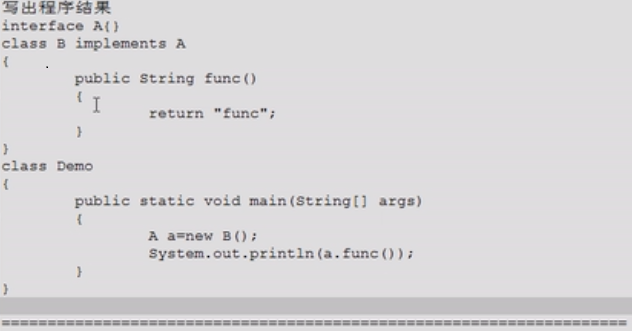

- 答：编译失败，多态，非静态方法，编译看左边，A接口中没有func()方法，向上转型后隐藏了子类的特有方法

---
## 2.
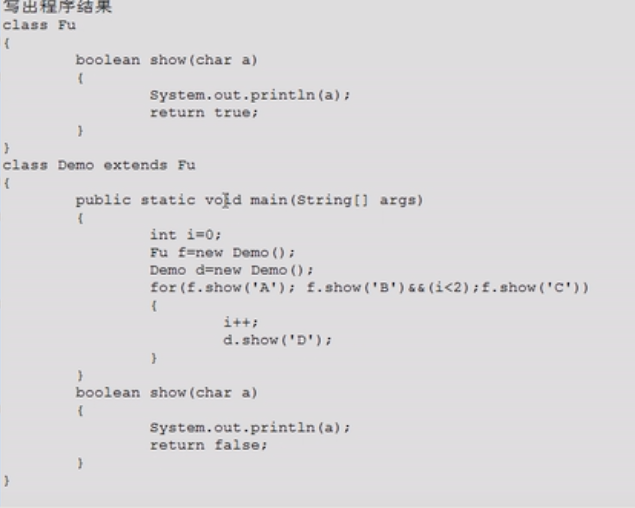

- 答：输出为：
```
A
B
```
多态，非静态方法，编译看左边，运行看右边，运行的是子类的show()方法，其覆盖了父类的show()方法

---
## 3.
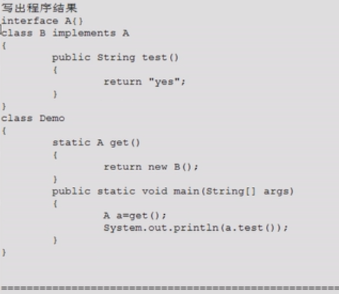

- 答：编译失败，多态，非静态方法，编译看左边，A接口中没有定义test()方法

---
## 4.
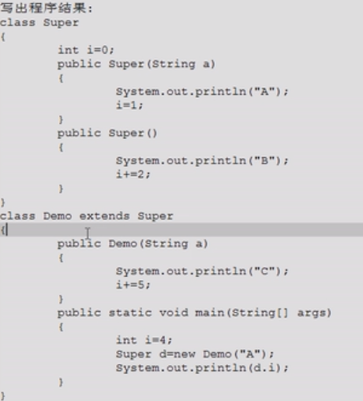

- 答：输出为：
```
B
C
7
```
main()中的`i`只是存放在栈内存中的局部变量，输出的`d.i`是存放在堆内存对象中的成员变量，Demo类的构造函数的第一行会通过`super();`调用其父类Fu类的构造函数进行初始化

---
## 5.
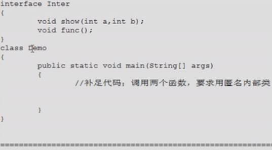

- 答：应填入：

```
        Inter i = new Inter() {
            public void show(int a, int b) {
                System.out.println("show run");
            }
            public void func() {
                System.out.println("func run");
            }
        };
        i.show(3,4);
        i.func();
```

---
## 6.
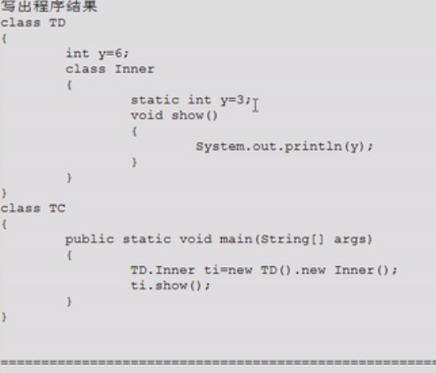

- 答：编译失败，内部类中有静态成员时，该内部类也必须定义成静态的

---
## 7.
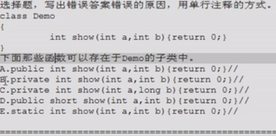

- 答：
 - A：可以，覆盖父类方法
 - B：不可以，覆盖父类方法时权限不能变小
 - C：可以，是子类的特有方法
 - **D：不可以，会产生调用的不确定性，不确定该返回int类型还是short类型**
 - E：不可以，静态方法只能覆盖静态方法，而不能和非静态方法互相覆盖

---
## 8.
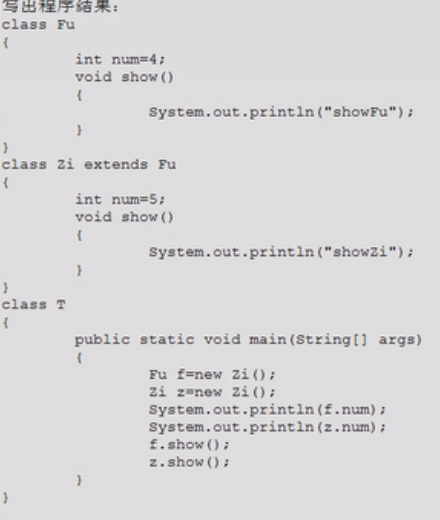

- 答：输出为：
```
4
5
showZi
showZi
```
多态，成员变量和静态方法编译运行都看左边，非静态方法编译看左边，运行看右边

---
## 9.
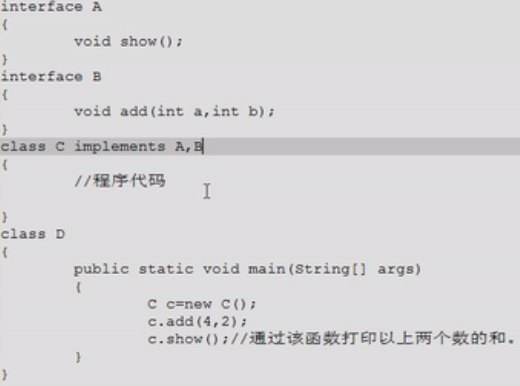

- 答：应填入：
```
    private int sum;
    public void add(int a, int b) {
        sum = a+b;
    }
    public void show() {
        System.out.println("sum="+sum);
    }
```
注意：
 - add()方法返回值类型为`void`，故要通过一个成员变量把两数之和存起来，再在show()方法中输出
 - 实现接口中的方法，不要忘记加public，否则造成权限变小，无法实现（覆盖）成功

---
## 10.
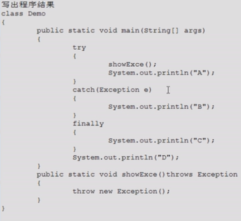

- 答：输出为：
```
B
C
D
```

---
## 11.
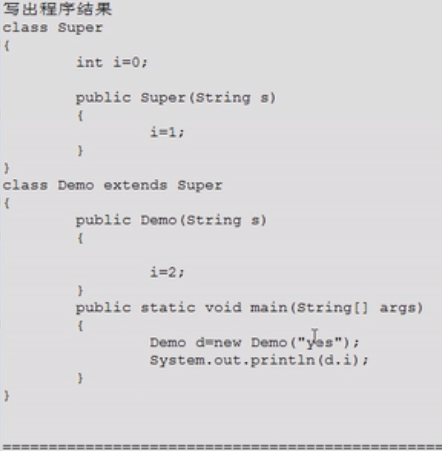

- 答：编译失败，Demo类构造函数第一行会通过隐式`super();`调用其父类Super()类空参的构造函数，但Super()类没有空参的构造函数（因为定义了构造函数，所以没有默认的空参构造函数了），因此编译失败

---
## 12.
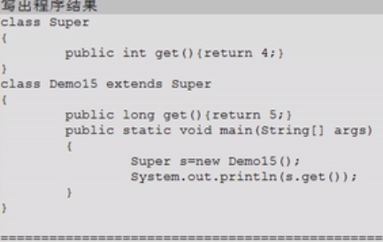

- 答：编译报错，因为覆盖失败，会出现调用的不确定性，不确定get()方法应返回long类型还是int类型

---
## 13.
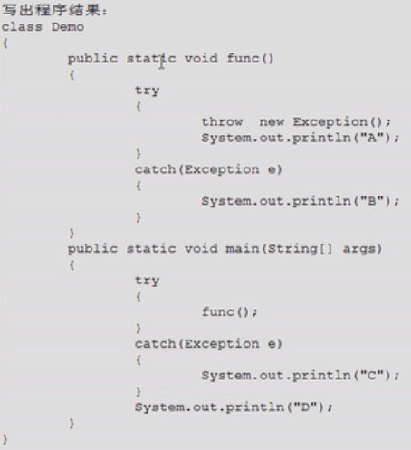

- 答：编译报错，在`throw`下面不要写任何语句，如该`System.out.println("A");`，永远执行不到，而如果`throw`被封装在函数中则可以，因为封装后不知道里面的内容，如：

```
    public static void main(String[] args) {
        try {
            func();
            System.out.println("A");
        }
        catch (Exception e) {
			...
        }
		...
    }

    void func() throws Exception{
        throw new Exception();
    }
```

---
## 14.
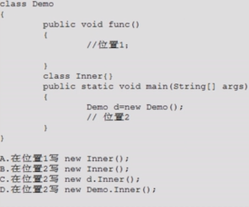

- 答：
 - A：正确
 - B：错误，因为主函数是静态的，只能调用静态成员，要调用该内部类，则该内部类也必须是静态的
 - C：格式错误，这么写相当于`new new Demo().Inner();`，格式是错误的，应该为`d.new Inner();`
 - D：错误，该内部类为非静态的，必须先new外部类对象，通过外部类对象来new该内部类对象，即`new Demo().new Inner();`或者`d.new Inner();`

---
## 15.
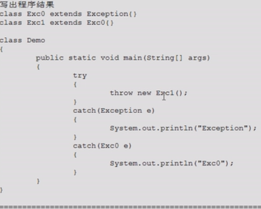

- 答：编译失败，**多catch情况时，父异常类的catch语句块一定要放在最下面**，**否则**它下面的子异常类的catch语句块永远无法访问到，造成**编译失败**

---
## 16.
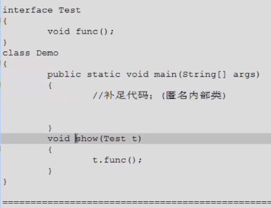

- 答：应填入：
```
        new Demo().show(new Test() {
            public void func() {
                System.out.println("func run...");
            }
        });
    }
```
注意：
 - 主函数是静态的，要在主函数中调用非静态的show()方法，需要new一个Demo对象来调用
 - 实现接口中的方法，不要忘记加public，否则造成权限变小，无法实现（覆盖）成功

---
## 17.
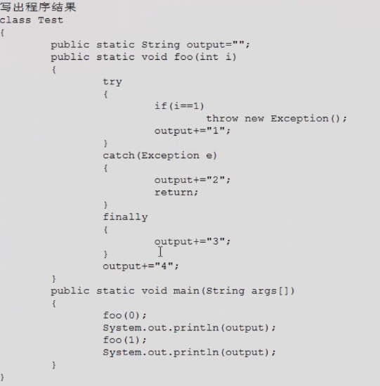

- 答：输出为：
```
134
13423
```

---
## 18.
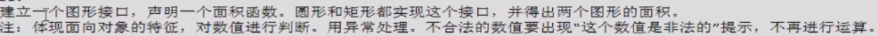

- 答：

```
class IllegalParaException extends RuntimeException {		//自定义非法数据的异常类，遇到该异常不处理而直接结束程序，故为运行时异常
    IllegalParaException() {}
    IllegalParaException(String msg) { super(msg); }
}

interface Figure {		//定义图形接口
    double getArea();
}

class Circle implements Figure {		//定义圆形类，实现图形接口
    private double radius;
    private static final double PI = 3.14;

    public Circle(double radius) {
        if (radius<=0)
            throw new IllegalArgumentException("这个半径是非法的");
        this.radius = radius;
    }

    public double getArea() {
        return PI*radius*radius;
    }
}

class Rectangle implements Figure {		//定义矩形类，实现图形接口
    private double length;
    private double width;

    public Rectangle(double length, double width) {
        if (length<=0 || width<=0)
            throw new IllegalParaException("长或宽是非法的");
        this.length = length;
        this.width = width;
    }

    public double getArea() {
        return length*width;
    }
}

class Demo {
    public static void main(String[] args) {
        Circle c = new Circle(1);
        System.out.println("The area of the circle is : "+c.getArea());

        Rectangle r = new Rectangle(-3,4);
        System.out.println("The area of the rectangle is : "+r.getArea());
    }
}
```

---
## 19.
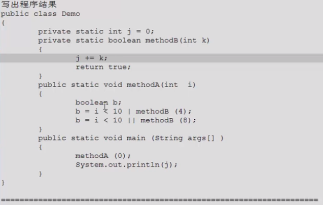

- 答：输出为`4`，考察单或和双或的区别

---
## 20.


- 答：

```
class Demo {
    public static void main(String[] args) {
        char[] arr = new char[]{'a','b','a','d'};
        System.out.println(findEle(arr,'a'));
        System.out.println(findEle(arr,'d'));
        System.out.println(findEle(arr,'e'));
        System.out.println(findEle(null,'a'));
    }

    private static int findEle(char[] arr, char c) {
        if (arr==null)
            throw new IllegalArgumentException();
        for (int i=0; i<arr.length; i++) {
            if (arr[i] == c)
                return i;
        }
            return -1;
    }
}
```

## 21.

```
    /**
     * 给定一个字符串数组，进行从小到大排序
     * {"nba","abc","cba","zz","qq","haha"}
     */
    private static void stringExercise1() {
        String[] strings = {"nba", "abc", "cba", "zz", "qq", "haha"};
        arrayPrint(strings);
        arraySort(strings);
        arrayPrint(strings);
    }

    private static void arraySort(String[] arr) {
        int minIndex;
        for (int i = 0; i < arr.length - 1; i++) {
            minIndex = i;
            for (int j = i + 1; j < arr.length; j++) {
                if (arr[minIndex].compareTo(arr[j]) > 0) {
                    minIndex = j;
                }
            }
            arraySwap(arr, i, minIndex);
        }
    }

    private static void arrayPrint(String[] arr) {
        if (arr == null) {
            System.out.println("null");
            return;
        }
        System.out.print("{");
        for (int i = 0; i < arr.length; i++) {
            if (i != arr.length - 1)
                System.out.print(arr[i] + ",");
            else
                System.out.println(arr[i] + "}");
        }
    }

    private static void arraySwap(String[] arr, int i, int j) {
        String temp = arr[i];
        arr[i] = arr[j];
        arr[j] = temp;
    }

```
注意：对象（如字符串）之间的比较用compareTo()方法，不用`>`、`<`、`==`

## 22.

```
    /**
     *  一个子串在整串中出现的次数
     */
    private static void stringExercise2() {
        String str = "nbanbanbanba";
        String key = "nba";
        int count = 0;
        int index = 0;
        while (str.indexOf(key, index) != -1) {
            index = str.indexOf(key, index) + key.length();
            count++;
        }
        System.out.println("count=" + count);
    }

```

## 23.

```
    /**
     *  两个字符串中最大相同的子串
     */
    private static void stringExercise3() {
        String s1 = "aoerhiijavaoefsio";
        String s2 = "eiadbuiacijavaonuiao";
        String maxSubstring = getMaxSubstring(s1,s2);
        System.out.println(maxSubstring);
    }

    private static String getMaxSubstring(String s1, String s2) {
        String max = (s1.length() >= s2.length()) ? s1 : s2;
        String min = (s1.length() >= s2.length()) ? s2 : s1;
        for (int i = 0; i < min.length(); i++) {
            for (int startIndex = 0, endIndex = min.length() - i; endIndex <= min.length(); startIndex++, endIndex++) {
                if (max.contains(min.substring(startIndex, endIndex)))
                    return min.substring(startIndex, endIndex);
            }
        }
        return null;
    }
```

## 24.

```
    /**
     *  模拟一个和 String类的trim()方法 功能一致的方法
     */
    private static void stringExercise4() {
        String s = "   ab c   def  ";
        System.out.println("-" + myStringTrim(s) + "-");
    }

    private static String myStringTrim(String s) {
        if (s == null)
            return null;

        int beginIndex = 0, endIndex = s.length();

        while (beginIndex < endIndex && s.charAt(beginIndex) == ' ')
            beginIndex ++;
        while (beginIndex < endIndex && s.charAt(endIndex - 1) == ' ')
            endIndex --;

        return s.substring(beginIndex, endIndex);
    }
```

## 25.

```
    /**
     * 对一个字符串中的数值进行从小到大的排序
     * "20 78 9 -7 88 36 29"
     */
    private static void wrapperExercise() {
        String str = "20 78 9 -7 88 36 29";
        int[] nums = toIntArray(str);
        Arrays.sort(nums);
        String result = toString(nums);

        System.out.println("Before sort: " + str);
        System.out.println("After sort: " + result);
    }

    private static String toString(int[] nums) {
        StringBuilder sb = new StringBuilder();
        for (int i = 0; i < nums.length; i++) {
            if (i != nums.length - 1)
                sb.append(nums[i] + " ");
            else
                sb.append(nums[i]);
        }
        return sb.toString();
    }

    private static int[] toIntArray(String str) {
        String[] strArray = str.split(" ");
        int[] arr = new int[strArray.length];
        for (int i = 0; i < arr.length; i++)
            arr[i] = Integer.parseInt(strArray[i]);
        return arr;
    }
```

## 26.

```
    public static void main(String[] args) {
        int a = 10;
        int b = 10;
        method(a, b);   // 需要在method()被调用后，仅输出a=100 b=200，请写出method()中的代码
        System.out.println("a=" + a);
        System.out.println("b=" + b);
    }

    private static void method(int a, int b) {
        /* 方法1：在method()中输出，并不让主函数中的输出语句执行
        a *= 10;
        b *= 20;
        System.out.println("a="+a);
        System.out.println("b="+b);
        System.exit(0);
         */

        /* 方法2：改变打印流 */
        // 自定义输出流
        PrintStream out = new PrintStream(System.out) {
            @Override
            public void println(String str) {
                if ("a=10".equals(str))
                    str = "a=100";
                else if ("b=10".equals(str))
                    str = "b=200";
                super.println(str);
            }
        };
        // 将自定义输出流设置为系统的输出流
        System.setOut(out);
    }
```

## 27.

```
    /**
     * 定义一个int型数组，让数组每个位置上的值去除以首位置的元素，得到的结果作为该位置的新值
     */
    public static void main(String[] args) {
        int[] arr = {10, 30, 50, 20, 100, 90};
        System.out.println(Arrays.toString(arr));
        for (int i = arr.length - 1; i >= 0; i--)   // 若从头开始遍历，要先记录下首位置元素的值，否则第一次操作后其值已改变，造成错误
            arr[i] /= arr[0];
        System.out.println(Arrays.toString(arr));
    }
```

## 28.

```
    /**
     * 程序的输出是？
     */
    private static void function2() {
        int[] arr1 = {2, 3, 4};
        char[] arr2 = {'a', 'b', 'c'};
        System.out.println(arr1);
        System.out.println(arr2);
    }

-------
arr1输出的是"类型@哈希值"，arr2输出的是"abc"，因为String类正好有一个println(char[])重载方法，将字符数组元素变成字符串输出（其他类型数组都没有）
```

## 29.

```
    /**
     * 下面两个输出是否相同？
     */
    private static void function3() {
        Object o1 = true ? new Integer(1) : new Double(2.0);
        System.out.println(o1);
        
        Object o2;
        if (true)
            o2 = new Integer(1);
        else
            o2 = new Double(2.0);
    }

-------
不相同。o1输出的是1.0，o2输出的是1，因为三元运算符要求类型相同，故做了自动类型提升
```

## 30.


```
编译报错，因为x不明确是接口A中的x还是父类B中的x（如果A和B中不重名则不会出错）
若要调用父类B中的x，可使用 super.x 
若要调用接口A中的x，由于接口中定义的是全局常量，可直接 A.x 调用
```

## 31.


```
倒数第二行，由于ball是在接口Rollable中定义的，是public static final的，不能被重新赋值
其实Ball类中的play()方法既是对接口Playable中的抽象play()方法的实现，也是对接口Bounceable中的抽象方法play()的实现
```

## 32.

```
    /**
     * 下列程序的输出是什么？
     */
    private static void function5() {
        List list = new ArrayList();
        list.add(1);
        list.add(2);
        list.add(3);
        updateList(list);
        System.out.println(list);
    }

    private static void updateList(List list) {
        list.remove(2);
    }
```

```
考察的是List的remove(int index)和remove(Object obj)
输出的是[1, 2]
删除的2是索引2，要想删除数据2，应该list.remove(new Integer(2))
```

## 33.

```
    /**
     * 每个输出的结果是什么？
     */
    private static void function6() {
        Person p1 = new Person("JDT", 21);
        Person p2 = new Person("LW", 21);
        Set<Person> set = new HashSet<>();
        set.add(p1);
        set.add(p2);
        System.out.println(set);

        p2.setAge(3);
        set.remove(p2);
        System.out.println(set);

        set.add(new Person("LW", 21));
        System.out.println(set);

        set.add(new Person("LW", 3));
        System.out.println(set);
    }

其中Person类已经重写hashCode()方法和equals()方法：

class Person {
    private String name;
    private int age;

    @Override
    public int hashCode() {
        return this.name.hashCode() + 37 * this.age;
    }

    @Override
    public String toString() {
        return "Person{" +
                "name='" + name + '\'' +
                ", age=" + age +
                '}';
    }

    public String getName() { return name; }
    public void setName(String name) { this.name = name; }
    public int getAge() { return age; }
    public void setAge(int age) { this.age = age; }

    public Person() {}

    public Person(String name, int age) {
        this.name = name;
        this.age = age;
    }
}
```

```
输出为：
[Person{name='JDT', age=21}, Person{name='LW', age=21}]
[Person{name='JDT', age=21}, Person{name='LW', age=3}]
[Person{name='JDT', age=21}, Person{name='LW', age=3}, Person{name='LW', age=21}]
[Person{name='JDT', age=21}, Person{name='LW', age=3}, Person{name='LW', age=21}, Person{name='LW', age=3}]

因为p2更改age后，哈希值也发生改变，但是存储在Set中的位置仍是按照原来的哈希值算出来的
删除p2时，先通过hashCode()方法计算p2的新哈希值，到新哈希值的位置上没有找到p2，因此删除失败
添加Person("LW", 21)时，也通过hashCode()方法计算Person("LW", 21)的哈希值，找到存在该位置的p2，但是通过equals()方法比较发现二者不同，因此可以存入
添加Person("LW", 3)时也类似，但在该哈希值（也是p2更改age后的新哈希值）的位置没有找到元素，因此可以存入
```

## 34.

以下程序的输出是什么？


```
输出为 double 10...
理解：在JDK5之前是没有自动装箱的，一定会调用参数为double的方法，而JDK是向下兼容的，因此还是调用参数为double的方法，而不进行自动装箱
```